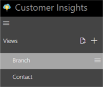
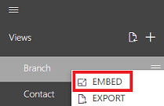

Embed a [!include] view
=========================
[!include[pre release disclaimer](../../includes/cc-beta-prerelease-disclaimer.md)]

Follow these steps to embed a [!include[pn-customer-insights](../../includes/pn-customer-insights-full.md)] view.

##Steps

1.  Define views by using available profile types in [!include[pn-customer-insights](../../includes/pn-customer-insights-short.md)].

2.  Embed view feature.

3.  Embed view - parameters.

4.  Troubleshoot.

##Details

1.  **Define [!include[pn-customer-insights](../../includes/pn-customer-insights-short.md)] Views**.

    >-   Open [!include[pn-customer-insights](../../includes/pn-customer-insights-short.md)] by using the following URL:

         Prod: https://<hubname>.apps.azurecustomerinsights.com

    >-   Use the + button to create a new view, selecting appropriate profile type, a new-views New-view.

    

    >-   Create a view, and add the widgets you want for the data visualization.

2.  **Embed a View Feature**.

    >-   Use the embed option given next to the profile view you’ve created to get the [!include[pn-customer-insights](../../includes/pn-customer-insights-short.md)] embedding URL. The View URL would be like:

         <appurl>?viewid={guid}&widgets={[guid,guid,guid….]}&filterkey=<propertyname
        
         Example: Email>&filtervalue={Property value e.g.: abc@hotmail.com}

    

    >-   You can also get the complete Iframe markup snippet by using the **Embed View** option.

3.  **Embed View - Set Parameters**.

   URL Template - <appurl>?viewid={guid}&widgets={[guid,guid,guid….]}&filterkey=<propertyname e.g.: Email>&filtervalue={Property value e.g.: abc@hotmail.com}

   1.  *appurl* - This can be derived from the [!include[pn-customer-insights](../../includes/pn-customer-insights-short.md)] hub name. Using below template:

       >-  Prod: https://<hubname>.apps.azurecustomerinsights.com

   2.  *viewid* - System-generated GUID for every view.

   3.  *viewname* - To be supported. Dev in progress - Display name of the view to be embedded.

   4.  *filterkey* - Metadata property name to be used as the key for data filtering. For example: Email,FirstName,LastName

   5.  *filtervalue* - Metadata property value to be used as the value for data filtering. For example:  abc@hotmail.com,John,Smith

   6.  *widgets* - Array of widget GUIDs to be used in case the view is to be embedded by using selected widgets.

4.  **Troubleshoot**.

    **[!include[pn-customer-insights](../../includes/pn-customer-insights-short.md)] View loading empty**:

    >-  Check to be sure that your browser allows pop-ups and the pop-up blocker is not enabled.

    >-  Check the *filterkey* and *filtervalue* getting passed as query parameters. It must match the data ingested in [!include[pn-customer-insights](../../includes/pn-customer-insights-short.md)] for the selected view.

    **No Profiles found message**: 

    >-  Check the security roles in the [!include] for the signed-in user. The signed-in user should have at least one profile associated to the user.

    
   
        
