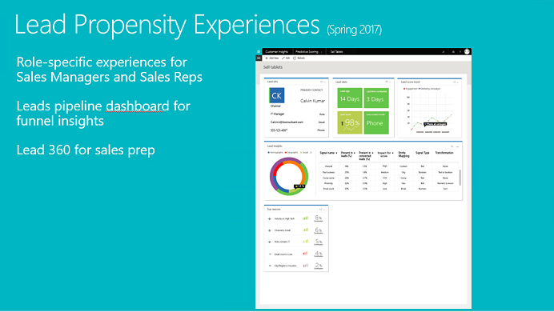

Predictive scoring
==========================
[!include[pre release disclaimer](../../includes/cc-beta-prerelease-disclaimer.md)]

 

##What is predictive scoring?

- Predicts lead qualification by using internal and external signals.
- Provides targeted experiences for sales managers and sales representatives.
- Lets users visualize their leads pipeline in addition to key factors that influence the prediction.