Analyze your data with Power BI
==========================
[!include[pre release disclaimer](../../includes/cc-beta-prerelease-disclaimer.md)]

>[!NOTE]
>The Dynamics 365 for Customer Insights Power BI connector is a Preview feature.

Combine the analytical power of Customer Insights with data visibility and exploration capabilities of Power BI to build interactive reports and dashboards. This connector is used to extract data from Customer Insights KPIs and profiles to build Power BI reports.

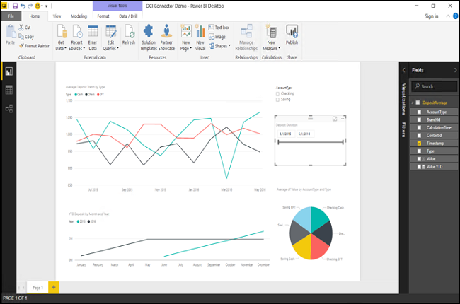 

Example of Power BI report built from Customer Insights data

##Requirements
- [Power BI Desktop] (https://powerbi.microsoft.com/en-us/documentation/powerbi-desktop-report-view/)  
- Customer Insights hub

##To use Customer Insights data in Power BI

1.  In Power BI, select **Get Data** > **Online Services** > **Dynamics 365 for Customer Insights**.

2.  On the **All Data Sources** blade, select **Add**.

    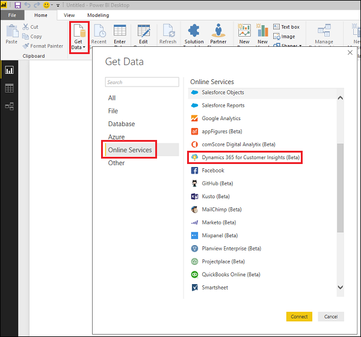 

3.  Enter your Customer Insights API endpoint URL and select **OK**.

    >[!NOTE]
    >To find this URL, sign in to your Azure portal, open your Customer Insights hub, and then go to the **Overview** blade. Mouse over the URL and select **Click to copy** to copy the URL.
    > 
    > 
    >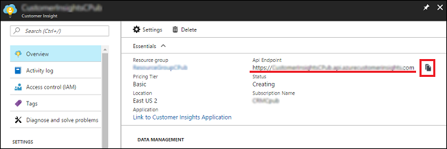 

4.  Sign in with your Customer Insights credentials, and then select **Connect**.

    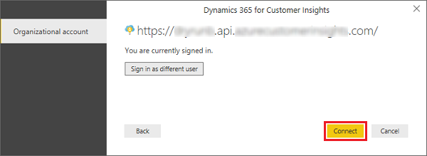 

    The KPIs and Profiles from your Customer Insights hub are displayed. 

    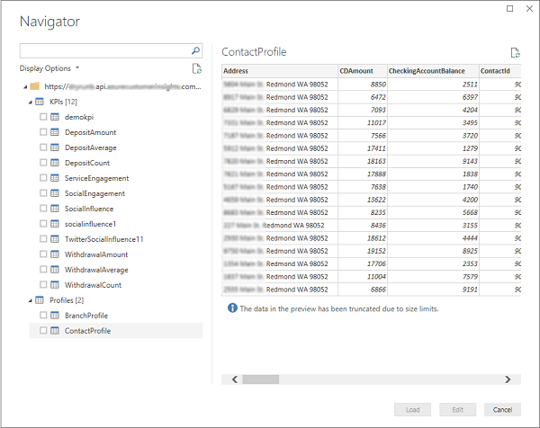 

5.  Select a KPI or Profile to create a query, then select **Edit**.

    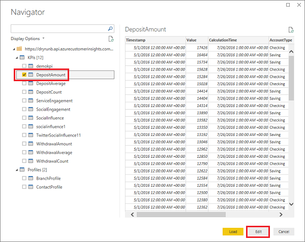 

    The Power BI Query Editor is displayed.

    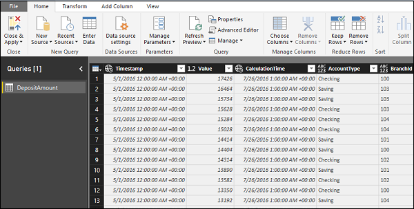 

6.  Proceed to edit your query in the Power BI Query Editor. When done, select **Close & Apply**.

    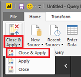 

7.  Select **Relationships** to see your query as a table.

    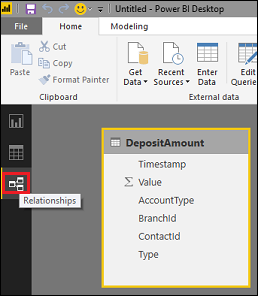 

8.  Select **Data** to see your data from Customer Insights.

    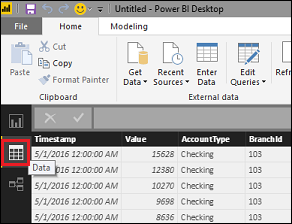 

9.  Select **Report** to start creating data visualizations.

    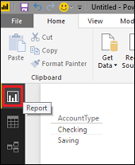 

10. To build reports, drag fields under **Values**.

##Example Report

The following steps were done to create a report that aggregates the total deposit amounts per month.

|**Report**|**Steps**|
| ----------- | ---------- |
| 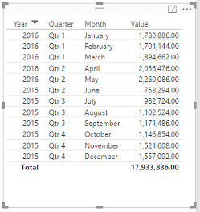 | 1. Drag **TimeStamp** field under **Values**.   2. Drag **Value** field under **Values**.   3. Remove the **Day** value from **Timestamp**   4. Set **Value** to **Sum**.    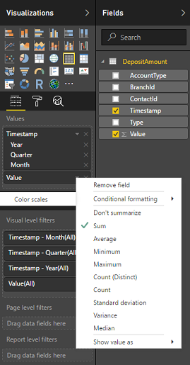 |
<!--
| 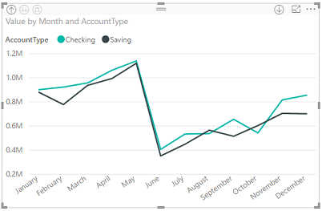 | 1. Drag **Account Type** field under **Values**.   2. Select the **Line Chart** control.   3. Select the Hierarchy control in the report to get to Value by quarter and account type.       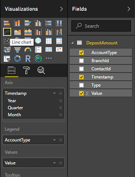 |
| 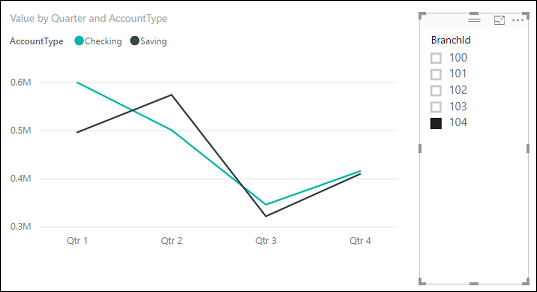 | 1. Drag **BranchId** field into the report area.   2. Select the **Slicer** control.   When you select the Branch ID, the values will change in the visualization.  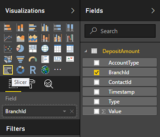 |
-->
When finished creating visualizations, you can save your report and upload it to your Power BI online account and publish it for others to use. You'll need to register with Microsoft Power BI.

### See also

[Register with Microsoft Power BI] (http://powerbi.com/)  
[Power BI Support: Report View in Power BI Desktop] (https://powerbi.microsoft.com/en-us/documentation/powerbi-desktop-report-view/)  

