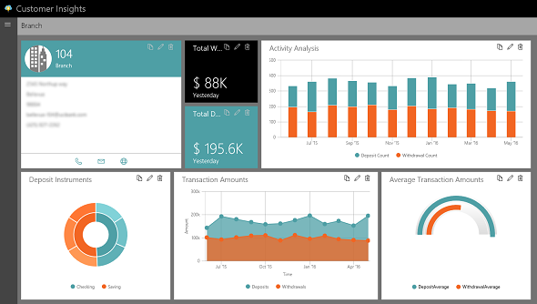
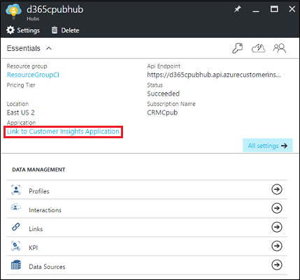
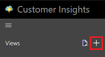
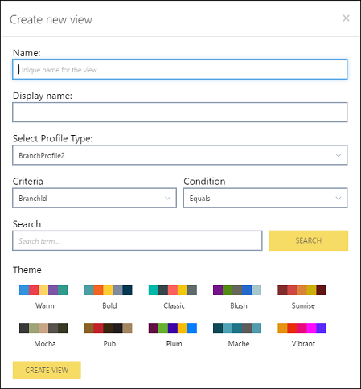
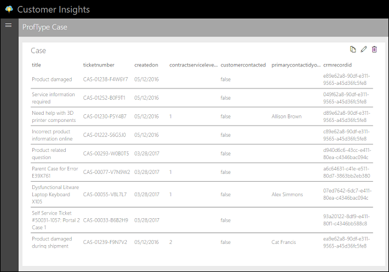
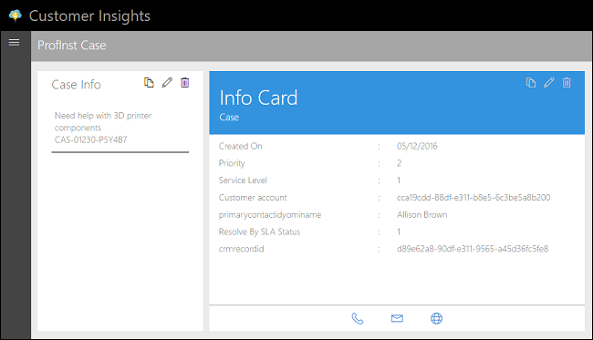
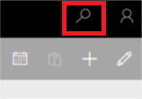
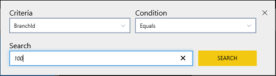
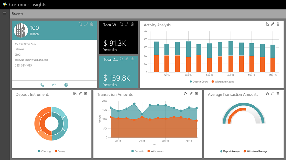

Set up Customer 360
=========================
[!include[pre release disclaimer](../../includes/cc-beta-prerelease-disclaimer.md)]

This section describes how to customize the [!include[pn-customer-insights](../../includes/pn-customer-insights-full.md)] application to achieve a holistic 360° view of customers specific to a business role.

## About the [!include[pn-customer-insights](../../includes/pn-customer-insights-short.md)] application

After you've got [!include[pn-customer-insights](../../includes/pn-customer-insights-short.md)] configured with data, you're ready to explore the data by using rich visuals that you can customize and organize to focus on what matters to you.

Create a view to see data presented like this bank branch example.

 

There are two types of views you can create in [!include[pn-customer-insights](../../includes/pn-customer-insights-short.md)].

* Profile Type view: 
* Profile Instance view: 

## Creating a custom [!include[pn-customer-insights](../../includes/pn-customer-insights-short.md)] Profile Type view

Follow these steps to create a Profile Type view.

1.  The [!include[pn-customer-insights](../../includes/pn-customer-insights-short.md)] application can be accessed through the Azure portal. Sign in to the Azure portal by using your Azure account, and navigate to your [!include[pn-customer-insights](../../includes/pn-customer-insights-short.md)] service instance.

2.  On your [!include[pn-customer-insights](../../includes/pn-customer-insights-short.md)] service instance blade, select **Link to [!include[pn-customer-insights](../../includes/pn-customer-insights-short.md)] Application** to open it.

     

3.  In the [!include[pn-customer-insights](../../includes/pn-customer-insights-short.md)] application, open the leftmost navigation menu by selecting the icon in the upper-left corner.

4.  To create a view for your use, select the **+** button next to **Views**, and then select **Profile Type**. 

     

5.  In the **Create A New View** dialog box, enter the **View Name**.

     

6.  From the **Select A Profile Type** list, choose the profile that you want to target based on the business requirement.

7.  To visualize the charts when composing the view, it helps to have data from a profile instance. To optionally choose a profile instance to use, choose the **Criteria** and **Condition** and enter a **Search** value, and then select **Search**.

  <h5>NOTE</h5>
  
<b>TRY IT!</b>

  
We'll use the Customer Service sample data that comes with [!include[pn-crm-online-subsequent](../../includes/pn-crm-online-subsequent.md)] to create some simple widgets. These won't be flashy but will give you some understanding of what you can do with [!include[pn-customer-insights](../../includes/pn-customer-insights-short.md)] when you use your own data connections.

  
First, export the Case sample data from [!include[pn-crm-shortest](../../includes/pn-crm-shortest.md)] to [!include[pn-excel-short](../../includes/pn-excel-short.md)] so you can see the values you'll be working with.

  <ol>
    <li>Open your [!include[pn-crm-shortest](../../includes/pn-crm-shortest.md)] and go to to <b>Service</b> > <b>Cases</b>.</li>
    <li>Change the list to display all cases.</li>
    <li>In the top menu bar, select the down arrow next to <b>Export to [!include[pn-excel-short](../../includes/pn-excel-short.md)]</b>, and then select <b>Static Worksheet</b>.</li>
    <li>Open the [!include[pn-excel-short](../../includes/pn-excel-short.md)] spreadsheet you exported, and enable editing.</li>
    <li>Unhide the hidden columns. See <a title="" href="https://support.office.com/article/Hide-or-show-rows-or-columns-659c2cad-802e-44ee-a614-dde8443579f8">Hide or show rows or columns</a>.</li>
    <li>Note the fields in Column A. These are the fields that uniquely identify the Case data. You will use these values to search for records in Customer 360.</li>
  </ol>
  
Create your first view and add a widget.

  <ol>
    <li>Open the [!include[pn-customer-insights](../../includes/pn-customer-insights-short.md)] application in Azure. </li>
    <li>Create a Profile Type view by using the steps at the beginning of this section. </li>
    <li>Select the <b>+</b> button in the upper-right corner, select <b>List</b>, and then select <b>Next</b>.</li>
    <li>Choose the following settings, and then select <b>Save</b>.</li>
  </ol>
  <table>
  <tbody>
  <tr>
    <th>List Item</th>
    <th>Value</th>
  </tr>
  <tr>
    <td>Sources</td>
    <td>Profile</td>
  </tr>
  <tr>
    <td>Column 1 Source</td>
    <td>Case Title</td>
  </tr>
  <tr>
    <td>Column 2 Source</td>
    <td>Case Number</td>
  </tr>
  <tr>
    <td>Column 3 Source</td>
    <td>Created On</td>
  </tr>
  <tr>
    <td>Column 4 Source</td>
    <td>Service Level</td>
  </tr>
  <tr>
    <td>Column 5 Source</td>
    <td>Customer Contacted</td>
  </tr>
  <tr>
    <td>Column 6 Source</td>
    <td>primarycontactidyominame</td>
  </tr>
  <tr>
    <td>Column 7 Source</td>
    <td>crmrecordid</td>
  </tr>
  </tbody>
  </table>
  

  
Note the following about this view:

  <ul>
    <li>The Profile Type view is available to all users to view. </li>
    <li>The values you entered for the Column source usually don't match the values you see in the table column headings.  </li>
    <li>The table shows all active cases. </li>
    <li>You can't do an interactive search for data by using the Profile Type view.</li>
    <li>You can use this view to do a quick review to find cases where customers haven't been contacted, as displayed in the customercontacted column. </li>
  </ul>
  
&nbsp;

##Creating a custom [!include[pn-customer-insights](../../includes/pn-customer-insights-short.md)] Profile Instance view

Create a Profile Instance view to enable searching for particular records.

1.  Sign in to the Azure portal by using your Azure account, and navigate to your [!include[pn-customer-insights](../../includes/pn-customer-insights-short.md)] service instance.

2.  On your [!include[pn-customer-insights](../../includes/pn-customer-insights-short.md)] service instance blade, select **Link to [!include[pn-customer-insights](../../includes/pn-customer-insights-short.md)] Application** to open it.

     

3.  In the [!include[pn-customer-insights](../../includes/pn-customer-insights-short.md)] application, open the leftmost navigation menu by selecting the icon in the upper-left corner.

4.  To create a view for your use, select the **+** button next to **Views**, and then select **Profile Instance**. 

     

5.  In the **Create A New View** dialog box, enter the **View Name**.

     

6.  From the **Select A Profile Type** list, choose the profile that you want to target based on the business requirement.

7.  To visualize the charts when composing the view, it helps to have data from a profile instance. To optionally choose a profile instance to use, choose the **Criteria** and **Condition** and enter a **Search** value, and then select **Search**.

  <h5>NOTE</h5>
  
<b>TRY IT!</b>

  
We'll use the Customer Service sample data that comes with [!include[pn-crm-online-subsequent](../../includes/pn-crm-online-subsequent.md)] to create some simple widgets. These won't be flashy but will give you some understanding of what you can do with [!include[pn-customer-insights](../../includes/pn-customer-insights-short.md)] when you use your own data connections.

  
First, export the Case sample data from [!include[pn-crm-shortest](../../includes/pn-crm-shortest.md)] to [!include[pn-excel-short](../../includes/pn-excel-short.md)] so you can see the values you'll be working with.

  <ol>
    <li>Open your [!include[pn-crm-shortest](../../includes/pn-crm-shortest.md)] and go to to <b>Service</b> > <b>Cases</b>.</li>
    <li>Change the list to display all cases.</li>
    <li>In the top menu bar, select the down arrow next to <b>Export to [!include[pn-excel-short](../../includes/pn-excel-short.md)]</b>, and then select <b>Static Worksheet</b>.</li>
    <li>Open the Excel spreadsheet you exported, and enable editing.</li>
    <li>Unhide the hidden columns. See <a title="" href="https://support.office.com/article/Hide-or-show-rows-or-columns-659c2cad-802e-44ee-a614-dde8443579f8">Hide or show rows or columns</a>.</li>
    <li>Note the fields in Column A. These are the fields that uniquely identify the Case data. You will use these values to search for records in Customer 360.</li>
  </ol>
  
Create a Profile Instance view, and add an Interactions widget.

  <ol>
    <li>Open the [!include[pn-customer-insights](../../includes/pn-customer-insights-short.md)] application in Azure. </li>
    <li>Create a Profile Instance view by using the steps at the beginning of this section. </li>
    <li>Select the <b>+</b> button in the upper-right corner, select <b>Interactions</b>, and then select <b>Next</b>.</li>
    <li>For <b>Title</b>, choose <b>Static</b>. Enter a title in the field. </li>
    <li>Select the check box for <b>CaseUpsert</b>. </li>
    <li>Drag <b>Case Title</b> and <b>Case Number</b> into the box on the right.</li>
    <li>Select <b>Save</b>.</li>
  </ol>
  
Add an Info Card widget

  <ol>
    <li>Select the <b>+</b> button in the upper-right corner, select <b>Info Card</b>, and then select <b>Next</b>.</li>
    <li>Choose the following settings, and then select <b>Save</b>.</li>
  </ol>
  <table>
  <tbody>
    <tr>
    <th>List Item</th>
    <th>Value</th>
  </tr>
  <tr>
    <td>Title</td>
    <td>Static. Enter a title in the field.</td>
  </tr>
  <tr>
    <td>Sub Title</td>
    <td>Static. Enter a title in the field.</td>
  </tr>
  <tr>
    <td>Show Image and Image</td>
    <td>Keep at default values.</td>
  </tr>  
  <tr>
    <td>Show Labels</td>
    <td>Keep as checked.</td>
  </tr>  
  <tr>
    <td>Field 1 Label</td>
    <td>Profile metadata - Created On</td>
  </tr>
  <tr>
    <td>Field 1 Value</td>
    <td>Profile - Created On</td>
  </tr>
  <tr>
    <td>Field 2 Label</td>
    <td>Profile metadata - Priority</td>
  </tr>
  <tr>
    <td>Field 2 Value</td>
    <td>Profile - Priority</td>
  </tr>
  <tr>
    <td>Field 3 Label</td>
    <td>Profile metadata - Service Level</td>
  </tr>
  <tr>
    <td>Field 3 Value</td>
    <td>Profile - Service Level</td>
  </tr>
  <tr>
    <td>Field 4 Label</td>
    <td>Profile metadata - Customer account</td>
  </tr>
  <tr>
    <td>Field 4 Value</td>
    <td>Profile - Customer account</td>
  </tr>
  <tr>
    <td>Field 5 Label</td>
    <td>Profile metadata - primarycontactidyominame</td>
  </tr>
  <tr>
    <td>Field 5 Value</td>
    <td>Profile - primarycontactidyominame</td>
  </tr>
  <tr>
    <td>Field 6 Label</td>
    <td>Profile metadata - Resolve By SLA Status</td>
  </tr>
  <tr>
    <td>Field 6 Value</td>
    <td>Profile - Resolve By SLA Status</td>
  </tr>
  <tr>
    <td>Field 7 Label</td>
    <td>Profile metadata - crmrecordid</td>
  </tr>
  <tr>
    <td>Field 7 Value</td>
    <td>Profile - crmrecordid</td>
  </tr>
  </tbody>
  </table>
  

  
Note the following about this view:

  <ul>
    <li>The Profile Instance view is available to the signed-in user to view. </li>
    <li>Use this view to do a an interactive search. Use the [!include[pn-excel-short](../../includes/pn-excel-short.md)] sample spreadsheet you exported previously to give it a try. See the next section.</li>
  </ul>
  
&nbsp;

## Using the [!include[pn-customer-insights](../../includes/pn-customer-insights-short.md)] application

With the widgets created, you're ready to get some meaningful data.

1. Select the Search icon in the upper-right corner. 

    

2. Fill in the criteria, and then select **Search**.

    

Note the change in values in the widgets.

 

>[!NOTE]
>**TRY IT!**  
<ol>
<li>Open the [!include[pn-excel-short](../../includes/pn-excel-short.md)] spreadsheet you created previously by using Case sample data. </li>
<li>Copy a value from Column A. This is a case ID. </li>
<li>Select the **Search** icon in the upper-right corner. </li>
<li>For **Criteria**, choose **crmrecordid**. </li>
<li>For **Condition**, choose **Equals**. </li>
<li>For **Search**, paste the value you copied from Column A in the spreadsheet&mdash;for example, d89e62a8-90df-e311-9565-a45d36fc5fe8 </li>
<li>Select **Search**. </li>
</ol>
>The two widgets are updated with the values for the case ID entered.  
> 
>  
