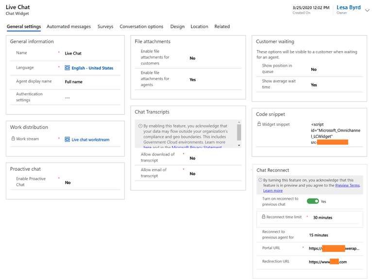

# Add a chat widget

[!INCLUDE[cc-use-with-omnichannel](../includes/cc-use-with-omnichannel.md)]

1. Sign in to Omnichannel Administration.

2. Go to **Channels** > **Chat**.

3. Select **New**. The **New Chat Widget** page is displayed.

4. On the **General settings** tab, specify the information for the following fields.

    | Section | Field | Description | Example value |
    |---------------|------------------------|-----------------------------------|---------------------|
    | **General information** | **Name** | Specify the name of the widget. | Contoso chat |
    |  | **Language**| Select the language of the chat widget from the list. | English - United States |
    |  | **Agent display name** | Select an agent display name type from the list: **Full name**, **First name**, **Last name**, and **Nick name**.   More information: [Configure agent display name](agent-display-name.md) | Full name |
    |  | **Authentication settings** |Select an authentication setting from the list. This is an optional field. More information: [Create chat authentication settings](create-chat-auth-settings.md) | Chat authentication |
    |||

    | Section | Field | Description | Example value |
    |---------------|------------------------|-----------------------------------|---------------------|
    | **Work distribution** | **Work stream** | Select a work stream from the list. Initially, a default a work stream is selected.  More information: [Understand and create work streams](work-streams-introduction.md)   **Note:**   If you save the chat widget, you can't edit the **Work stream** field. If you want to edit the field, you must delete the chat widget and create a new one. | Live work stream |
    
    | Section | Field | Description | Example value |
    |---------------|------------------------|-----------------------------------|---------------------|    
    | **Proactive chat** | **Enable Proactive Chat** | Select whether to enable proactive chat.  More information: [Configure proactive chat](proactive-chat.md) | Yes |
    |||

    | Section | Field | Description | Example value |
    |---------------|------------------------|-----------------------------------|---------------------|    
    |**File attachments** | **Enable file attachments for customers** |Select whether to allow customers to attach and send files as attachments.   More information: [Configure file attachment capability](configure-file-attachment.md) | Yes |
    | | **Enable file attachments for agents** | Select whether to allow agents to attach and send files as attachments.   More information: [Configure file attachment capability](configure-file-attachment.md) | Yes |
    |||
    
    | Section | Field | Description | Example value |
    |---------------|------------------------|-----------------------------------|---------------------|        
    | **Chat Transcripts** | **Allow download of transcript** | Select whether to allow chat transcripts to be downloaded.   More information: [Configure download and email of chat transcripts](download-email-chat-transcripts.md) | Yes |
    | | **Allow email of transcript** |Select whether to allow chat transcripts to be emailed.   More information: [Configure download and email of chat transcripts](download-email-chat-transcripts.md) | Yes |
    | | **Email Template** |If you selected **Yes** for the **Allow email of transcript** field, the **Email Template** field is displayed. Select the email template you want to use to send the chat transcript as an email to the customer. | Conversation transcript email template |
    | | **From mailbox** | If you selected **Yes** for the **Allow email of transcript** field, the **"From" mailbox** field is displayed. Select the mailbox from which you want to send the chat transcript email to the customer. | Contoso |
    |||

    | Section | Field | Description | Example value |
    |---------------|------------------------|-----------------------------------|---------------------|            
    |**Customer waiting** | **Show position in queue** | Select whether to show customers their position in the queue when they're waiting to interact with an agent.   More information: [Show customers their position in a queue](show-queue.md) | Yes |
    | | **Show average wait time**| Select whether to show customers average wait time in the queue when they're waiting to interact with an agent.   More information: [Show customers their average wait time in a queue](average-wait-time.md) | Yes |
    |||

5. Select **Save**. The following sections are displayed:
    - **Code snippet:** The code snippet that you need to embed in the HTML source of your website to display the chat widget is displayed in the **Widget snippet** box.
    - **Chat Reconnect:** The toggle to configure options for providing a reconnect link to the chat user is displayed. More information: [Configure reconnection to a previous chat session](configure-reconnect-chat.md)

    > [!div class=mx-imgBorder]
    > 

6. On the **Automated messages** tab, set up automated messages for your chat widget. More information: [Configure automated messages](configure-automated-message.md)

7. On the **Surveys** tab, specify the information for the following fields.

    | Section | Field | Description | Example value |
    |---------------|------------------------|-----------------------------------|---------------------|
    | Pre-conversation survey | Pre-conversation survey | Select whether to set up a pre-chat survey in the chat widget. The survey will be shown to users before a conversation is initiated. | Yes |
    | Pre-chat unauthenticated questions | Pre-chat unauthenticated questions | If you set **Yes** for the **Pre-conversation survey** field, the **Pre-chat unauthenticated questions** section is displayed.   Add the pre-chat questionnaires   More information: [Configure a pre-conversation survey](configure-pre-chat-survey.md) | Product |
    |Post-conversation survey| Turn on | If you set to **Yes**, you can configure a post-conversation survey to be presented to customers. More information: [Configure a post-conversation survey](configure-post-conversation-survey.md) |

    > [!div class=mx-imgBorder]
    > 

8. On the **Conversation options** tab, specify the information for the following fields.

    | Section | Field | Description | Example value |
    |---------------|------------------------|-----------------------------------|---------------------|
    |Voice and video calls | Call options | Select a call option from the list: <ul>**No calling**:  Agents can't make voice or video calls. </ul>  <ul>**Video and voice calling**:  Agents can make both voice and video calls. **Note:** Video calling is not available in Unified Service Desk. </ul> <ul>**Voice only**:  Agents can make only voice calls.  </ul>| Video and voice calling |
    | Visual engagement | Screen sharing | Select whether to enable third-party screen sharing. You must install a third-party provider from AppSource to use the feature. | Enabled |
    | Visual engagement | Screen sharing provider | Select the provider from the list.| *Screen sharing provider* |
    | Visual engagement | Co-browse | Select whether to enable third-party co-browse. You must install a third-party provider from AppSource to use the feature. | Enabled |
    | Visual engagement | Co-browse provider | Select the provider from the list. | *Co-browse provider* |
       
   > [!NOTE]
   > You can select one co-browse provider and/or one screen sharing provider for each chat widget. Only co-browse and screen sharing providers that have published a solution on AppSource will appear in the lists.
   
9. On the **Design** tab, specify the information for the following fields. The offline settings are available only when the operating hours are set.

    | Section | Field | Description | Example value |
    |---------------|------------------------|-----------------------------------|---------------------|
    | Online | Theme color | Select a color from the list for the chat widget. | Blue |
    | Online | Logo | Use a public-facing image URL for the chat widget. | https://oc-cdn-ocprod.azureedge.net/livechatwidget/images/chat.svg |
    | Online | Title | Specify the name for the widget that's displayed for customers in the chat widget. | Let's Chat! |        
    | Online | Subtitle | Specify the name for the widget that's displayed for customers in the chat widget. | We're Online |
    | Online | Position | Specify the position of the widget. | Bottom right |
    | Online | Operating hours | Select an operating hour window for the chat widget from the list.   More information: [Create and manage operating hours](create-operating-hours.md) | Regular shift |
    | Offline | Show widget during offline hours | Set to **Yes** to display the chat widget during the offline hours.| Yes. The default is No; the chat widget will be hidden .|
    | Offline | Theme color | Select a color from the list. | Grey |
    |Offline | Title | Specify a title to be displayed. | We're offline. |
    | Offline | Subtitle | Optionally, specify a subtitle. | No agents are available. |
    |||||
    
10. On the **Location** tab, do the following:

    1. In the **Widget location** section, select **Add** to specify the website domain where the chat widget must be shown. The domain format should not include the protocol (for example, **http** or **https**).
    2. In the **Visitor location** section, specify whether you need to detect the visitor's location, and then select a **Geo Location Provider**. More information: [Set up location detection](geo-location-provider.md)

    > [!NOTE]
    > If no domains are specified, the chat widget can be embedded on any website without restrictions. If you specify a domain, the chat widget can be hosted only on the specified domain.

11. On the **Related** tab, view activity associated with your chat widget, such as survey responses, chat widget locations, and system messages. 

12. Select **Save** to save the configurations.

After you configure, agents can get the capabilities while they are in a conversation. To learn more, see [Call options and visual engagement in live chat](call-options-visual-engagement.md).

### Troubleshooting

[Errors in creating a chat widget](troubleshoot-omnichannel-customer-service.md#chat-widget)

### See also

[Configure a pre-conversation survey](configure-pre-chat-survey.md)  
[Configure agent display name](agent-display-name.md)  
[Configure proactive chat](proactive-chat.md)  
[Configure file attachment capability](configure-file-attachment.md)  
[Create quick replies](create-quick-replies.md)  
[Create and manage operating hours](create-operating-hours.md)  
[Create chat authentication settings](create-chat-auth-settings.md)  
[Embed chat widget in your website or portal](embed-chat-widget-portal.md)  
[Embed chat widget in mobile experiences](render-live-chat-widget-mobile.md)  
