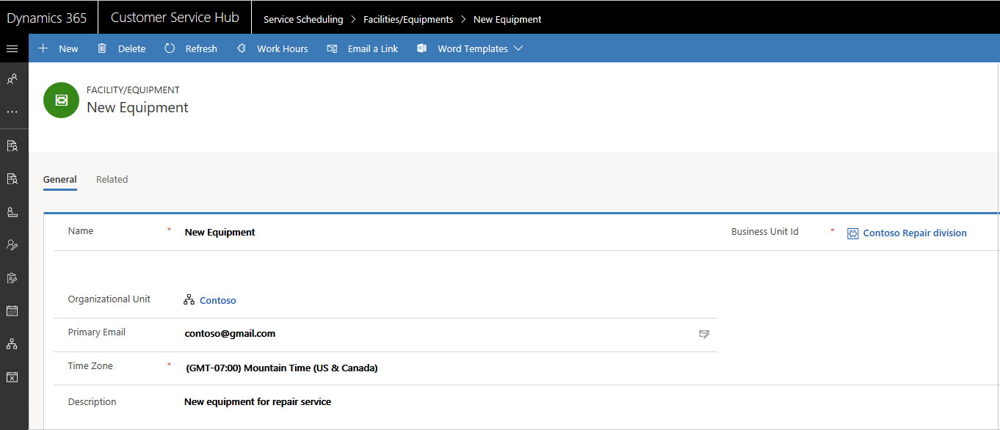

# Add facilities and equipment to schedule service

Facilities and equipment are resources you use to perform services for your customers. Facilities could be physical spaces like service bays or conference rooms and equipment could be tools or other assets. Add these resources to Dynamics 365 Customer Service to ensure optimal services for your customers.  

  
## Create a new facility or equipment record

Make sure that you have the required security role or equivalent permissions. 

[!INCLUDE[proc_more_information](../includes/proc-more-information.md)] [Manage security roles in service scheduling](manage-security-roles.md)
  
1. In the Customer Service Hub sitemap, go to **Scheduling**.
2. From the list of entity records, select **Scheduling > Facilities/Equipment**.
   - The **Local Facility/Equipment** view is displayed. You can switch between various system views using the drop-down list.
   

3. On the command bar, select **New** to create a new record. 
  
5.  In the **General** section, fill in the information as required:  
  
    - **Name**. Enter the name of the facility or equipment you want to add for scheduling.  
  
    - **Business Unit ID**. Enter a business unit ID. To choose an ID, select the **Lookup** button and then select from the list. You can also create a new business unit ID.
  
    - **Organizational Unit**. Select the location where the facility or equipment is located.
  
    - **Primary Email**. Enter the email address of the site manager or equipment manager. If there are any updates or cancellations related to the schedule, facilities, or equipment, notifications are sent to this email address.  
  
    - **Time Zone**. Select the appropriate time zone to determine availability for the facility or equipment. By default, this is set to the time zone you’ve selected in the **General** tab of the **Set Personal Options** dialog box. [!INCLUDE[proc_more_information](../includes/proc-more-information.md)] [Set personal options](../basics/set-personal-options.md)  
  
    - **Description**. Add details about the facility or equipment, such as the numbers, size, make, or model.  
  
6.  When you’re done, select **Save** or **Save and Close**.  

    

### See also

[Service Scheduling overview](basics-service-service-scheduling.md)

[!INCLUDE[footer-include](../includes/footer-banner.md)]