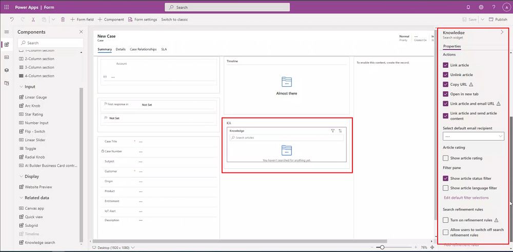
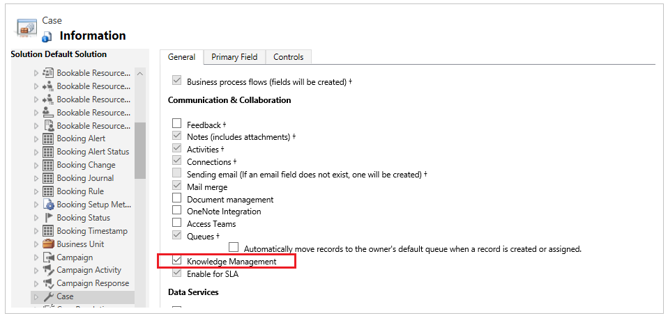
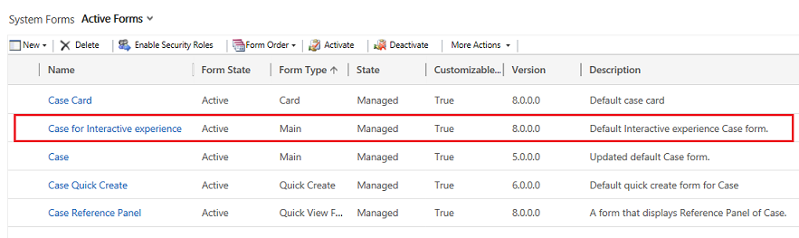
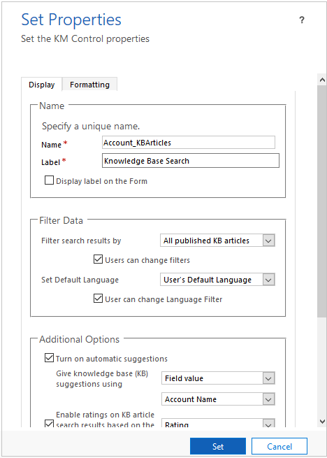
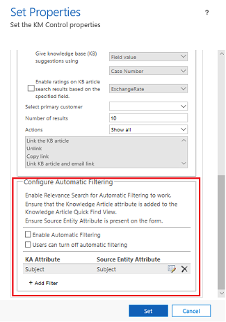

# Add the Knowledge Base Search control to forms

[!INCLUDE[cc-data-platform-banner](../includes/cc-data-platform-banner.md)]

Add a **Knowledge Base Search** control to [!INCLUDE[pn_dynamics_crm](../includes/pn-dynamics-crm.md)] forms to make it easy for users in your organization to find knowledge articles so they can answer common customer questions and resolve their issues right from the records, without having to switch to a different application.  
  
 You can configure the Knowledge Base Search control to:  
  
- Show automatic suggestions in search results based on certain fields, or based on text analytics. The text analytics feature in only available for [!INCLUDE[pn_CRM_Online](../includes/pn-crm-online.md)].  
  
- Define filters that users can use on search results.  
  
- Choose from a set of predefined contextual actions the users can take on an article.  
  
- Add the control on any section of any entity that is enabled for knowledge management, including the timeline, and custom entities. The control is enabled in the case entity out of the box, and is added to the following forms:
   - Case main form -  In the **Activity wall** section 
   - Case for interactive experience main form – In the **Related** section 
  
  > [!NOTE]
  >  The Knowledge Base Search control can be used on Microsoft Dynamics 365 for tablets and phones. However, some actions like Pop Out, Email Link, and Email Content aren't supported.  

Microsoft Dynamics 365 Customer Service supports the native knowledge management, and this option is available for the Dynamics 365 Customer Service app users.
  
## Prerequisites  
 Before you add the Knowledge Base Search control, make sure to:  
  
- Set up knowledge management in [!INCLUDE[pn_dynamics_crm](../includes/pn-dynamics-crm.md)]. [!INCLUDE[proc_more_information](../includes/proc-more-information.md)] [Set up knowledge management](set-up-knowledge-management-embedded-knowledge-search.md)
  
- Select the entity you want to enable knowledge management on while setting up knowledge management.  

> [!NOTE]
> All customization tasks for the Customer Service Hub must be done in Microsoft Dataverse.
  
## Add the Knowledge Base Search control to main forms 

Depending on which experience you are using, you can add the knowledge base search control to main forms using one of the following methods:

- [Power Apps experience](#prevew-power-apps-experience)
- [Web client experience](#Web-client-experience)

### Preview: Power Apps experience

Make sure that you have the System Administrator or System Customizer security role or equivalent before you begin.

1.  In Power Apps, in the left pane, select **Data** > **Tables**.

2.	In the top-right part of the window, change **Default** to **All**.

3.	Select the entity for which Knowledge is enabled. To search for the entity, in the **Search** field, type the entity name.
   
    ![Search for entity]{media\knowledge-entity.png "Search for entity")
    
4.	Select the entity name, select the **Forms** tab, and then open the form where you want to add the knowledge control. To add the control, create a section and then and then add a knowledge search control within it.

    **Note:** If the option to add Knowledge Base Search is disabled, it could be because knowledge management isn’t set up, isn’t enabled for the entity for which you’re adding the search control. Also this control won't be enabled for reference panels until a later date.

5. Once you have added your new section, select **Save and Publish**. You may need to refresh the screen to see the new section.

   

6.	On the left-hand side, in the **Tree view**, under **Summary**, expand **Related**, and then select **Knowledge**.
            
    ![Select Knowledge]{media/knowledge-control-tree-view.png "Select Knowledge from the tree view"}
 
 The knowledge properties are displayed in the pane on the right side of the page. 
 
 
 The following table describes the properties you can configure.
    
|Property  |Description|
|---------|---------|
|Reference name     |**Required**: The unique name for the tab that is used when referencing it in scripts. The name can contain only alphanumeric characters and underscores.   |
|Label        |**Required**: The localizable label for the tab visible to users.    |
|Results shown on page       |Select how many articles to show in the search results at first.     **Note**: If Relevance Search is enabled, the number of results that are displayed may differ from what you set due to the default Relevant Search setting. Your system administrator must disable Relevance Search or enable Simple Relevance Search for this property to work correctly. (Simple Relevance Search queries only articles, excluding attachments and notes.) For more information, see [Understand knowledge base search mechanisms](https://docs.microsoft.com/dynamics365/customer-service/knowledge-base-search-methods). |
|Automatic search > Provide search results using     |Once you open the entity form, automatic search is performed using the field you specify in the field below.   If you’ve enabled automatic suggestions, select the field for the entity that Dynamics 365 Customer Service will use to suggest article results in the Give knowledge base (KB) suggestions using drop-down list.   For example, if you’re adding the search control to the Account entity and want Dynamics 365 Customer Service to automatically show search results that contain the account name, select Account Name in the drop-down list. **Note**: This drop-down list can include all fields that are text, multi-line text, or lookup type fields.  If you are a Dynamics 365 Customer Service user and your organization is using native Dynamics 365 Customer Service knowledge management as the knowledge solution, you can also use text analytics to show suggested articles. To do this, select Text Analytics from the Give knowledge base (KB) suggestions using the drop-down list. |
|Actions   |**Link article**: Lets users link a knowledge article Lets users link a knowledge article to the record they're viewing the knowledge article search results in.  **Unlink article**: Lets users unlink a knowledge article from a primary record.  **Copy URL**: Lets users copy the external URL of the article so they can share it over channels like chat or email. In the native Dynamics 365 customer engagement knowledge management solution, the Copy URL option is available only for published articles.  **Open in new tab**: Opens a knowledge article in a new tab within the same browser window.  **Link article and email URL**: Lets users associate an article with the primary record and share the article URL with the customer through email.  **Link article and send article content**: Lets users associate an article with a primary record and share the contents of the article with the customer through email. |
|Select default email recipient    |Select who the email will be sent to when an agent sends the article link in email. This drop-down list includes all fields for the entity that are enabled for email (for example Customer, Contact, or Responsible contact).   When the agent chooses to send a link to the article to the customer, the To field is automatically populated with the value of the field that you select here. If you leave it blank, in the email recipient display, it will show as blank and you need to fill it in manually.|
|Show article rating   | Shows the rating on an article. |
|Show status filter   | Allows the user to filter knowledge articles based on article status: Draft, Approved, or Published.   |
|Show article language filter    |Allows the user to filter knowledge article search results based on the language they choose.   If you want users to see search results only for articles in a specific language, in the **Set Default Language** drop-down list, select a language. By default, User’s Default Language is selected:  <ul><li>If you select User's Default Language, search results will be filtered based on the signed-in user's default language. </li> <li> If the language you select isn't an active language, the search results will be filtered using the signed in user's default language. </li> <li> If you select User's Default Language, and if the user's default language isn't an active language, the first active language available alphabetically is used as the default filter. </li> <li>	To let user’s select a different language filter on search results so they can see other articles in other languages, select the **Users can change Language Filter** check box. Only when you enable this option will users see an option to change the filter in the Search pane in a record. </li> </ul> |
| Edit default filter selection   | Allows you to change the default display for filtered articles, whether you want to show Draft, Approved, or Published articles. |
| Add refinement rules | Opens a window where you can define more precise search results. |

#### Configure automatic filtering in Power Apps

Improve knowledge article suggestions and search results by enabling automatic filtering. Automatic filtering ensures your customer service agents receive only the most relevant knowledge articles. As an administrator, you can configure Knowledge Base Search control to automatically filter knowledge articles based on case data without any manual input from the agents.

For example, if you set up automatic filtering of knowledge articles on the subject of the case, the knowledge articles that have the same subject as the case will be filtered in and will be shown to the agents. Other articles will be filtered out automatically. 

This feature can be extended to automatically filter knowledge articles on any lookup field that is present on both Case and Knowledge Article entity. **Note**: Polymorphic lookups aren't supported. Agents also have an option to turn off automatic filtering and search the entire knowledge base. Administrators can configure this option in the Knowledge Base Search control.

Open the **Knowledge Base Search** control and edit its properties to configure automatic filtering. In the **Set Properties** dialog box, on the **Display** tab, specify the following fields in the **Configure Automatic Filtering** section.

1. Select **Enable Automatic Filtering** check box to enable automatic filtering.
2. Select **Users can turn off automatic filtering** check box if you want to provide your agents the option to turn off automatic filtering and search the entire knowledge base. This enables **Auto filter results** option for agents on knowledge search control.
3. Select **Add Filter** to define filtering of knowledge articles on case subject or any other lookup field.
4. Select **Set** to save the properties.

    > [!NOTE]
    > Ensure that Relevance search is enabled for automatic filtering to work. The Knowledge Article attribute must be added to the Knowledge Article Quick Find View. Ensure Source Entity Attribute is present on the form.

### Web client experience
  
1. [!INCLUDE[proc_permissions_system_admin_and_customizer](../includes/proc-permissions-system-admin-and-customizer.md)]  
  
2. [!INCLUDE[proc_settings_customization](../includes/proc-settings-customization.md)]  
  
3. Choose **Customize the System**.  
  
4. In the solution explorer, choose the entity you want to add the search control to, and under **Communication & Collaboration**, make sure the **Knowledge Management** check box is selected.  
  
   

   Select **Save** icon to save the setting for the entity.
  
5. Expand the entity you’re adding the search control to, and select **Forms**.  
  
6. Choose the entity form of type **Main**.  
  
   
  
7. Select the area where you want to place the search control, and on the **Insert** tab, select **Knowledge Base Search**.  
  
    If the option to add Knowledge Base Search is disabled, it could be because knowledge management isn’t set up or isn’t enabled for the entity you’re adding the search control to.  
  
8. In the **Set Properties** dialog box, on the **Display** tab, specify fields as given in the table below:
  
    

9. Select **Set** to apply the settings.   
    
|Tab  |Property  |Description|
|---------|---------|---------|
|**Display**     |    Name     |       **Required**: The unique name for the tab that is used when referencing it in scripts. The name can contain only alphanumeric characters and underscores.   |
|    |  Label        |     **Required**: The localizable label for the tab visible to users.    |
|     |      Filter Search results by   |   In the **Filter search results by** drop-down list, select the set of article states that you want Dynamics 365 Customer Service to search in:  <ul><li> In the native Dynamics 365 Customer Service knowledge solution, you can choose from all draft articles, all approved articles, or all published articles.</li><li>To let user’s select a different filter on search results so they can see other types of articles, select the **Users can change filters** check box. Only when you enable this option will users see an option to change the filter in the Search pane in a record.</li></ul> While searching for a  knowledge article in the Related section (Reference panel), the following fields of a knowledge article are searched for the keywords that you type: **Title**,**Content**, **Keywords**, **Description**, and **Article Public Number**. For more information, see [Search for knowledge articles](search-knowledge-articles-csh.md). |
|     |  Set Default Language |     If you want users to see search results only for articles in a specific language, in the **Set Default Language** drop-down list, select a language. By default, User’s Default Language is selected:  <ul><li>If you select User's Default Language, search results will be filtered based on the signed-in user's default language. </li> <li> If the language you select isn't an active language, the search results will be filtered using the signed in user's default language. </li> <li> If you select User's Default Language, and if the user's default language isn't an active language, the first active language available alphabetically is used as the default filter. </li> <li>	To let user’s select a different language filter on search results so they can see other articles in other languages, select the **Users can change Language Filter** check box. Only when you enable this option will users see an option to change the filter in the Search pane in a record. </li> </ul> |
|  |     Additional Options    |      If you want Dynamics 365 Customer Service to suggest articles automatically based on the value in certain fields of the entity, select **Turn on automatic suggestions**.    If you’ve enabled automatic suggestion, select the field for the entity that Dynamics 365 Customer Service will use to suggest article results in the **Give knowledge base (KB) suggestions** using drop-down list.     For example, if you’re adding the search control to the Account entity, and want Dynamics 365 Customer Service to automatically show search results that contain the account name, select Account Name in the drop-down list. **Note**:  This drop-down list can include all fields that are text, multi-line text, or lookup type fields.    If you are a Dynamics 365 Customer Service user and your organization is using native Dynamics 365 Customer Service knowledge management as the knowledge solution, you can also use text analytics to show suggested articles. To do this, select **Text Analytics** from the **Give knowledge base (KB) suggestions** using drop-down list.     If you want the article rating to appear for each article in the search results, select the **Enable ratings on KB article search results based on the specified field** check box, and then select the field from the drop-down list. |
|   |  Select Primary customer       |     In Select primary customer, select who the email will be sent to when a customer service rep sends the article link in email. This drop-down list includes all fields for the entity that are enabled for email, for example Customer, Contact, or Responsible contact.     When the customer service rep chooses to send a link to the article to the customer, the **To** field is automatically populated with the value of the field that you select here.     |
|  |   Number of results      |      Select how many articles to show in the search results at first.     **Note**: If Relevance Search is enabled, the number of results that are displayed may differ from what you set due to the default Relevant Search setting. Your system administrator must disable Relevance Search or enable Simple Relevance Search for this property to work correctly. (Simple Relevance Search queries only articles, excluding attachments and notes.) For more information, see [Understand knowledge base search mechanisms](https://docs.microsoft.com/dynamics365/customer-service/knowledge-base-search-methods).   |
|    |  Actions       |   Select whether you want to make all the default actions available to reps or only selected ones. If you choose Show Selected Actions, select the actions you want to show.   The following actions are available: <ul> <li>**Link the KB article**. Let’s users link the knowledge article to the record they're viewing the knowledge article search results in. </li> <li>	**Unlink**. Let’s users unlink the knowledge article from the primary record. </li> <li> **Copy link**. Let’s users copy the external URL of the article, so they can share it over channels like chat or email. In the native Dynamics 365 Customer Service knowledge management solution, the Copy Link option is available only for published articles.</li> <li> **Link KB article and email link**. Let’s users associate an article with the primary record and share the article link with the customer through email. |
|**Formatting**     |      Layout   |    Choose the type of layout to determine the number of columns the control should occupy.     |
|    |    Row Layout  |  Select the maximum number of rows per page.|

#### Configure automatic filtering for the web client

Improve knowledge article suggestions and search results by enabling automatic filtering. Automatic filtering ensures your customer service agents receive only the most relevant knowledge articles. As an administrator, you can configure Knowledge Base Search control to automatically filter knowledge articles based on case data without any manual input from the agents.

For example, if you set up automatic filtering of knowledge articles on the subject of the case, the knowledge articles that have the same subject as the case will be filtered in and will be shown to the agents. Other articles will be filtered out automatically. 

This feature can be extended to automatically filter knowledge articles on any lookup field that is present on both Case and Knowledge Article entity. Agents also have an option to turn off automatic filtering and search the entire knowledge base. Administrators can configure this option in the Knowledge Base Search control.

Open the **Knowledge Base Search** control and edit its properties to configure automatic filtering. In the **Set Properties** dialog box, on the **Display** tab, specify the following fields in the **Configure Automatic Filtering** section.

1. Select **Enable Automatic Filtering** check box to enable automatic filtering.
2. Select **Users can turn off automatic filtering** check box if you want to provide your agents the option to turn off automatic filtering and search the entire knowledge base. This enables **Auto filter results** option for agents on knowledge search control.
3. Select **Add Filter** to define filtering of knowledge articles on case subject or any other lookup field.
4. Select **Set** to save the properties.

    > [!NOTE]
    > Ensure that Relevance search is enabled for automatic filtering to work. The Knowledge Article attribute must be added to the Knowledge Article Quick Find View. Ensure Source Entity Attribute is present on the form.

   

To learn more about how to use the automatic filtering option, see [View filtered articles in the Related section](search-knowledge-articles-csh.md#view-auto-filtered-results)

### See also  

[Reduce call handling times with Knowledge articles in the Customer Service Hub](customer-service-hub-user-guide-knowledge-article.md)

[Set up knowledge management using embedded knowledge search](set-up-knowledge-management-embedded-knowledge-search.md)

[Understand knowledge base search mechanisms](knowledge-base-search-methods.md)
