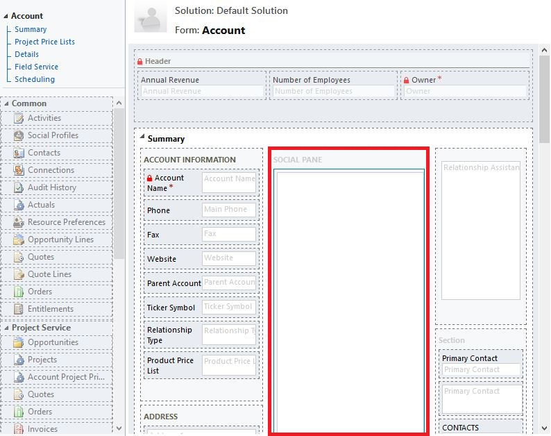
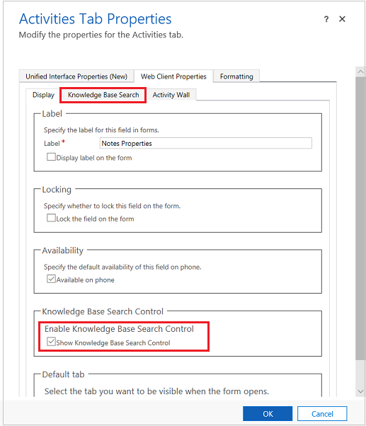

# Add the Knowledge Base Search control to forms

[!INCLUDE[cc-applies-to-update-9-0-0](../includes/cc_applies_to_update_9_0_0.md)]

Add a **Knowledge Base Search** control to [!INCLUDE[pn_dynamics_crm](../includes/pn-dynamics-crm.md)] forms to make it easy for users in your organization to find knowledge articles so they can answer common customer questions and resolve their issues right from the records, without having to switch to a different application.  
  
 You can configure the Knowledge Base Search control to:  
  
-   Show automatic suggestions in search results based on certain fields, or based on text analytics. The text analytics feature in only available for [!INCLUDE[pn_CRM_Online](../includes/pn-crm-online.md)].  
  
-   Define filters that users can use on search results.  
  
-   Choose from a set of predefined contextual actions the users can take on an article  
  
-   Add the control on any section of any entity that is enabled for knowledge management, including the Timeline, and also in custom entities. The control is added by default to the Case form of type **Main**. The control can be added to other Main forms also.  
  
    > [!NOTE]
    >  The Knowledge Base Search control can be used on Microsoft Dynamics 365 for tablets and phones. However, some actions like Pop Out, Email Link, and Email Content aren't supported.  
  
## Prerequisites  
 Before you add the Knowledge Base Search control, make sure to:  
  
-   Set up knowledge management in [!INCLUDE[pn_dynamics_crm](../includes/pn-dynamics-crm.md)]. [!INCLUDE[proc_more_information](../includes/proc-more-information.md)] [Set up knowledge management](../customer-service/set-up-knowledge-management.md)  
  
-   Select the entity you want to enable knowledge management on while setting up knowledge management.  

> [!NOTE]
> All customization tasks for the Customer Service Hub must be done in the Microsoft Dynamics 365 web application.
  
## Add the Knowledge Base Search control to Main forms  
  
1. [!INCLUDE[proc_permissions_system_admin_and_customizer](../includes/proc-permissions-system-admin-and-customizer.md)]  
  
2. [!INCLUDE[proc_settings_customization](../includes/proc-settings-customization.md)]  
  
3.  Choose **Customize the System**.  
  
4.  In the solution explorer, choose the entity you want to add the search control to, and under **Communication & Collaboration**, make sure the **Knowledge Management** check box is selected.  
  
    

    Select **Save** icon to save the setting for the entity.
  
5.  Expand the entity you’re adding the search control to, and select **Forms**.  
  
6.  Choose the entity form of type **Main**.  
  
    
  
7.  Select the area where you want to place the search control, and on the **Insert** tab, select **Knowledge Base Search**.  
  
     If the option to add Knowledge Base Search is disabled, it could be because knowledge management isn’t set up or isn’t enabled for the entity you’re adding the search control to.  
  
8.  In the **Set Properties** dialog box, on the **Display** tab, specify fields as given in the table below.
  
     

9. Choose **Set**.   
    
|Tab  |Property  |Description|
|---------|---------|---------|
|**Display**     |    Name     |       **Required**: The unique name for the tab that is used when referencing it in scripts. The name can contain only alphanumeric characters and underscores.   |
|    |  Label        |     **Required**: The localizable label for the tab visible to users.    |
|     |      Filter Search results by   |   In the Filter search results by drop-down list, select the set of article states that you want Dynamics 365 to search in:  <ul><li>If you’re using the native Dynamics 365 knowledge solution, you can choose from all draft articles, all approved articles, or all published articles.</li><li>If you’re using the Parature knowledgebase, you can choose from all articles, all draft articles, or all published articles.</li><li>To let user’s select a different filter on search results so they can see other types of articles, select the **Users can change filters** check box. Only when you enable this option will users see an option to change the filter in the Search pane in a record.</li></ul>  |
|     |  Set Default Language       |     If you want users to see search results only for articles in a specific language, in the Set Default Language drop-down list, select a language. By default, User’s Default Language is selected:  <ul><li>If you select User's Default Language, search results will be filtered based on the signed-in user's default language. </li> <li> If the language you select isn't an active language, the search results will be filtered using the signed in user's default language. </li> <li> If you select User's Default Language, and if the user's default language isn't an active language, the first active language available alphabetically is used as the default filter. </li> <li>	To let user’s select a different language filter on search results so they can see other articles in other languages, select the **Users can change Language Filter** check box. Only when you enable this option will users see an option to change the filter in the Search pane in a record. </li> </ul> |
|  |     Additional Options    |      If you want Dynamics 365 to suggest articles automatically based on the value in certain fields of the entity, click **Turn on automatic suggestions**.    If you’ve enabled automatic suggestion, select the field for the entity that Dynamics 365 will use to suggest article results in the Give knowledge base (KB) suggestions using drop-down list.     For example, if you’re adding the search control to the Account entity, and want Dynamics 365 to automatically show search results that contain the account name, select Account Name in the drop-down list.     If you are a Dynamics 365 (online) user and your organization is using native Dynamics 365 knowledge management as the knowledge solution, you can also use text analytics to show suggested articles. To do this, select Text Analytics from the Give knowledge base (KB) suggestions using drop-down list.     If you want the article rating to appear for each article in the search results, select the **Enable ratings on KB article search results based on the specified field** check box, and then select the field from the drop-down list. |
|   |  Select Primary customer       |     In Select primary customer, select who the email will be sent to when a customer service rep sends the article link in email. This drop-down list includes all fields for the entity that are enabled for email, for example account or contact. When the customer service rep chooses to send a link to the article to the customer, the To field is automatically populated with the value of the field that you select here.     |
|  |   Number of results      |      Select how many articles to show in the search results at first.    |
|    |  Actions       |   Select whether you want to make all the default actions available to CSRs or only selected ones. If you choose Show Selected Actions, select the actions you want to show.   The following actions are available: <ul> <li>**Link the KB article**. Let’s users link the knowledge article to the record they're viewing the knowledge article search results in. </li> <li>	**Unlink**. Let’s users unlink the knowledge article from the primary record. </li> <li> **Copy link**. Let’s users copy the external URL of the article, so they can share it over channels like chat or email. If you're using the native Dynamics 365 knowledge management solution, the Copy Link option is available only for published articles.</li> <li> **Link KB article and email link**. Let’s users associate an article with the primary record and share the article link with the customer through email. </li> <li>	Link article and email content. Let’s users associate an article with a case and share the article content through email. </li> <li>	Pop out. Let’s users open the article in a new window.  |
|**Formatting**     |      Layout   |    Choose the type of layout to determine the number of columns the control should occupy.     |
|    |    Row Layout  |  Select the maximum number of rows per page.|

  
## Add the search control to the activity wall of the Main form  
 By default, the Knowledge Base Search control is added to the social pane of the entity form.  
  
1.  Open the entity form you want to add the search control to.  
  
2.  In the form, in the **Social Pane** section, double-click the box.  
  
     

    The **Activities Tab Properties** panel is displayed.
  
3.  In the **Activities Tab Properties** panel, in the **Web Client Properties** > **Display** tab, select the **Show Knowledge Base Search Control** check box.  
  
     As soon as you select the check box, a new tab **Knowledge Base Search** is added to the **Activity Tab Properties** dialog box.  
  
    
  
4.  Select the **Knowledge Base Search** tab.  
  
5.  Follow steps 8 and 9 as described in the previous procedure [Add the Knowledge Base Search control to Main forms](#add-the-knowledge-base-search-control-to-main-forms).  
  
> [!TIP]
>  You can set up the Knowledge Base Search tab as the default tab so whenever users open the form, the Knowledge Base tab is open on the activity wall. To do this, in the **Activity Tab Properties** dialog box, go to **Web Client Properties** > **Display**, and in the **Default**, select **Knowledge Base Search** from the **Tab** drop-down list. 
  
  
### See also  
 [Set up knowledge management](../customer-service/set-up-knowledge-management.md)

 [Reduce call handling times with Knowledge articles in the Customer Service Hub](customer-service-hub-user-guide-knowledge-article.md)
