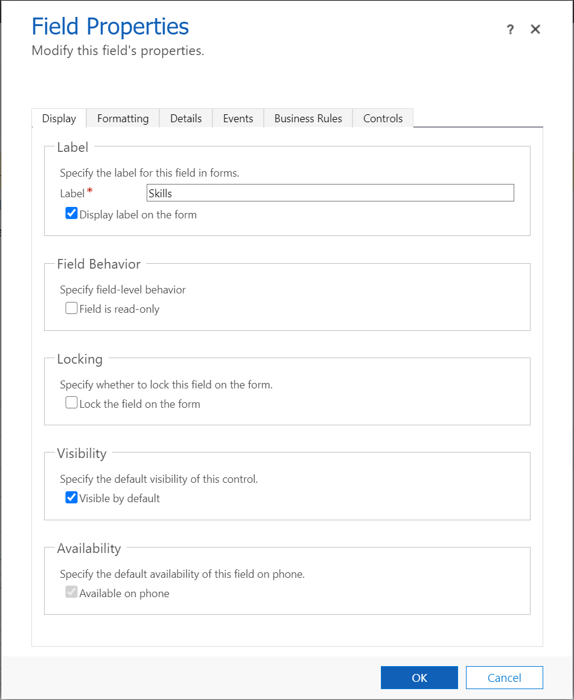
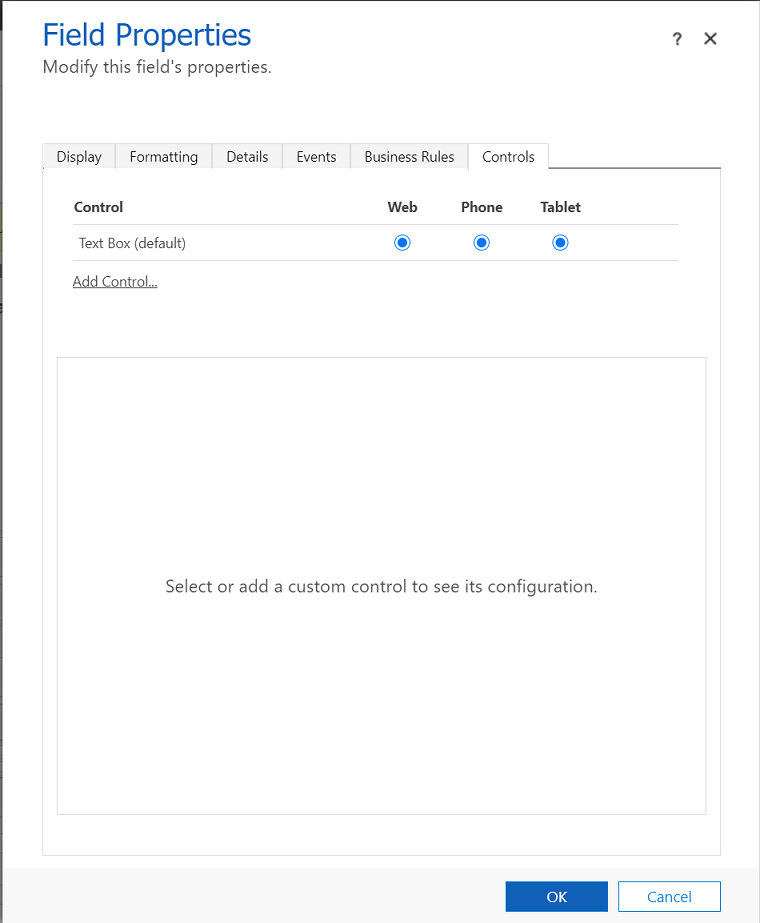
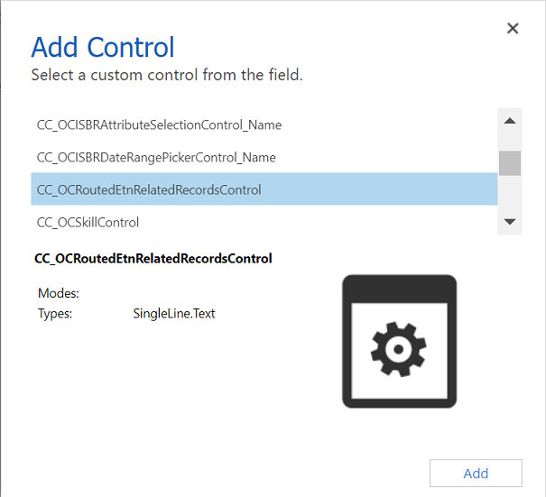

# Add a skill update control to view skills on any routed record

Dynamics 365 provides an out-of-the box control that you can embed in any of your forms to view the skills of any routed record. To be able to add the skill update control, you must have the System Administrator or System Customizer security role or equivalent permissions. To know more about your security role, see [View your user profile](../basics/view-your-user-profile.md).

Say you want to add the skill update control named **Skills** to a case form, then:

1. In Dynamics 365, go to **Advanced Settings** > **Customizations** > **Customize the System**.

2. In the navigation pane, under **Components**, select **Entities** > **Case** > **Forms**. 

3. From the **Forms** list that appears on the grid, select the form where you want to add the skill update control. In this example, we have selected the **Case for Interactive experience** form.

4. On the **Insert** tab, select **Section** > **One Column**. Drag and drop the section on the form.
 
5. From the **Field Explorer**, select an appropriate field (such as **Case Title**) to add onto the section you just created, and save the form.

6. Select the field you just added and click **Change Properties**.  In the **Field Properties** dialog box that appears, select the **Display** tab and enter a label name for the field, such as **Skills**.
    > [!div class=mx-imgBorder]
    > 

7. On the **Controls** tab, select **Add Controls**. 
    > 

  In the **Add Control** dialog box that appears, select the **CC_OCRoutedEtnRelatedRecordsControl** custom control from the drop-down list and click **OK**.
    > 

9. Save and publish the form.
   
> [!NOTE]
> To be able to add the skill update form in Customer Service workspace or Omnichannel admin center, you can add the skill update control to the Case for Multisession experience form.

### See also

[Overview of unified routing](overview-unified-routing.md)  
[Routing and assignment rules](routing-workstream-queues.md)  
[Set up record routing](set-up-record-routing.md)  
[Set up unified routing](set-up-routing-process.md)  