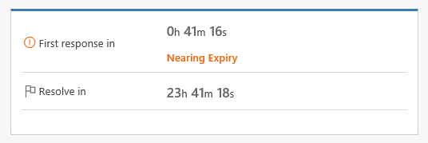
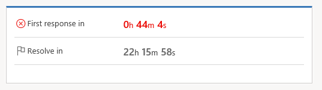
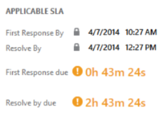
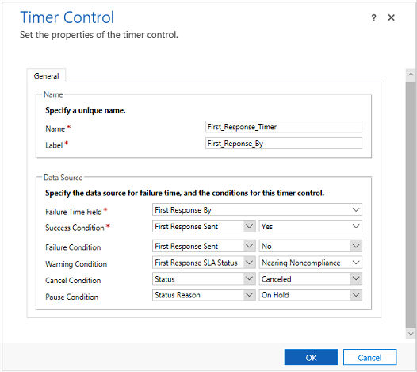

# Add a timer control to the Case form to track time against an SLA

Add a timer control to an entity form to help users gauge the amount of time they have to complete a task—typically as specified in a service level agreement (SLA). The timer control initially displays a count-down timer to show the time remaining to complete the task.  
  
 On a case form, the timer control can show any of the following, depending on the actions of the customer service representative (CSR) and what you specify when you set up the timer control:  
  
-   If the CSR completes the task within the time remaining, the control shows the word **Succeeded**.  
  
-   If the CSR doesn’t complete the task within the time remaining, the control shows the word **Expired**.  
  
-   As the timer counts down, the color changes to yellow as the time remaining nears non-compliance. If the time remaining expires, the timer shows the word **Expired**. Then the timer color changes to red and the timer starts counting up to show the elapsed time since the task should have been completed. This behavior is optional.  
  
-   If a condition causes the milestone to be canceled, the control shows the word **Canceled**. This behavior is optional.  
  
-   If either of the required fields in the **Timer Control** dialog box do not have a value in the record, the control shows the words **Not Set**.  
  
    

    
  
> [!IMPORTANT]
> - The instructions in this topic apply if you're adding a timer to track time for the date/time field of any entity, or for tracking time against standard SLAs on case records. If you are using enhanced SLAs and want to add a timer to your forms, see [Add a timer to forms to track time against enhanced SLAs](../customer-service/add-timer-forms-track-time-against-enhanced-sla.md).  
> - The timer control is designed to visually show the current state or show the remaining or elapsed time relative to the date and time as specified in the **Failure Time** field of the SLA KPI Instance. It doesn’t calculate or keep track of the time for which the Pause condition is true.  
 
> [!NOTE]
> The above screens showcase the timer control on a Unified interface based app. On a webclient app, the timer control is displayed as follows:    

For more information, see: [Track SLA details with Timer Control](customer-service-hub-user-guide-case-sla.md#track-sla-details-with-timer-control)

## Add a timer control to the Case form  
  
1. [!INCLUDE[proc_permissions_system_admin_and_customizer](../includes/proc-permissions-system-admin-and-customizer.md)]  
  
    #### Check your security role  
  
   - [!INCLUDE[proc_follow_steps_in_link](../includes/proc-follow-steps-in-link.md)]  
  
2. [!INCLUDE[proc_settings_customization](../includes/proc-settings-customization.md)]  
  
3. Select **Customize the System**.  
  
4. In the solution explorer, in the left nav pane, expand **Entities**, expand the **Case** entity, and select **Forms**.
  
    To add the timer to the form so the customer service representatives can use it in the Customer Service Hub, open the case form of type **Main**.  
  
5. Select on the form where you want to place the control. You can add it anywhere except the form header or footer.  
  
6. On the **Insert** tab, in the **Control** group, select **Timer**.  

   
  
7. In the **Timer Control** dialog box:  
  
   1. In the **General** section, type a name and label for the control.  
  
   2. Under **Data Source**, next to **Failure Time Field**, select the date-time field that represents the time when a milestone should be completed. For example, select the **First Response By** field.  
  
   3. Next to **Success Condition**, select a field to use to evaluate the success of the milestone, and then select the condition that indicates success. For example, select the **First Response Sent** field, and then select **Yes** to indicate the success criteria of the First Response metric. This setting is required.  
  
   4. Next to **Failure Condition**, select a field to use to evaluate the failure of the milestone, and then select the condition that indicates the failure. For example, in the first drop-down list, select **IsEscalated**. In the second drop-down list, select **Yes**.  
  
   5. Next to **Warning Condition**, enter the condition that will cause the timer control to display a warning when the time is about to expire. For example, in the first list next to **Warning Condition**, select **First Response SLA Status**. In the list to the right, select **Nearing Noncompliance**. This setting is optional.  
  
   6. Next to **Cancel Condition**, select a field to evaluate whether the achievement of the milestone should be canceled. Then choose the option that indicates the milestone is canceled. This setting is optional.  
  
   7. Next to **Pause Condition**, enter the condition that will cause the timer to pause the count down. For example, you want the timer to pause the count down every time the case status is set to “On-hold”. For this, in the first drop-down list, select **Status**. In the second drop-down list, select **On-hold**.  
  
      
  
8. Select **OK** to add the control to the form.  
  
   **Notes**  
  
- The timer control refreshes on the **OnChange** form event, and also when the form is loaded.  
  
- You can add a timer control to a form based on any record type (entity), including custom record types.  
  
- You can add multiple timer controls for different key performance indicators (KPIs).  
  
- You can add a timer control to any Main or Main - Interactive experience form of other entities, but timer controls are not displayed in [!INCLUDE[pn_moca_full](../includes/pn-moca-full.md)].  
  
### See also  

[Add a timer in forms to track time against enhanced SLAs](add-timer-forms-track-time-against-enhanced-sla.md)

[Track SLA details with Timer Control](customer-service-hub-user-guide-case-sla.md#track-sla-details-with-timer-control)

[!INCLUDE[footer-include](../includes/footer-banner.md)]