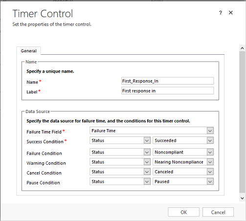

# Add a timer in forms to track time against enhanced SLAs

A timer helps users gauge the amount of time they have to complete a key performance indicator (KPI) that is typically associated with a service level agreement (SLA). If your organization uses enhanced SLAs, you must use quick view forms to add a timer to track time against such SLAs.  
  
 The timer control initially displays a count-down timer to show the time remaining to complete the KPI.  
  
> [!NOTE]
> - A timer control can be used independent of SLAs, too.  
> - The timer control is designed to visually show the current state or show the remaining or elapsed time relative to the date and time specified in the **Failure Time** field of the SLA KPI instance. It doesn’t calculate or keep track of the time for which the Pause condition is true.  
  
 The timer control can show any of the following, depending on the actions of the user and what you as a system administrator or customizer specify when you set up the timer control:  
  
-   If the user completes the task within the time remaining, the control shows the word **Succeeded**.  
  
-   If the user doesn’t complete the task within the time remaining, the control shows the word **Expired**.  
  
-   As the timer counts down, the color changes to yellow as the time remaining nears non-compliance. If the time remaining expires, the timer shows the word **Expired**. Then the timer color changes to red and the timer starts counting up to show the elapsed time since the task should have been completed.  
  
-   If a condition causes the SLA KPI to pause, the control shows the word **Paused**.  
  
-   If a condition causes the SLA KPI to be canceled, the control shows the word **Canceled**. This behavior is optional.  
  
-   If either of the required fields in the **Timer Control** dialog box do not have a value in the record, the control shows the words **Not Set**.  
  
To add a timer to track time against enhanced SLAs:  
  
1.  Ensure the entity is enabled for SLA.  
  
2.  Create SLA KPI fields for the entity for which you want to create the SLA.  
  
3.  Create quick view forms for each SLA KPI instance field that you've created.  
  
4.  Create an SLA.  
  
5.  Add the quick view forms that you created to the primary entity form  
  
## Enable an entity for SLA  

 To add a timer for an enhanced SLA to an entity form, that entity must be enabled for SLA. To learn more, see [Enable entities for service level agreements](../customer-service/enable-entities-service-level-agreements.md).  
  
## Create SLA KPI fields  
  
1. [!INCLUDE[proc_permissions_system_admin](../includes/proc-permissions-system-admin.md)]  
  
    #### Check your security role  
  
   - [!INCLUDE[proc_follow_steps_in_link](../includes/proc-follow-steps-in-link.md)]  
  
   - [!INCLUDE[proc_dont_have_correct_permissions](../includes/proc-dont-have-correct-permissions.md)]  
  
2. [!INCLUDE[proc_settings_customization](../includes/proc-settings-customization.md)]  
  
3. Choose **Customize the System**.  
  
4. Under **Components**, expand **Entities**, and then expand the entity you want.  
  
5. Click **Fields**.  
  
6. On the Actions toolbar, click **New**, and then enter a **Display Name** to generate the **Name**.  
  
7. In the **Data Type** drop-down list, select **Lookup**.  
  
8. In the **Target Record Type** drop-down list, select a SLA KPI Instance.  
  
    If you create a lookup field in an entity form, the relationship is automatically generated. A lookup field is created as a relationship field.  
  
9. Click **Save and Close** to close the form editor.  
  
10. Publish your customization.  
  
    -   To publish customizations for just one entity, under **Components**, click **Entities**. Then, on the Actions toolbar, click **Publish**.  
  
    -   To publish all customizations you have made to any entities or components, on the Actions toolbar, click **Publish All Customizations** .  
  
## Create quick view forms for the SLA KPI Instance entity

 Quick view forms help you show data of a related entity in the primary entity form. For enhanced SLAs, all the SLA-related states and times are stored in the SLA KPI instance entity. To show this data in the primary entity like a lead or an opportunity form, you must create a quick view form for each SLA KPI field that you've created for the primary entity. Add a timer to the quick view form so it shows the count down for the SLA.  
  
#### Create a quick view form  
  
1. [!INCLUDE[proc_settings_customization](../includes/proc-settings-customization.md)]  
  
2. Choose **Customizations**, then choose **Customize the System**.  
  
3. In the solutions explorer, expand the SLA KPI Instance entity, and then select **Forms**.  
  
4. Select **New** > **Quick View Form** from the tool bar.  
  
5. In the **Form** group, click **Form Properties**, and then specify a form name.  
  
6. Double-click the section, type a meaningful name for the section, and then click **OK**.  
  
7. Select the section, and on the **Insert** tab, click **Timer**.  
  
8. Specify a name and label for the timer, and the data source for the failure time.  
  
    Following is an example of the properties you'd set for a timer for a Case entity.  
  
      
  
   > [!NOTE]
   >  Typically, for enhanced SLAs, the timer control is set up using the SLA KPI Instance status field values only.  
  
9. When you are finished, click **OK**.  
  
10. Publish the customizations .  
  
## Create an SLA

 Create an SLA for the entity you want to track. For example, you may want to create track the time taken by sales person to take action on a lead, like qualifying or disqualifying a lead. For this, create an SLA for the lead entity. For more information on creating an SLA, see [Define service level agreements](../customer-service/define-service-level-agreements.md)  
  
## Add the quick view form to the primary entity form to show the timer

 You can add the quick view forms you created earlier as quick view controls in the primary entity forms.  
  
1. [!INCLUDE[proc_permissions_system_admin_and_customizer](../includes/proc-permissions-system-admin-and-customizer.md)]  
  
    #### Check your security role  
  
   - [!INCLUDE[proc_follow_steps_in_link](../includes/proc-follow-steps-in-link.md)]  
  
2. [!INCLUDE[proc_settings_customization](../includes/proc-settings-customization.md)]  
  
3. Click **Customize the System**. In the solution explorer, in the left nav pane, expand **Entities**, expand the entity you want to add the quick view form to, and then click **Forms**.  
  
4. To add the timer to use in the Dynamics 365 Customer Service app, open the form of type **Main**.  
  
    -OR-  
  
    To add the timer to the interactive experience form so users can use it in the interactive service hub, open the form of type **Main – Interactive experience**  
  
5. Add a section to insert the quick view control. On  the **Insert** tab, in the **Section** group, click **Section**, and then click **One Column**.   Double-click the section to specify the section properties. [!INCLUDE[proc_more_information](../includes/proc-more-information.md)] [Section properties](../customerengagement/on-premises/customize/section-properties-legacy.md).  
  
   > [!NOTE]
   >  You can't add an SLA timer to the reference panel section of the Main - Interactive experience form.  
  
6. Select the section that you just added, and on the **Insert** tab, in the **Control** group, click **Quick View Form** .  
  
7. Specify a name and label for the quick view control. In the **Lookup Field** drop-down list, select the lookup field that you created to point to the SLA KPI Instance entity.  
  
8. The Related Entity drop-down list will be automatically set to "SLA KPI Instance".  
  
9. In the **Quick View Form** drop-down list, select the quick view form you created in the SLA KPI Instance entity.  
  
10. Click **OK** to close the **Quick View Control Properties** dialog box.  
  
    You must save and publish the Main form before the quick view control changes will be visible.  
  
### See also  
 [Add a timer control to the Case form to track time against an SLA](../customer-service/add-timer-control-case-form-track-time-against-sla.md)   

 

[!INCLUDE[footer-include](../includes/footer-banner.md)]