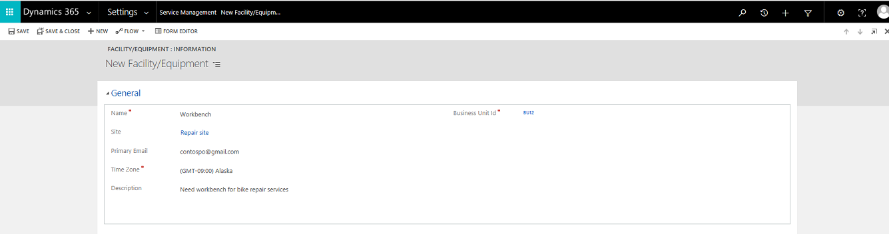

# Add facilities and equipment for service scheduling (Customer Service app)

Facilities and equipment are resources you’d use to perform services for your customers. Facilities can be physical spaces like service bays or conference rooms and equipment could be tools or other assets. Add these resources to Dynamics 365 Customer Service to ensure optimal services to your customers.  

Service Scheduling is available in the Customer Service Hub site map. We recommend that you create facilities and equipments using the new experience. Learn more in [Add facilities and equipments to schedule service](add-facilities-equipment-ss-csh.md).
  
## Add a facility or equipment  
  
1. [!INCLUDE[proc_permissions_system_admin](../../includes/proc-permissions-system-admin.md)]  
  
    #### Check your security role  
  
    - [!INCLUDE[proc_follow_steps_in_link](../../includes/proc-follow-steps-in-link.md)]  
  
    - [!INCLUDE[proc_dont_have_correct_permissions](../../includes/proc-dont-have-correct-permissions.md)]  
  
2. [!INCLUDE[proc_settings_service_management](../../includes/proc-settings-service-management.md)]  
  
     -OR-  
  
   [!INCLUDE[proc_settings_bus_management](../../includes/proc-settings-bus-management.md)]
  
3.  Select **Facilities/Equipment**.  
  
4.  On the command bar, select **New**.  
  
5.  Provide the information as required:  
  
    - **Name**. Enter the name of the facility or equipment you want to add for service scheduling.  
  
    - **Business Unit**. Dynamics 365 Customer Service enters the business unit automatically. To select a different business unit, select the **Lookup** button  and then select from the list.  
  
    - **Site**. Select the location where the facility or equipment is located.  
  
        > [!TIP]
        >  Make sure the site and the customer are in the same location. Resources for a given service activity should also be located at the same site.  
  
    - **Primary Email**. Enter the email address of the site manager or equipment manager. If there are any updates or cancellations related to the schedule, facilities, or equipment, notifications are sent to this email address.  
  
    - **Time Zone**. Select the appropriate time zone to determine availability for the facility or equipment. By default, this is set to the time zone you’ve selected in the **General** tab of the **Set Personal Options** dialog. Learn more in [Set personal options](../../customerengagement/on-premises/basics/set-personal-options.md).  
  
    - **Description**. Add details about the facility or equipment, such as the numbers, size, make, or model.  
  
6.  When you’re done, select **Save** or **Save and Close**.  

    
  
### Related information  
 [Basics of service and service scheduling](basics-service-service-scheduling.md)

[!INCLUDE[footer-include](../../includes/footer-banner.md)]
