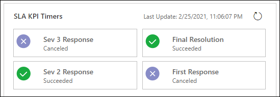

# Add a timer control for SLA-enabled tables

Add a timer control to a service-level agreement (SLA) enabled table form to help users gauge the amount of time they have to complete a task as specified in the SLA. The timer control displays countdown timers that show the current status and time remaining for the configured SLA KPIs.

## Add a SLA timer to a SLA-enabled table

After you configure the SLA KPIs, SLAs, and SLA items for a table, add the SLA Timer control to display the SLA KPIs that you configured for the table. You can customize the views to filter the KPIs and display only the relevant KPIs to customer service representatives (service representatives). Some of the KPIs that service representatives can see include the different stages that KPIs go through.

For information on how the SLA KPIs are displayed at runtime when service representatives view the case to work on in Customer Service Hub, see [Timer for SLA-enabled tables](../use/customer-service-hub-user-guide-case-sla.md#timer-control-for-sla-enabled-entities).

> [!NOTE]
> - The SLA Timer control displays SLA KPIs that are created in Unified Interface only.
> - The SLA Timer control displays  **No Applicable SLA** when there aren't any applicable SLAs.

A sample runtime view of the SLA Timer is as follows.

However, SLA KPI Instances don't reach a **Nearing non-compliance** or **Non-complaint** state if the **SLAWarningAndExpiryMonitoringFlow** isn't enabled and the SLA KPI Instance timer continues to run. The following warning message is displayed on the SLA Timers:
"The SLA instances might be incorrect because workflow <*workflow ID*> is turned off. Contact your admin to turn on the workflow." The workflow ID varies from system to system as it corresponds to **SLAWarningAndExpiryMonitoringFlow**. For more information on how to enable **SLAWarningAndExpiryMonitoringFlow**, see [ Warning message appears on slakpiinstances](../troubleshoot-sla-issues.md#warning-message-appears-on-slakpiinstances).

For more information on why an SLA KPI Instance doesn't reach **Nearing Non-compliance** or **Non-compliant** state and how you can resolve it, see [SLA KPI Instance doesn't reach Nearing Non-compliance or Non-compliant state, and the SLA KPI Instance timer continues to run](../troubleshoot-sla-issues.md#sla-kpi-instance-doesnt-reach-nearing-non-compliance-or-non-compliant-state-and-the-sla-kpi-instance-timer-continues-to-run).

To add the SLA timer control for the Case table, follow these steps:

1. In your Power Apps environment, add a **SLA Timer** subgrid for the **Case** table, on the **Case for interactive experience** form. Learn how to [add and configure a subgrid component on a form](/power-apps/maker/model-driven-apps/form-designer-add-configure-subgrid).
1. On the subgrid **Properties**, do the following:
   1. For **Table**, select **SLA KPI Instances (Regarding)**.
   1. For **Default view**, select **All SLA KPI Instances**.
   1. For **Components**, select add and on the **Add component** dialog, select **SLA Timer**.
   1. On the **Add SLA Timer** dialog, **Update frequency** section, do the following:
      - **Value**: Enter a value for the timer refresh interval. For optimal performance, choose an interval that isn't too short. The default interval is 30 minutes.
      - Set the **Turn on negative countdown** value to **Yes**.
      - For **Customized Labels**, select the **Bind to table column** checkbox.
      - For **Table column**, select **Resolution (Multiline Text)** and then select **Done**.
1. Save and publish the solution.

   :::image type="content" source="../media/sla-timer-properties.png" alt-text="Screenshot SLA timer properties":::

### Related information  

[Configure service level agreements](define-service-level-agreements.md)

[Set and enable languages](../../customerengagement/on-premises/admin/enable-languages.md#set-and-enable-languages)

[Add a timer in forms to track time against enhanced SLAs](add-timer-forms-track-time-against-enhanced-sla.md)

[Understand SLA details with Timer control](../use/customer-service-hub-user-guide-case-sla.md#understand-sla-details-with-timer-control)

[!INCLUDE[footer-include](../../includes/footer-banner.md)]
