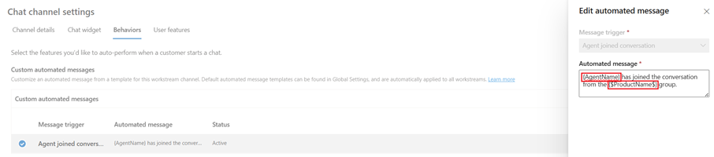

# Configure automated messages

[!INCLUDE[cc-feature-availability-embedded-yes](../../includes/cc-feature-availability-embedded-yes.md)]

[!INCLUDE[cc-rebrand-bot-agent](../../includes/cc-rebrand-bot-agent.md)]

You can configure the system to send automated messages through a channel, such as chat, voice, SMS, or social channels. The **Automated messages** tab in each channel instance enables you to create channel-specific and locale-specific text. You can customize, deactivate, and activate messages specific to customer and customer service representative (service representative or representative) at the channel level.
As an administrator, you can also overwrite or deactivate the preconfigured, out-of-the-box automated messages for any channel instance. The preconfigured automated message triggers are listed in [this section](#preconfigured-automated-message-triggers).

## Display a list of all automated messages

You can view a list of all representative and customer-facing automated messages in your contact center environment.

> [!NOTE]
> Automated messages aren't shown in the customer chat transcript.

1. In the site map of Copilot Service admin center, select **Customer Settings** in **Customer support**. The **Customer settings** page appears.
1. In the **Automated messages** section, select **Manage**. The **Automated messages** page is displayed.

    > [!div class=mx-imgBorder]
    > 

1. To edit the language code and text, select one or more of the records. If you want to deactivate the messages, select the **Deactivate** button. If overflow conditions are configured, the default automated message is played for the overflow action if you deactivate the message that's configured for the overflow condition.

## Customize automated messages at the channel level

You can customize messages across instances within a channel. For example, you can apply a change to all Facebook accounts or all SMS numbers.

1. Select a message on the **Automated messages** page, and then select **Edit**.

2. On the **General** tab, edit the **Localized text** field, and then select **Save**.

    The message field supports the following slugs and context variables.
    
    | **Slug** | **Description** |
    |----------|-----------------|
    |{AgentName} | The full name of the service representative who is assigned to the conversation. |
    |{QueueName} | The name of the queue. |

    > [!div class=mx-imgBorder]
    > 

The message field also supports context variables as placeholders, for which the system replaces the value of context variables at runtime. The syntax to insert a context variable is {$ContextVariableName$}, as shown in the following example.

 > [!div class=mx-imgBorder]
 > 

> [!NOTE]
> Context variables in the message field aren't supported for the voice channel.

Keep in mind the following rules when using context variables:

- You must enclose context variables in curly braces with dollar signs. For example: {$VariableName$}
- The context variable name you use must match the variable name defined in the context variables exactly, including capitalization.
- Context variables can contain alphanumeric characters and underscores only. For example: {$User_ID$}. Except for curly braces and dollar signs, all other special characters aren't allowed.
- Context variables can't contain spaces in their names. For example, {$User Name$} is invalid. Use {$UserName$} instead.
- Context variables can't be left empty. For example, {$ $} is invalid.
- If the matching context variable isn't found, the slug pattern is replaced with an empty string.

Learn more about context variables in [Manage context variables](manage-context-variables.md).

## Customize automated messages at the channel instance level

You can customize automated messages at the channel instance level. For example, you can apply a change to a specific Facebook account or a specific SMS number. If you don't create customized automated messages at the channel instance level, each instance inherits the channel-level settings.

> [!IMPORTANT]
> If you create customized automated messages at the channel instance level, then the channel-level settings are overwritten.

### Add custom automated messages

Complete the following steps for the channel in which you want to create custom automated messages in the Copilot Service admin center app:

1. Go to the workstream, and then edit the channel instance.
2. On the **Behaviors** page, select **Add message** in the **Custom automated messages** area.
3. On the **Add automated message** pane, select a trigger from the **Select a message trigger** dropdown list.
4. In the **Automated message** box, type the message that should be displayed.
5. Select **Confirm**.
6. Repeat steps 3 through 5 to create multiple messages.
7. Save the settings.

## Preconfigured automated message triggers

| **Message trigger** | **Definition** | **When to trigger** | Message recipient
|-----------------|------------|-----------------|-------------------|
| Greeting Message for Async Channels and Voice | The automated message played for the customer as soon as the call is connected.  **Note**  If the AI agent is enabled, ensure that the automated greeting message is different from the agent message. | You can set it up to be played as the first message that the customer should hear when they call the digital contact center. | Customer |
| Agent assigned to a conversation | Message displayed to the customer when the representative is assigned to the conversation. | The representative is assigned to the conversation. | Customer |
| Agent couldn't be assigned to conversation | Message displayed to the customer when the representative assignment fails. | Work distribution fails or when routing is unable to add the representative to the chat due to system failure. For example, no representatives are available in the queue, or the default queue isn't found.  **Note**  This trigger isn't applicable to a scenario when a matching representative can't be identified based on the assignment configuration. |Customer |
| Agent disconnected from conversation | Message displayed to the customer when the representative gets disconnected. | The representative gets disconnected due to browser tab closure, browser closure, offline presence, or network issue.  | Customer |
| Agent ended conversation | Message displayed to the customer when the representative ends the conversation. | The representative selects the End button. | Customer |
| Agent joined conversation | Message displayed to the customer when the representative joins a conversation. | The representative accepts the notification. | Customer |
| Agent joined customer conversation | Message displayed to the customer when the representative joins a customer conversation. | The representative joins a customer conversation.  | Customer |
| Agent left customer conversation | Message displayed to the customer when the representative leaves a customer conversation. | The representative leaves a customer conversation. | Customer |
| Average wait time for customers: Hours   (applies to live chat and voice channels only) | Message displayed to the customer with the average wait time displayed in hours.  |  The customer is waiting in queue. | Customer |
| Average wait time for customers: Hours and minutes   (applies to live chat and voice channels only) | Message displayed when the customer is waiting in queue with average wait time being displayed in both minutes and hours. | The customer is waiting in queue. | Customer |
| Average wait time for customers: Minutes   (applies to live chat and voice channels only)  | Message displayed to the customer with the average wait time displayed in minutes.  | The customer is waiting in queue. | Customer |
| Consult accepted  | Message displayed to the customer when another representative is consulted successfully.  | Another representative accepts the consult request. | Customer |
| Consult session ended  | Message displayed to the customer when the consulted representative ends the session. | The consult representative closes the session. | Customer |
| Customer is next in line  |   Message displayed when the customer is next in line in the queue.  |  The customer is next in line in the queue. | Customer |
| Customer's position in queue |  Message displayed when the customer is waiting in queue at the second position or beyond. | When the customer is waiting in queue at the second position or beyond. | Customer |
| Customer disconnected from conversation | Message displayed to the representative when the customer gets disconnected. | The customer explicitly closes the browser tab or gets disconnected because of network issue.  | Representative |
| Holiday message to customer | Message displayed to the customer on holidays. | The customer initiates a conversation on holidays set up for the Live Chat, channel, or queue.  | Customer |
| Out of operating hour message to customer | Message displayed to the customer outside of the business hours.  | The customer initiates a conversation outside of business hours set up for the Live Chat, channel, or queue. | Customer |
| Session ended   | Message displayed to the customer when the representative ends the conversation and closes the session.| The representative ends the conversation and closes the session. | Customer |
| Transfer to agent accepted  | Message displayed to the customer when the conversation is transferred successfully. | Another representative accepts the transfer request.| Customer |
|Offer customer callback |The callback message played for the customer when the wait times are longer than expected.| The customer calls and wait time is long.| Customer |
| Customer callback response | When the customer presses 1 on the call menu, a confirmation message is played to indicate the customer choice.| Customer presses 1 on the call menu. The response to offer customer callback message is played.| Customer |
| Queue overflow conditions where the corresponding action is direct callback| The system presents an automated message to the customer that asks if they prefer a callback by the representative instead of waiting in the queue.| The first automated message plays after the customer waits for 30 seconds and then repeats after every 120 seconds until the customer selects the option, ends the call, or is connected to a representative.| Customer |
| Prompt and transfer to external number| The voice agent plays the automated message, "please hold while we transfer your call to an agent", and then transfers the call to a specified external number. You can customize this message. |You can set it up to trigger a fallback message whenever the Copilot agent becomes unresponsive at any point during the customer’s call.| Customer |
| Prompt and escalate | The voice agent plays the automated message, "please hold while we transfer your call to an agent", and then transfers the call to a customer service representative. You can customize this message.  |You can set it up to trigger a fallback message whenever the Copilot agent becomes unresponsive at any point during the customer’s call.| Customer |
| Prompt and hang up | The voice agent plays the automated message,"we're currently unable to process your call. We apologize for the inconvenience. Please try calling us again later", and then ends the call. You can customize this message. |You can set it up to trigger a fallback message whenever the Copilot agent becomes unresponsive at any point during the customer’s call.| Customer |

> [!NOTE]
> The supported locale is mentioned in the out-of-the-box system messages that you can see in Copilot Service admin center.
> If post-call survey is enabled for the workstream, the system doesn't play the agent disconnect message to the customer. 

## Best practices for using automated messages

Use the following best practices when you configure automated messages for the voice channel:

- Make sure that you configure concise messages when you use automated and custom messages because lengthy messages might mean that representatives take longer to connect with customers.

- Consider configuring **Greeting Message for Async Channels and Voice** instead of **Agent assigned to a conversation**.

- If you configured both **Agent assigned to a conversation** and **Greeting Message for Async Channels and Voice**, consider configuring **Greeting Message for Async Channels and Voice** to avoid the accumulation of messages in the queue.

- Disable messages that announce the average wait times, unless your business requires that customers know this information. 
 
## Next steps

[Add a chat widget](add-chat-widget.md)  

### Related information
[Channels](../use/channels.md)  

[!INCLUDE[footer-include](../../includes/footer-banner.md)]
