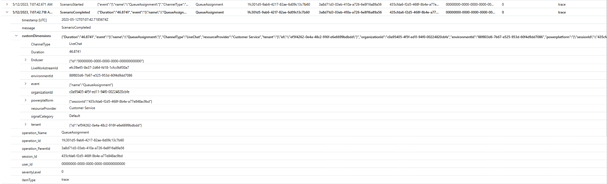

# Configure conversation diagnostics

Conversation diagnostics logs each of the conversation lifecycle events, giving you a greater visibility into conversations-based operational telemetry of your organization.  This helps your support team to proactively monitor the system and allows developers to easily identify, diagnose, and fix problematic conversations, or seek swift support.

Connect your Dynamics 365 Customer Service environment to an Azure Application Insights instance to collect and store conversation logs. For more information about Application Insights features and how they can be used to monitor your telemetry and diagnose failures, see [Application Insights Overview dashboard](/azure/azure-monitor/app/overview-dashboard) and [Diagnose failures using the Azure portal](/azure/azure-monitor/app/asp-net-exceptions#diagnose-failures-using-the-azure-portal).

You can then use the conversation lifecycle events data from Customer Service in Application Insights to monitor system health, export, and combine it with additional data sets to build custom dashboards for your business needs.

> [!NOTE]
> - Export of Power Automate and Dynamics 365 Customer Service data is not available in sovereign clouds, such as Government Community Cloud (GCC), Government Community Cloud - High (GCC High), and Department of Defense (DoD).
> - The feature is available in managed environments only.

## Prerequisites

The user must be a Power Platform administrator or System Administrator.

## Pricing

The conversation diagnostics data is stored in Azure Application Insights database. Azure Application Insights is an extension of Azure Monitor and charges for data ingested. The two log ingestion plans are Basic and Analytic logs. Learn more about the pricing for your business requirements at [Azure Monitor pricing](https://azure.microsoft.com/en-us/pricing/details/monitor/#pricing).

he following table lists the analysis of the average data consumption in Application Insights - 
 
| Data Consumption                                                                 | Size in kilobytes (average**1**) |
|----------------------------------------------------------------------------------|------------------------------|
| Per routed work item (Call/Conversation/Record) with one classification, one route-to-queue (RTQ) ruleset and one assignment ruleset 7  |
| Per ruleset with a single rule in it                                             | 2                            |
| Per new rule in a ruleset                                                        | 1                            |
 
**1** The average values can vary based on factors, like the number of rules, conditions defined within a ruleset, and size of the conditions (number of characters).
 
Let's take an example in which each routing stage has a single ruleset with a couple of rules and moderately complex rule conditions. If you route 500 work items per day, it consumes approximately 4.88 MB of data. For information about routing stages, Understand routing stages.

## Set up a connection with Azure Application Insights

Before you perform a data export, create a connection between your Customer Service instance and Azure Application Insights in Power Platform admin center. You can create only one data export configuration from Customer Service to Application Insights per environment. Learn more at [How to enable data export](/power-platform/admin/conversation-diagnostics-application-insights#set-up-a-connection-with-azure-application-insights).

## Access and use the conversation information in Application Insights

After you've configured the data export setup, conversation lifecycle information for live chat, digital messaging, voice, and custom channel conversations is available in the Application Insights **Traces** table.

## Conversation scenarios

The **Traces** table contains data about the following conversation scenarios.

- **Category**: Conversation initiation 
  - **Scenario**: Conversation is initialized 
  - **Scenario**: Customer identified

- **Category**: Virtual agent interaction
  - **Scenario**: Virtual agent assigned
  - **Scenario**: Conversation ended by virtual assistant
  - **Scenario**: Virtual assistant escalation to human agent from virtual agent

- **Category**:  Routing
  - **Scenario**: Demand Classification
  - **Scenario**: Queue assignment

- **Category**:  Human agent interaction
  - **Scenario**: Agent accepted
  - **Scenario**: Agent rejected
  - **Scenario**: Acceptance request timed out
  - **Scenario**: Agent rejoined
  - **Scenario**: Agent self-assignment

- **Category**: Conversation completion
  - **Scenario**: Conversation ended by customer
  - **Scenario**: Conversation ended by agent
  - **Scenario**: Agent session closed
  - **Scenario**: Conversation abandoned by customer/customer disconnect
  - **Scenario**: Conversation force close by supervisor
  - **Scenario**: Conversation closed
 
### Conversation scenarios metadata

The conversation scenarios in the **Traces** table contains has the following metadata.

-	Org ID
- LiveWorkItem ID
-	Channel Type
-	Scenario Status (Started/Failed/Completed)
-	Timestamp
-	Duration (for completed scenarios)
-	Participant Type (human agent or virtual agent)
-	Active Directory User ID (where applicable)

## Understand conversation logs metadata

A description of the attributes displayed in Application Insights is as follows:

- **Timestamp \[UTC\]**: The date and time at which the event is logged. 
- **Message**: Indicates the scenario status the conversation lifecycle event. This can be Started, Failed, or Completed.
    -   **Started**: Indicates that the conversation scenario started.
    -   **Completed**: Indicates that the conversation scenario was successfully completed.
    -   **Failed**: Indicates that the conversation scenario failed.
- **customDimensions**: Contains the following metadata required for detailed debugging:
    - **organizationId**: The unique identifier of the organization.
    - **LiveWorkItemID**: The unique identifier of the conversation to which the message must be sent to.
    - **Channel Type**: Indicates the channel through which the customer is sending messages.
    - **Duration**: The time taken for the scenario to complete.
    - **Participant Type**: Indicates if the conversation is assigned to a human agent or a bot.
- **Operation\_name**: Indicates the conversation lifecycle event.
- **Operation\_id**: The unique identifier of the root operation. This is the transaction ID of the conversation from Dynamics 365 Customer Service.
- **Operation\_parentid**: The conversation ID of the conversation.
- **Session\_id**: The instance of the user's interaction with the app.
- **User\_id**: Represents the user of the application. This field is populated with the Active Directory user ID whenever the scenario includes human agents or bots. For all other scenarios, 0 is displayed.
- **Severitylevel**: The trace severity level. This is set to 0.
- **itemType**: The table that the record was retrieved from. This is always set to Trace.

For example, in a scenario where a live chat conversation is assigned to a queue, the Traces table displays the following metadata:

-   The **ScenarioStarted** message, with the **Operation\_name**, QueueAssignment, and the timestamp at which the scenario started.
-   The **ScenarioCompleted** message, with the duration the application took for the scenario to be successfully completed as the scenario is a success, and the conversation is assigned to a queue.  
      
    

## Access conversation logs

Do the steps in [Access conversation logs from Application Insights](/power-platform/admin/conversation-diagnostics-application-insights#access-conversation-logs-from-application-insights) to view the logs for a conversation.

## Unified routing scenarios

The following scenarios are covered that start from when a work item is created to how it's routed to a queue and agent.

| Business question                                                                          | Category               |
|--------------------------------------------------------------------------------------------|------------------------|
| How are skills identified for the call?                                                    | Classification         |
| How is case priority identified?                                                           | Classification         |
| Why is case or call routed to a particular queue?                                          | Route to queue         |
| Why is conversation routed to fallback queue?                                              | Fallback queue routing |
| Why is the call transferred to voicemail instead of being added to the queue?              | Pre-queue Overflow     |
| Did the customer close the conversation?                                                   | Customer Actions       |
| Why is the call assigned to Agent A?                                                       | Assignment             |
| Has any agent accepted or rejected the call assignment?                                    | Agent actions          |
| Virtual agent interactions                                                                 | Bot Interactions       |
| Is supervisor able to clear backlog conversations?                                         | Supervisor actions     |
| What skills are predicted by intelligent skill finder?                                     | AI   

