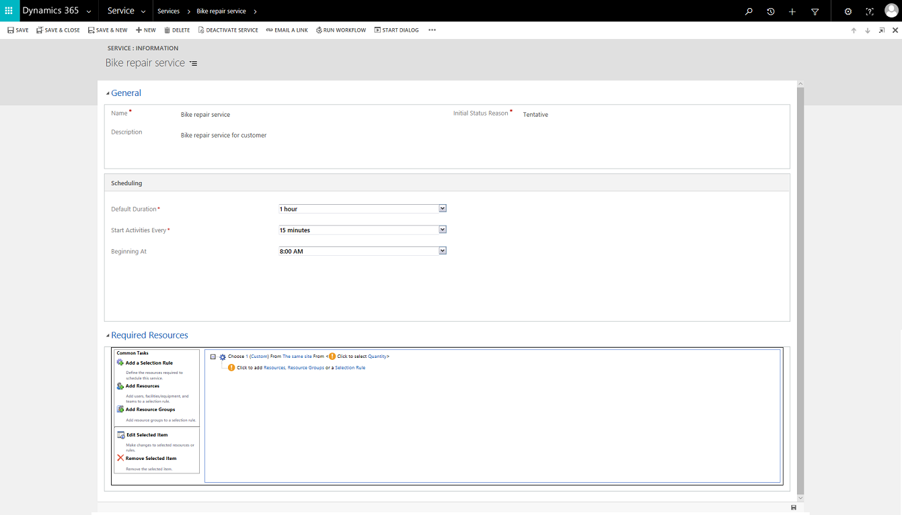

# Create or edit a service (Customer Service app)

To make scheduling services quick and easy, it’s helpful to predefine the specifics of the services you’d provide to customers. By using the service records in Dynamics 365 Customer Service, you can define:  
  
-   How long a service activity would last  
  
-   What resources are available for the service activity, like users, facilities, or equipment  
  
A service requires at least one selection rule and one or more resources, resource groups, or teams before the service can be scheduled with a service activity.

Service Scheduling is available in the Customer Service Hub site map. We recommend that you create services using the new experience. Learn more in [Create or change a service](create-edit-service-csh.md).

## Create or change a service
  
1. [!INCLUDE[proc_permissions_mgr_vp_ceo_busmgr_sysadmin_syscust](../../includes/proc-permissions-mgr-vp-ceo-busmgr-sysadmin-syscust.md)]   
   
2. [!INCLUDE[proc_settings_bus_management](../../includes/proc-settings-bus-management.md)]  
  
3.  Select **Services**.  
  
4.  To create a new service, select **New**.  
  
     -OR-  
  
     To edit a service, open a service from the list.  
  
5.  Type or modify information in the text boxes.  
  
    1.  Under **General**, enter a name and description to reflect the specifics of the service and describe what the service is. Also, specify the initial status of the service activity when it's created. If your organization prefers to approve all service activities before committing them to the schedule, you can select **Requested** or **Tentative**.  
  
    2.  Under **Scheduling**, in **Default Duration**, select how long the service lasts. This can be changed when the service activity is created. The maximum duration of an appointment or service activity is 10 days.  
  
    3.  In **Start Activities Every**, select how often service activities can start. This allows the start times of service activities to be staggered.  
  
    4.  In **Beginning At**, select the time when the service activities must begin.  
  
6.  In the **Required Resources** area, define a selection rule:  
  
    1.  Select a selection rule in the right-hand pane.  
  
         Selection rules appear in the tree beside the **Selection Rule** button .  
  
    2.  Select one of the items under **Common Tasks** to define the selection rule by indicating how many resources are required and in what combination.  
  
 **Add a Selection Rule**  
  
   You can add complexity to a rule by adding a subrule to it.  
  
 **Add Resources**  
  
   Add users, facilities, equipment, or teams as resources to a selection rule.  
  
 **Add Resource Groups**  
  
   Resource groups are users, facilities, or equipment that can be scheduled interchangeably.  
  
   > [!NOTE]
   >  You can save a service without defining a selection rule, but you won’t be able to schedule that service. Learn more in [Create or edit a selection rule](create-simple-selection-rule.md).
  
7.  When you’re ready to save your data, select **Save**.  

    
  
## Activate or deactivate a service  
 You can make a service available on unavailable for scheduling by activating or deactivating it. To do this, in the list of service records, select a service, then select **More Actions** > **Activate** or **More actions** > **Deactivate**.  
  
### Related information  
 [Set the capacity required for a service or resource](set-capacity-required-service-resource.md)   
 [Create or edit a selection rule](create-simple-selection-rule.md)   
 [Create or change a resource group](create-edit-resource-group.md)   
 [Set work hours for a resource](../use/set-work-hours-resource.md)

[!INCLUDE[footer-include](../../includes/footer-banner.md)]
