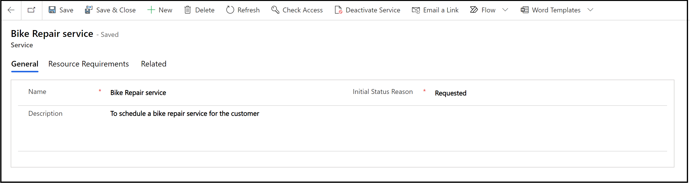

# Create or edit a service in Service Scheduling

To make scheduling services quick and easy, it’s helpful to predefine the specifics of the services you provide to customers. By using the service records in Dynamics 365 Customer Service, you can define:  
  
-   The length of time a service activity lasts.
  
-   The resources needed for the service activity, like facilities or equipment.
  
> [!NOTE]
> A service requires at least one selection criteria and one or more resources or resource groups before the service can be scheduled with a service activity.

## Create a service
  
Make sure that you have the required security role or equivalent permissions. 

Learn more in [Manage security roles in service scheduling](manage-security-roles.md).

You can create a service in the Customer Service admin center or Customer Service Hub app.

1. Go to one of the apps, and perform the following steps.

   ### [Customer Service admin center](#tab/customerserviceadmincenter)

    1. In the site map, select **Service Scheduling** in **Operations**. The **Service Scheduling** page appears.
    2. In the **Service** section, select **Manage**.
        
        The **Active Services** view is displayed. You can switch between various system views using the drop-down list.  

   ### [Customer Service Hub](#tab/customerservicehub)

    1. In the site map, go to **Scheduling**.
    2. From the list of entity records, select **Services** in **Scheduling**.
       
       The **Active Services** view is displayed. You can switch between various system views using the dropdown list.

2. On the command bar, select **New** to create a new service. To edit a service, open a service from the list.  
  
3. In the **General** section, enter a **Name** and **Description** to reflect the specifics of the service and describe what the service is.  

   Also, specify the initial status of the service activity when you create it. If your organization prefers to approve all service activities before committing them to the schedule, you can select **Requested** or **Tentative**.

   > [!NOTE]
   > The status reason also reflects in the schedule board when you create a booking for the service.

4. Select **Save** to save the service.

   

5. In the **Resource Requirements** section, define the selection criteria.

    - Here, the new service record forms the root node. In the root node, you can:

      

     - Select **All** or **Any**. All selects resources for all the underlying requirements and Any selects resources for any one of underlying requirement.

     - Select **Duration**, and enter the duration in minutes to define the duration for which resources are allocated for the service. 

        > [!NOTE]
        > The maximum duration of a service activity is 10 days.

     - Look up or quick create a **Fulfillment Preference** to define the start and end times of the service availability in a day, and the provided intervals. You can also select from a list of fulfillment preferences displayed. 
        > [!NOTE]
        > When you select create, a **Quick Create** form is displayed where you can quickly create a new fulfillment preference.

     After configuring details in the root node:  
        
    - Add a new requirement subgroup by selecting **Subgroup**. You can add subgroups inside a subgroup.
    - Add a new resource requirement by selecting **Requirement**. 

   - Select whether the service is **Part of Same** organizational unit, resource tree, or location.
  
   - Select the **Organizational Unit** to define the unit that the selected resource should belong to.
   - Select **Resource Categories**  and select **Resource Characteristics** to define the categories for the resource.
   - Select **Preferred Resource** to display resource options. When you select only preferred resources on a requirement, any one of the available resources from the list of preferred resources are selected as per the time slot. When you select preferred resources along with the resource category on a requirement, any one of the available resources from the list of preferred resource that belongs to the resource category are selected as per the time slot.
   - Select **Sort Option** to sort according to most and least business impact.
   - Provide **Effort Required**. When you book resources, this option helps you view all the resources that satisfy the minimum effort requirement. For example, if the effort required is defined as 100, only the resources with the capacity value of 100 and more are displayed in the list while booking the service in the schedule board.

   You can add complexity to a rule by adding a subrule to it.  
   > [!NOTE]
   >  You can save a service without defining a selection criteria, but you won’t be able to schedule that service.   

7.  When you’re ready to save your data, select **Save**.  
  
## Activate or deactivate a service  
You can make a service available or unavailable for scheduling by activating or deactivating it. In the list of service records, select a service, and then select **Activate** or **Deactivate** in the command bar.  

> [!NOTE]
> A service can't be deactivated if there are open or scheduled service activities associated with it.
  
### Related information  

[Create and manage resource categories](resource-categories-service-scheduling.md)   
[Set work hours for the resources](resources-service-scheduling.md#set-work-hours-for-the-resources)

[!INCLUDE[footer-include](../../includes/footer-banner.md)]
