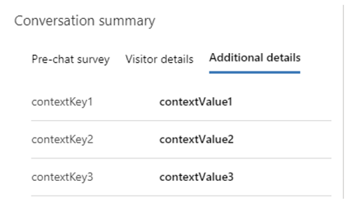

# Create quick replies

[!INCLUDE[cc-feature-availability-embedded-yes](../../includes/cc-feature-availability-embedded-yes.md)]

Quick replies are predefined messages that can be created for agents to quickly respond to common questions from customers. For information about the agent's quick reply experience, see [Send quick replies](../use/oc-conversation-control.md#send-quick-replies).  

1. In the Customer Service admin center or Contact Center admin center site map, in **Agent experience**, select **Productivity**, and then select **Manage** for **Quick replies**.

1. To create a quick reply, select **New**, or to edit an existing quick reply, select the name of the quick reply.

1. Provide or change the following information:

    - **Title:** Enter the title of the message.
    - **Locale:** Specify the language of the message.
    
        > [!NOTE]
        > Customer Service admin center or Contact Center admin center doesn't localize quick replies. To provide quick replies in multiple languages, create a separate quick reply for each language and select its corresponding locale.

    - **Message:** Enter the text of the message. To use chat dynamic text (also called slugs), select the plus icon next to the name of the dynamic text slug you want to use. The dynamic text populates in the **Message** field.

      > [!div class=mx-imgBorder]
      > 

      The **Message** field lets you quickly add the following chat dynamic text (slugs).  

      | Chat dynamic text (slug) | Description |
      |-----------------|-----------------------------|
      | {FullName{Customer}}  | The full name of the customer who initiated the conversation. |
      | {FirstName{Customer}} | The first name of the customer.
      | {LastName{Customer}}| The last name of the customer.|
      | {FullName{Agent}}| The full name of the agent assigned to the conversation.|
      | {FirstName{Agent}}| The first name of the agent.|
      | {LastName{Agent}}| The last name of the agent.|
      | {Nickname{Agent}}| The nickname for the agent.|
   
      If you defined a context key, you can create a quick reply that contains dynamic text that corresponds to that context key in the following format: {OCContext.contextKey1}, where "contextKey1" in the syntax is a placeholder for the predefined custom context field in the conversation. For example, {OCContext.OrderID} would be a context key that populates the message field with the Order ID for a record. More information: [Add context variables](manage-context-variables.md#add-context-variables) and setContextProvider.
    
         > [!div class=mx-imgBorder]
         > 

1. Select **Save**.

## Create or edit tags for common categories of quick replies

Quick replies can be classified and tagged into categories. The categorization capability can also be used to group quick replies into logical chunks that represent key conversational states for agents. These logical chunks help agents select appropriate messages that correspond to customer issues.

1. In the =admin center site map, in **Agent experience**, select **Productivity**, and then select **Manage** for **Quick replies**. 

1. Select two or more quick replies for which you want to create a tag, and then select **Edit**.

> [!div class=mx-imgBorder]
> 

  The **Edit records** dialog appears.

1. In the **Tags** field, start typing the tag you want to create. If it already exists, it appears in a list below the field. If it doesn’t appear, select **+** (plus sign icon) to add it.

> [!div class=mx-imgBorder]
> 

1. After you're done, select **Close**.

## Associate quick replies with a workstream

For organizations with diverse lines of businesses, agents send various messages, depending on their area of expertise. As an administrator, you can determine which quick replies are necessary for different groups of agents to use. You can associate quick replies with workstreams to show agents only those quick replies that apply to them. If no workstream is associated, the quick reply is available for all agents.

1. In the site map of admin center, in **Agent experience**, select **Productivity**, and then select **Manage** for **Quick replies**.

1. Select a quick reply from the list.

1. In the **Workstreams** section, select **Add Existing Work Stream**.

1. Select the workstream from the list of records, and then click **Add**.

   The workstream appears in the list.

1. Select **Save**.

   If you select the workstream in the list, you can view the workstream record and see the quick replies associated with the workstream.

## Availability of quick replies and language settings

The following parameters determine the quick replies that the agents see:

- The language mapped to the channel instance
- The language configured in the agent's personal settings
- The workstream the quick reply is mapped to

For example, when you set up a live chat widget or Facebook page, the quick replies are available in the language configured for the chat widget or Facebook page. Then, when you associate the chat widget with a queue containing agents, the agent-specific language setting, if configured, determines the language in which the quick replies are available to the agents. The agents see the quick replies mapped to the workstream associated with the channel with other quick replies.

### Related information

[Add a chat widget](add-chat-widget.md)  
[Configure a pre-conversation survey](configure-pre-chat-survey.md)  
[Create and manage operating hours](create-operating-hours.md)  
[Create chat authentication settings](create-chat-auth-settings.md)  
[Embed chat widget in Power Apps portals](embed-chat-widget-portal.md)  
[Language settings for agents](/powerapps/user/set-personal-options)

[!INCLUDE[footer-include](../../includes/footer-banner.md)]
