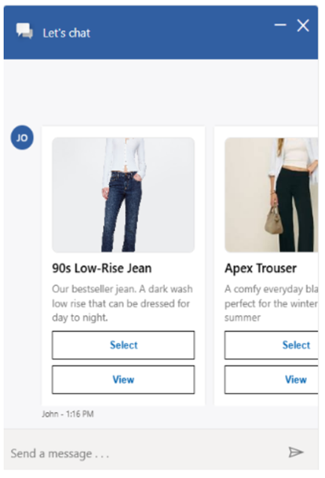
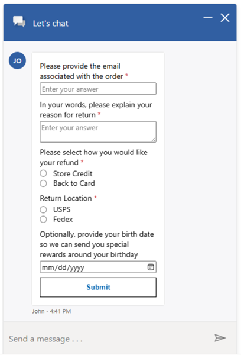
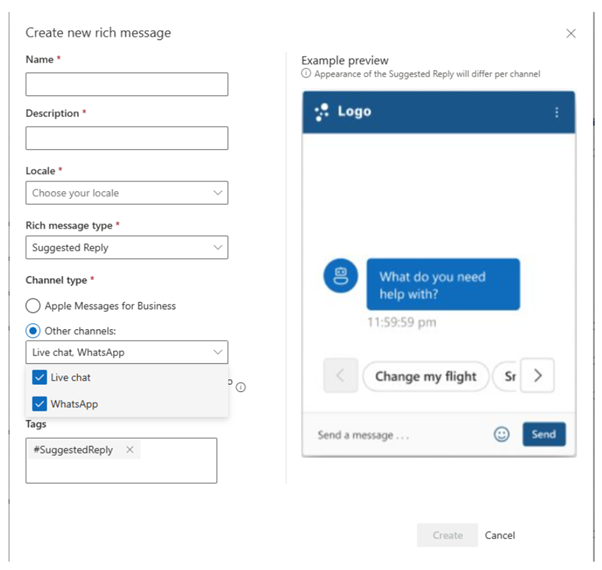
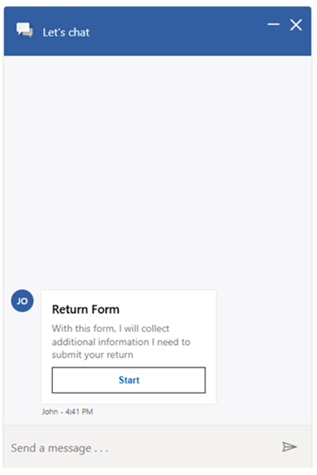
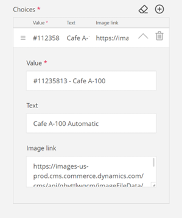

---
title: Create rich messages
description: Learn how to create, publish, and update rich messages in Omnichannel for Customer Service.
ms.date: 10/13/2025
ms.topic: how-to
author: lalexms
ms.author: laalexan
ms.reviewer: laalexan
---

# Create rich messages

[!INCLUDE[cc-feature-availability](../../includes/cc-feature-availability.md)]

Rich media messaging transforms traditional text-based communication into dynamic, interactive experiences that enhance engagement between customer service representatives or agents and customers. Unlike plain text messages, rich media messages can include structured elements such as forms, carousels, suggested replies, and custom JSON payloads. These options allow users to interact without typing long responses.  

These messages are designed to streamline conversations, reduce service representative handle time, and improve customer satisfaction by offering intuitive, guided interactions. For example, a customer might receive a carousel of product options, a form to submit feedback, or quick reply buttons to confirm an appointment— all within the messaging interface. 

The following images are examples:

Forms:

   > [!div class=mx-imgBorder]
   > 

Cards and carousel:

   > [!div class=mx-imgBorder]
   > 

Suggested replies:

   > [!div class=mx-imgBorder]
   > 

These messages are currently supported in several key channels, each with varying capabilities, as follows:

**Live Chat widget (preview)**:
- Forms (only customer service representatives can send)
- Cards and carousels
- Suggested replies
- Custom JSON

**WhatsApp (preview)**:
- Suggested replies

**Apple Messages for Business**:
- Apple Pay
- Authentication
- Custom JSON
- Forms
- List picker
- Suggested reply
- Time picker
- Video rich link
- Website right link 

## Create a new rich media message (preview for Live Chat and WhatsApp)

1. In the site map of Copilot Service admin center, select **Productivity** in **Support experience**.
2. On the **Productivity** page, select **Manage** for **Rich messages**.
3. Select **New**, and then enter the following information:
   - **Name**: A descriptive name to be used by customer service representatives to search for rich messages.
   - **Description**: A short summary of what this rich media message contains or its intended purpose. This helps service representatives quickly identify the message during selection.
   - **Locale**: The language of the rich message. Rich messages are filtered by locale within representative sessions.
   - **Type**:
     - Apple Pay
     - Authentication
     - Cards
     - Custom JSON
     - Forms
     - List picker
     - Suggested reply
     - Time picker
     - Video rich link
     - Website rich link
   - **Channel**: Depending on the rich media message type you select, you either see Apple Messages for Business preselected, or a multiselect dropdown to choose more supported channels. Based on the message type, you can select Live Chat, WhatsApp, or both.
   - **Tags** A message type tag is automatically added to each rich media message. In addition to the type tag, any relevant search tags can be added to the rich message. These tags can help representatives identify the correct rich message when they search for rich messages.
   - **Allow customer service representative to configure**: Some rich media message types allow representatives to update the contents before sending to customers. By enabling configurations, representatives can make single-use customizations, which don't affect the originally created rich message. Representative editing can be enabled for the following types:
      - List picker
      - Suggested reply
      - Forms (Live Chat only)
      - Cards and carousels (Live Chat only)
      - Time picker
      - Video rich link
      - Website rich link

   > [!div class=mx-imgBorder]
   > 

4. Select **Create**.
5. Begin building your rich message within the rich message designer. Select **Save** at the top of the designer anytime to save your work. For more information about building each message type, select the type to learn more.
    - Apple Messages for Business:
       - [Apple Pay](#apple-pay)
       - [Authentication](#authentication)
       - [Custom JSON](#apple-custom-json)
       - [List Picker](#list-picker)
       - [Forms](#forms)
       - [Suggested reply](#suggested-reply)
       - [Time picker](#time-picker)
       - [Video rich link](#video-rich-link)
       - [Website rich link](#website-rich-link)
    - Other channels
       - [Suggested replies](#suggested-replies)
       - [Forms](#live-chat-forms)
       - [Cards/Carousels](#live-chat-cards-and-carousels)
       - [Custom JSON](#custom-json)

## Publish rich messages
For representatives to send a rich message in conversations, the message must first be published.
1. Build your rich message using the steps in the previous section.
2. At the top of the designer, select **Publish**. If there are any missing fields, the designer highlights them in red and requires you to fix them.
3. You can confirm that your rich message successfully published in either of the following ways:
   - The **Publish Save** button no longer appears above the designer.
   - The status page shows as **Active** within the designer and rich messages settings page.

**Update a published rich message**

You can update rich messages that are published and active. 

1. Select the rich message and open it in the designer.
1. Fill in all required fields, and then select **Publish**. This step ensures that rich messages that are missing required fields don't become active. 

## Workstream association 

Workstream association for rich messages behaves similarly to quick replies. By default, an active rich message is available to use across all channels it's configured for. 

After a rich message is associated with one or more specific workstreams, it's no longer available to use in all other workstreams. 

To associate rich messages with a workstream, complete the following steps: 

1. From a workstream, select **Show advanced settings** to expand the **Advanced settings** panel. 
1. In the advanced settings, navigate to **Rich messages**, and then select it. The existing rich messages appear.
1. Select one or more rich messages from the list, and then select **Add**. Any associated rich messages appear within the **Rich messages** table in **Advanced settings**.
1. To edit a workstream's rich messages, select **Edit**, and then add or remove rich messages as required.
1. To add more rich messages, select **Add**. Select more rich messages, and then select **Add**. They appear in the list of rich messages. 
1. To remove rich messages, select one or more within the table, and then select **Remove**. The removed rich message no longer appears in the list.

## Configure specific rich media message types for Live Chat and WhatsApp

### Suggested replies 
(Applies to: Live Chat and WhatsApp)
- **Title**: This is an introductory message appears before the reply button. For Live Chat, the limis is 2,000 characters. For WhatsApp, the limit is 1,204 characters. If a suggested replies template is configured to support both channels and the limit for WhatsApp is exceeded, the admin has the option to specify an alternative title for WhatsApp.
- **Add reply buttons**
   - For Live Chat:
      - Add up to 10 buttons, with a minimum of two buttons required.
      - Supported button types are **Send a message**, **Open URL**, and **Make a Call**. **Send a message** supports an optional **Message upon submission** field that specifies a longer, 150-character text that's sent as a message when the user selects the reply button.
      - Each button can include an image URL.
      - The maximum character limit per button is 20 characters.
    - For WhatsApp
       - **Send a message** buttons are limited to three, with a minimum of two buttons required.
       - Images and markdown text aren't supported.
       - The maximum character limit per button is 20 characters.
       - If Markdown text is used, an alternate, plain-text title is required.

### Live chat cards and carousels

You can use a rich media format to present a scrollable list of options, each containing text, an image, and interactive buttons.

1. Add cards: At least one card is required, with a maximum of 10 cards allowed per carousel.
2. Define card content: For each card, specify the following:
     - **Title**: A title for the card. The character limit is 80 characters.
     - **Subtitle** (optional): A longer description that appears below the title. The character limit is 1,204 characters.
     - **Image URL**: A valid URL that points to the image displayed on the card.
     - **Buttons**: Up to five buttons per card are permitted.
           - Send a message (optional): Specify message text to be sent when the user selects the button. The character limit is 150 characters.
           - Open URL
           - Make a call

### Live chat forms

1. Specify form details:
    - Form title: The character limit is 80 characters.
    - Description: Explains the purpose of the form to the customer. The character limit is 1,024 characters.
    - Image URL (optional)
    - Start button text: Text that appears on the start button for the form.
      
    > [!div class=mx-imgBorder]
    > 

2. Add questions: You can add up to 10 questions of any type.
   	- Question: Specify the question text. The character limit is 300 characters.
   	- Question type: From the dropdown, select one of the following question types. Each has their own properties, as follows:
   	    - Single line input: Use this question type for concise responses. Ideal for questions such as email address of phone number.
   	      - Response type (optional): A dropdown with text, number, email, URL, and phone number options. For types other than text, a regex specific to the type is applied.
   	      - Placeholder text (optional): The default text that appears inside the input box before the user enters a response.
   	      - Regular expression: A pattern used to validate the format of a customer's response.
   	      - Maximum length: Defines the character limit for a customer's response. The maximum allowed value is 80 characters.
   	   - Multiline input: Use this question type for longer form responses
   	     - Placeholder text (optional): The default text that appears inside the input field before the user enters a response.
   	     - Maximum length: Defines the character limit for a customer's response. The maximum allowed value is 300 characters.
   	    - Single-select: Presents a list of predefined options from which a customer can select one only.
   	      - Option title: The label that appears for each option in the dropdown menu.
   	      - Option value: While option title is what the customer views, the system references each option with a value. When a customer selects an option, the customer service representative sees the option value of the option the customer selected only.
   	    - Multi-select: Presents a list of predetermined options from which the customer can select multiple options.
   	      - Option title: The label that appears for each option in the dropdown menu. The maximum allowed value is 30 characters.
   	      - Option value: While option title is what the customer views, the system references each option with a value. When a customer selects an option, the customer service representative sees the option value of the option the customer selected only.
   	    - Dropdown: Presents a dropdown menu of predefined options from which the customer can choose one only.
   	      - Option title: The label that appears for each option in the dropdown menu. The maximum allowed value is 30 characters.
   	      - Option value: While option title is what the customer views, the system references each option with a value. When a customer selects an option, the customer service representative sees the option value of the option the customer selected only.
   	    - Date picker: Allows the customer to select a specifc date from a defined range.
   	      - Min: Start of date range from which the customer can select a date.
   	      - Max: End of date range from which the customer can select a date.
   	  

### Custom JSON 

Admins can use custom JSON to design a custom rich media message using Microsoft’s adaptive card technology. Learn more in [Designer | Adaptive Cards](https://adaptivecards.io/designer/). 

> [!Note]
> Element IDs can't include spaces. 

EXISTING

## Configure specific rich messages for Apple Messages for Business

This section contains details for configuring rich message media type for Apple Messages for Business.

### Apple Pay

##### Properties

**messageTitle**

Text displayed in the message bubble.

Type: ```string``` - Required: Yes


**imageURL**

URL linking to the image displayed in the message bubble.

Type: ```string``` - Required: No


**currencyCode**

The three-letter ISO 4217 currency code for the currency used in the payment request.

Type: ```string``` - Required: Yes


**requiredBillingContactFields**

The customer's billing contact fields that are needed to process the transaction.

Type: ```requiredBillingContactFields[]``` - Required: Yes - Allowed values: - "email" - "name" - "phone" - "phoneticName" - "post"


**requiredShippingContactFields**

The customer's shipping address information. Include this value only if the purchase must be shipped.


Type: ```requiredShippingContactFields[]``` - Required: No - Allowed values: - "email" - "name" - "phone" - "phoneticName" - "post"


**shippingMethods**

An array of shippingMethods. Omnichannel currently supports only one shipping method per payment request. If more than one shipping methods are included, only the first method is used.

Type: ```shippingMethods[]``` - Required: No - Allowed values: - "shippingMethod"

**shippingMethod**

Describes the shipping method, which contains the amount, detail, label, and identifier properties.

**amount**

A non-negative value associated with this shipping method.

Type: ```string``` - Required: Yes

**identifier**

Internally defined, unique value used to identify this shipping method.

Type: ```string``` - Required: Yes


**label**

Description of the shipping method.

Type: ```string``` - Required: Yes


**type**

Property to represent whether the line item amount is final or pending.

Type: ```string``` - Required: Yes - Allowed values: - "final" - "pending"


**total**

Describes the final amount of the Apple Pay request. It contains the amount, label, and type properties.


**amount**

The monetary amount of the Apple Pay request. This value must be greater than zero.

Type: ```string``` - Required: Yes


**label**

The friendly business name customers see when the charge appears on statements. For example, "Contoso Coffee".

Type: ```string``` - Required: Yes


**type**

Property to represent whether the Apple Pay request's total amount is final or pending.

Type: ```string``` - Required: Yes - Allowed values: - "final" - "pending"

**Example**

```
{
    "messageTitle" : "Purchase your Contoso Barista Home",
    
    "imageUrl" : "https://images-us-prod.cms.commerce.dynamics.com/cms/api/qbvttlwqcm/imageFileData/search?fileName=/Products%2FSP-DCM1008_000_001.png&w=315&h=315&q=80&m=6&f=jpg&cropfocalregion=true",
    
    "imageStyle" : "large",
    
    "currencyCode" :"USD",
    
    //Billing contact information requested during purchase
    "requiredBillingContactFields" : [
        "post",
        "email",
        "phone",
        "name",
        "phoneticname"
    ],
    //Only required when customer's purchase must be shipped
    "requiredShippingContactFields" : [
        "post",
        "email",
        "phone",
        "name",
        "phoneticname"
    ],
    "shippingMethods" : [
        {
            "amount" : "0.00",
            "detail" :"Available within an Hour",
            "label" : "In-Store pickup",
            "identifier" : "in_store_pickup"
        }         
    ],

    "lineItems" : [
        {
            "label" : "Barista Home Espresso Maker",
            "amount" : "899.00",
            "type" : "Final"
        },
        {
            "label" : "Contoso Customer Discount",
            "amount" : "-898.99",
            "type" : "Final"
        }
    ],

    "total" : {
        "label" : "Label",
        "amount" : "0.01",
        "type" : "Final"
    }
}
```

##### Limitations

|Description | Limitation |
|------------|--------------|
| Merchant country | Payment processing for merchants in China and Saudi Arabia, country/region codes CN and SA, respectively, is not supported in Omnichannel.|
| Merchant capabilities | EMV – Omnichannel does not currently support China Union Pay transactions. |
| Supported networks | The list of supported networks is limited to:<br><br> - American Express <br> - Discover <br> - Mastercard <br> - Visa |


### Authentication

#### Properties

**receivedmessage**

Text displayed in the message alongside the “sign in” button.

Type: ```string``` - Required: Yes

**replymessage**

Text displayed to the customer once they have successfully authenticated.

Type: ```string``` - Required: Yes

**Example**

```
{
    "receivedmessage":"Please sign-in",
    "replymessage":"You're signed in"
}
```


##### Limitations

|Description | Limitation |
|------------|--------------|
|Message contents | Images aren't currently supported for authentication.|
|Representative | Authentication request-type rich messages don't currently support representative configuration.|


### Apple Custom JSON

##### Properties

**bid**

A string identifying the iMessage extension that the user interacts with while using Messages. The bid value format is `com.apple.messages.MSMessageExtensionBalloonPlugin:team-id:extension-id`. Replace `team-id` and `extension-id` with your Apple Developer team and extension IDs. 

Type: ```string``` - Required: Yes


**URL**

A URL string containing data that the Messages app sends to the iMessage app.

Type: ```string``` - Required: Yes

**Example**

```
{   "bid":"com.apple.messages.MSMessageExtensionBalloonPlugin:{team-id}:{ext-bundle-id}",
"URL":"?name=WWDC%20Goodies&deliveryDate=09-06-2017&destinationName=Contoso%20Coffee%20Redmond&street=1%20Microsoft%20Way&state=WA&city=Seattle&country=USA&postalCode=98052&latitude=47%2E6395&longitude=%2D122%2E1281&extraCharge=15%2E00"
}
```


### Forms

Survey-level properties

1. When a form rich message is created, you'll see the form level properties panel and builder. First, provide a title by selecting **Form Title** in the builder, or **Title** in the properties panel. You can also provide information for the following optional fields, which appear as part of the form's opening page:
   - **Header** (Optional): A large central header with a short text greeting or call to action.
   - **Image URL** (Optional) The image displayed to customers within the list picker's message and customer response message. Image URLs must be a valid image type. Videos and GIFs aren't supported.
   - **Start button**: You can change the label from the default string, but it can't be left blank.

1. The following form behaviors may be configured by navigating to the **Behavior** section in the property panel:<br>
     a.	By default, form responses are shown to the customer before they submit responses. This summary can be removed by deselecting **Show summary page**.<br>
     b.	Form responses can be hidden from live representatives, which may be helpful when designing automated processes to handle sensitive information. When **Hide customer responses in chat** is toggled on, representatives are unable to see any customer responses within the form. Privacy cannot be toggled per question.

1. The **Outbound message** properties determine the appearance of the message bubble containing the form. The outbound message may contain the following elements:<br>
     a.	**Message title**: The main text that informs the customer of what type of content the message contains. It could be the full or shortened title of your form.<br>
     b.	**Message description** (Optional): This text appears below the message title. It can be used as a call-to-action or to provide more context not included in the message title.<br>
     c.	**Image URL** (Optional): The image displayed to customers within the list picker's message and customer's response message. Image URLs must be a valid image type, and do not support videos or GIFs.<br>

1. To begin adding questions, select one of the question types from the **toolbox** located between the properties panel and builder. Each question contains required **Title** and optional **Header** fields, in addition to type-specific configurations. Apple Messages for Business forms support the following question types: Single input, multiline input, single-select, multi-select, dropdown picker, and date picker. 

1. A form can contain no more than 10 questions, and should be completable without needing to leave the messages application. While building a form, select **Save** to keep your changes. An unpublished form can be saved with missing fields. Changes made to a published form may only be saved if rich message has all required fields filled. 

1. New forms are available for representatives to use once they are published. To publish a new form, select **Publish** at the top of the page. To confirm that the form is published, confirm that its status displays as **Active**.

#### Single input question

Single input questions are a short-answer free response style question. This question type is good for collecting information like name, contact information, and numbers. These questions are limited to a maximum of 30 characters. For longer responses, see the multiline input question type.

1. Provide a **Question title**, optional **Header** text, and use the **Required** toggle to control whether the question may be left unanswered.

1. The **Input** type may be changed from the default **Text** type. Changing the input type changes the input keyboard on iOS devices. The keyboard input field won't verify whether the customer response matches the keys that are available on the keyboard. To limit customer responses and validate formatting, use the **Regular expression** field. The type options and their impact on input are as follows:
   - **Text** (Default): Default keyboard
   - **Name**: Default keyboard and name autofill suggestion
   - **Url**: URL keyboard and URL autofill suggestion
   - **Phone**: Phone pad keyboard and phone number autofill suggestion
   - **Email**: Email keyboard and email address autofill suggestion
   - **Number**: Numbers and punctuation keyboard 
	
     > [!Note]
     >  Autofill suggestions are generated by Apple from the customer’s Apple ID contact information, which isn't shared in forms responses.  

1. The **Input place holder** value appears in the empty textbox to provide example data or relevant information. If no place holder value is provided the form automatically sets the place holder value to “Required” or “Optional” based on your selection in step 1. 

1. The **Label** is an optional value that appears beside the text field and can serve as another prompt. For a question titled “What is your name?” the label might be set to “Name”. 

1. A single input can have a **Maximum length** between 1 and 30 characters. By default, the maximum length is 30. 

1. The **Prefix** value can be used to automatically add the first characters in an answer. For example, when asking for a LinkedIn profile link, the prefix might be set to “https://www.linkedin.com/in/”, so that the person completing the form would only need to type their specific information. 

1. The **Regular expression** is a Regex expression used to validate the customer response. The regex is used to validate customer responses on their device to ensure they are providing correctly formatted information. For example, regex can be used when asking for an email address. 

#### Multiline input question

Multiline input questions are a long-answer, free-response style question. This question type is good for collecting customer feedback, explanations, and responses that need line breaks. These questions are limited to a maximum of 300 characters. For shorter responses that support different iOS keyboards see the single input question type.

1. Provide a **Question title**, optional **HeaderI** text, and use the **Required** toggle to control whether the question may be left unanswered.

1. The **Input place holder** value appears in the empty textbox to provide example data or relevant information. If no place holder value is provided, the form automatically sets the place holder value to “Required” or “Optional” based on your selection in Step 1. 

1. The **Regular expression** is a regex expression used to validate the customer response. The regex is used to validate customer responses on their device to ensure they are providing correctly formatted information. For example, regex can be used when asking for an email address. 

1. A single input may have a **Maximum length** between 1 and 300 characters. By default, the maximum length is 300. 


#### Single-select question

Single-select questions can be used to quickly select a single option from a set of two or more choices. Each choice can support an image. This question type is good for choosing between products and choices, simple triage questions, and any single-select question with a limited number of choices. For multi-select questions that support images, see the multi-select question type, or for single selection questions with ten or more choices, see the dropdown picker question type.

1. Provide a **Question title** and an optional **Header** text.

1. Under **Choices**, you can add each of your options. We recommend that the number of choices is between two and 10 or fewer. Each choice has the following fields:

   a. **Value**: The true identifier for a choice. This value is what appears in the conversation control when a customer selects a choice. By default, the value is also used as the text that is shown to customers. However, when working in multiple languages or listing products, you might prefer to show a representative the product reference number and product name.<br>
   
   b. **Text** (Optional): The text is what the customer sees when viewing the question. By default, this text matches the value. Changing the **Text** content can allow you to localize selection questions without changing what the representative sees in the response.<br>
   
   c. **Image link** (Optional): The image displayed to customers within the list picker's message and customer's response message. Image URLs must be a valid image type, and do not support videos or GIFs.<br>

      For example, let's say we want to ask a Contoso customer to select the model of expresso maker that they own. The representative needs the model number, but a customer might only know the model by its name or image. In this instance, we would provide the following content:<br>
      
      |Type | Description | Notes |
      |--------|-----------|-------------|
      |Value | #11235813 Cafe A-100 | The representative sees this text.|
      |Text | Cafe A-100 Automatic | The customer sees this text. |
      |Image link | https://contoso.com/[image].jpg | The customer sees this image.|
          
    > [!div class=mx-imgBorder]
    > 
 
1. To add more choices, select the + icon within the properties panel or builder. You can rearrange the choices by dragging them up or down while selecting the handle button to the left of each choice. You can remove a choice by selecting the delete button. To remove all choices, select the erase icon next to the + icon at the top of the list.

#### Multi-select question

Multi-select questions can be used to quickly select one or more options from a set of two or more choices. Each choice can support an image. This question type is good for selecting from a subset of choices, simple triage questions, and any multi-select other multi-select question types. For single selection questions that support images, see the single-select question type, or the dropdown picker question type for single-select questions with a large set of choices.

1. Provide a **Question title** you may also include an optional **Header** text.

1. Under **Choices**, you can add each of your options. We recommended that the number of choices is between two and 10 or fewer. Each choice has the following fields:<br>

   a. **Value**: The true identifier for a choice. This value is what appears in the conversation control when a customer selects a choice. By default, the value is also used as the text that is shown to customers. However, when working in multiple languages or listing products, you might prefer to show a representative the product reference number and product name.<br>
   
   b. **Text** (Optional): What the customer sees when viewing the question. By default, this text matches the value. Changing the text content can allow you to localize selection questions without changing what the representative sees in the response.<br>
   
   c. **Image link** (Optional): The image that is displayed to customers within the list picker's message and customer's response message. Image URLs must be a valid image type, and do not support videos or GIFs.<br>
   
      For an example of the difference between **Value** and **Text**, see the section on single-select question types.<br>

1. To add more choices, select the + icon within the properties panel or builder. You can rearrange the choices by dragging them up or down while selecting the handle button to the left of each choice. A choice may be removed by selecting the delete icon. To remove all choices, press the erase icon that is located beside the + icon at the top of the list.


#### Dropdown picker question

Dropdown picker questions are used to quickly select a single option from a list of choices. These questions use a wheel-like scrolling interaction that only shows a small set of the options at a time. This question type is good for alphabetically sorted single-select questions like country/region, colors, brands, or categories. For single-select questions that support images but fewer choices, see the single-select question type. 

1. Provide a **Question title**. You can also include an optional **Header** text.

1. Under **Choices**, you can add each of your options. As these questions can support a large number of options, it is recommended that you add choices in a logical ordering such as alphabetical. Each choice has the following fields:

   a. **Value**: The true identifier for a choice. This value is what appears in the conversation control when a customer selects a choice. By default, the value is also used as the text that is shown to customers. However, when working in multiple languages or listing products, you might prefer to show a representative the product reference number and product name.<br>
   
   b. **Text** (Optional): What the customer sees when viewing the question. By default, the text matches the value. Changing the text content can allow you to localize selection questions without changing what the representative sees in the response.<br>
   
1. To add more choices, select the + icon within the properties panel or builder. Choices can be rearranged by dragging them up or down while selecting the handle button to the left of each choice. You can remove a choice by selecting the delete button. To remove all choices, select the erase icon located beside the + icon at the top of the list.

1. Once you’ve listed all your choices, you can choose a default answer by selecting **Set default value** and choosing an item from the dropdown. If you choose not to select one, the default is automatically set to the first item in your choices. For a large, sorted set of choices, setting the default value to an item in the middle or the most common answer might reduce the amount of scrolling needed.

#### Date picker question

Date picker questions are used to quickly select a date using a wheel-like scrolling interaction. Date picker can be configured to only allow dates within a pre-defined timespan. This question type is good for adding birthdays, purchase dates, or future events. Date pickers don't support times, which would need to be provided in a single line or multiline input question type. 

1. Provide a **Question title**. You can also include an optional **Header** text. 

1. **Label** is an optional value that appears beside the text field and can serve as an more prompt. For a question titled “When were you born”, the label might be set to “Birthday”. 

1. To limit the time range that customers can add, there are two optional range values:<br>

   a. **Min**: This value represents the furthest back date that can be selected. When this value is set, no dates earlier than this date can be selected.<br>
   
   b. **Max**: The value represents the furthest-forward date that can be selected. If this value isn't set, the maximum date is the date that the customer responds. When asking a question about a future date, this value must be set.<br>
   
1. The **Start date** value is the preset value that appears when the question opens. If this value isn't set, the start date is the date when the customer is completing the form.

### List Picker

Within the designer, the first fields are related to the message that appears within the messages application.

1. First, provide a message title that'll serve as title for both the message and the list picker.

1. The following fields are optional:

   a. **Message subtitle**: This text appears below the message title. It can be used as a call-to-action text or to provide more context that's not included in the header.<br>
   
   b. **Image URL**: The image displayed to customers within the list picker's message and customer's response message. Image URLs must be a valid image type; videos and GIFs aren't supported.<br>
   
1. A list picker is composed of one or more sections containing at least one item. The following fields are part of each section:<br>

   a. **Section title**: A title for each section that can provide context and instructions for customer responses. <br>
   
   b. **Allow multi-select**: Determines whether the customer can select one or more items within the section. By default, sections are single-select.<br>
   
   c. **List items**: Each section must include at least one option. Options can be added by selecting **Add option**, or removed by selecting **Remove**. Each option has the following fields:<br>
   
      i. **Option title**: The title field is required and is what appears as the customer's response in the messages app and in conversation control. Titles should be simple and straightforward, using the subtitle field for more details.<br>
      
      ii. **Option subtitle**: Subtitles are an optional field that can be used to provide details about an option, such as add-on costs, item descriptions, and other secondary information. <br>
      
      iii. **Image URL**: A valid image URL for adding an image beside a list option. Images are optional and shouldn't be used in place of the title or subtitle text.<br>
      
1. To add more sections, select **Add section**. When there are two or more sections, a section can be deleted by selecting **Remove**.

1. An optional response message can be added to the list picker rich message. This text appears in the customer's response, below selection choices.

### Suggested reply

1. The **Summary text** field contains helper text for the customer to see after they've responded to a suggested reply message. This field shouldn't be used as the question, as customers won't see it until after they select a choice.

1. Suggested reply messages can have between two and five options that should be kept concise.

1. To add more options, select **Add option**. When there are more than two options, an option can be removed by selecting the option's corresponding **Remove** icon.

### Time picker

1. Within the designer, the first fields are related to the message that appears within the messages application. First provide a message title, which serves as the title for the message.

1. The following fields are optional:

   a. **Message subtitle**: This text appears below the message title. It can be used as a call-to-action or to provide more context not included in the header.<br>
   
   b. **Image URL**: The image displayed to customers within the list picker's message and customer's response message. Image URLs must be a valid image type, and videos and GIFs aren't supported.<br>
   
1. Under **Event information**, you can configure the details and time slots as follows:<br>
    
   a. **Event title**: The event title appears within the customer's calendar application if they choose to add the event to their calendar.<br>
   
   b. **Location name**: The location name appears within the customer's calendar application if they choose to add the event to their calendar.<br>
   
   c. **Event time zone**: This field is the time zone where the event takes place.<br>
   
   d. **Adjust for daylight saving time**: By default, time zones are listed by their standard offset from GMT. However, if the event takes place in a region that uses daylight savings, this can result in timeslots being incorrectly converted. By toggling this setting to **Yes**, the daylight saving offset is automatically applied for each timeslot listed.<br>
   
   e. **Customer display option**: By default, each time slot's start times is converted to the customer's local time zone. To cause events to display in the event time zone regardless of the customer's current time zone, select **match event time**. Matching the event time can be helpful when customers may be travelling across time zones for the event, and need to more clearly understand the start time.<br>
   
   f. **Duration**: The duration of an event is not visible during time slot selection. It's automatically added to the calendar event and used to calculate the end time of an event. Events can range from zero minutes to multiple days long. Duration can be defined in the following units:<br>
      - Minutes
      - Hours
      - Days
     
   g. **Time slot**: The set of choices a customer can select from. To create time slots, select **Add date**, then add the following fields:<br>
   
      - **Date**: The date used for each associated start time.
       
      - **Start time**: Define each time slot that a customer can select. These times are grouped under the selected date.
       
      - To add more start times for a specific date, select the Add time slot button below existing start time.
       
   h. To add more dates, select **Add date**, and then complete preceding steps for adding time slots.
  
     > [!Note]
     > Past time slots won’t display on the customer's device.
     
1. An optional response message can be added to the time picker rich message. This text appears in the customer's response, below their time slot selection.

   - **Recommendation**: Use the response message as a call to action, encouraging customers to click the message for more details. The added details include an **Add to Calendar** option that displays information such as event title and duration.
   
   
### Video rich link

1. Provide a **Title** for the website rich link, which appears alongside the image within the messages application.

1. Provide the **Video URL**, which is the plain text URL that links directly to a video file.

   > [!Note]
   > Embedded videos and video streaming websites won't work correctly. The video URL must link directly to a video's source. If a video streaming website's URL is used, the rich link won't work. To link to video streaming sites, instead use the **Website rich link** style rich message. Supported format types include .mp4, .mkv, .wmv, .m4v, .mov, .avi, .flv, .webm, .flac, .mka, .m4a, .aac, and .ogg.
   
1. Provide the **Image URL**, which is used to display a relevant image alongside the rich link title. The image URL must be a valid, still image in order to display correctly.

   While an image URL is not required for video rich link messages, it's highly recommended. Video rich links that are sent without an image preview appear as blank previews. Adding a keyframe or relevant image can improve the customer experience.

### Website rich link

1. Provide a **Title** for the website rich link, which appears alongside the image within the messages application.

1. The **Website URL** is the plain text URL that the rich link launches when the customer selects or long-presses on the message.

1. The **Image URL** is used to display a relevant image alongside the rich link title. The image URL must be a valid, still image in order for it to display correctly.


### Related information

[Configure Apple Messages for Business](configure-apple-messages-for-business-channel.md)  
[Understand and create workstreams](create-workstreams.md)  
[Set up unified routing for records](set-up-record-routing.md)  
[Configure automated messages](configure-automated-message.md)  
[Configure a post-conversation survey](configure-post-conversation-survey.md)  
[Skill-based routing](overview-skill-work-distribution.md)  
[Create message templates](create-message-templates.md)  
[Templates](/dynamics365/app-profile-manager/templates-overview)  
[Delete a configured channel](delete-channel.md)  
[Support for live chat and asynchronous channels](card-support-in-channels.md)  
[sendMessageToConversation JavaScript method](../develop/reference/methods/sendMessageToConversation.md)  
[Retrieve and format rich messages](../develop/reference/methods/message-object.md)  

[!INCLUDE[footer-include](../../includes/footer-banner.md)]
