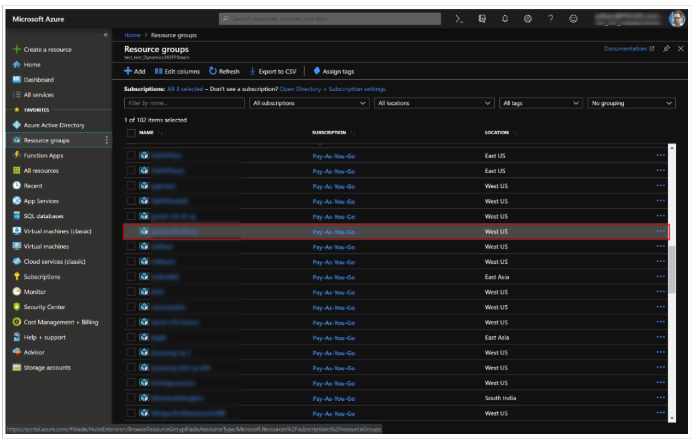
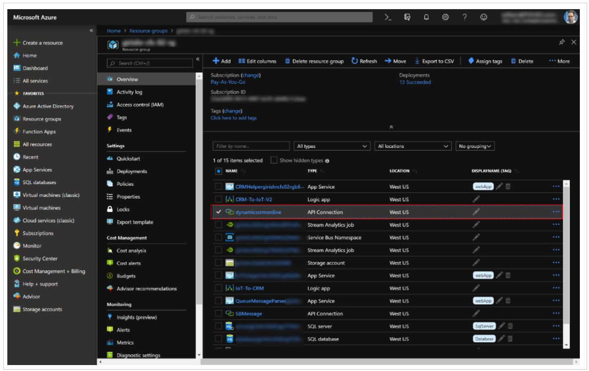
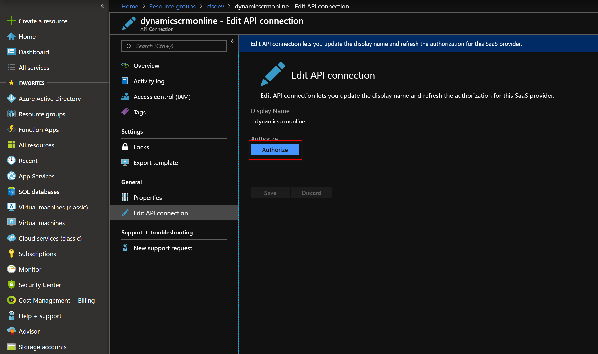

# Authorize API connections between Customer Service and Azure IoT Hub

Authorizing API connections enables Azure Logic Apps to read and write data. This authorization allows IoT alerts, device data, and commands to flow between Azure IoT Hub and Customer Service. You must complete this authorization step when you deploy Connected Customer Service for Azure IoT Hub by using the [IoT deployment app](https://iotdeployment.dynamics.com/).

Without completing this step, you can't do the following actions:

 - Send Iot alerts from IoT Hub to Customer Service
 - Add a device in Customer Service and register it in IoT Hub

## Prerequisites
- Azure account and subscription
- Dynamics 365 Customer Service 
- Connected Customer Service with IoT Hub deployed through deployment app

## Instructions

Sign into your Azure account, and then go to the [Azure portal](https://portal.azure.com). 

From there, go to **Resource Groups** and find the resource group you recently deployed IoT Hub to. See the following screenshot for reference.

> [!div class="mx-imgBorder"]
> 

One such resource is an API Connection type to Customer Service. Select and edit this resource.

> [!div class="mx-imgBorder"]
> 

Finally, select **Authorize**, **Save**, and use your Dynamics 365 Customer Service credentials that you use to sign into your Connected Customer Service environment, which may be different than your Azure credentials to the Azure portal.

> [!div class="mx-imgBorder"]
> 

You can now pass data between Azure IoT Hub and Customer Service to use Connected Customer Service.

[!INCLUDE[footer-include](../../includes/footer-banner.md)]
