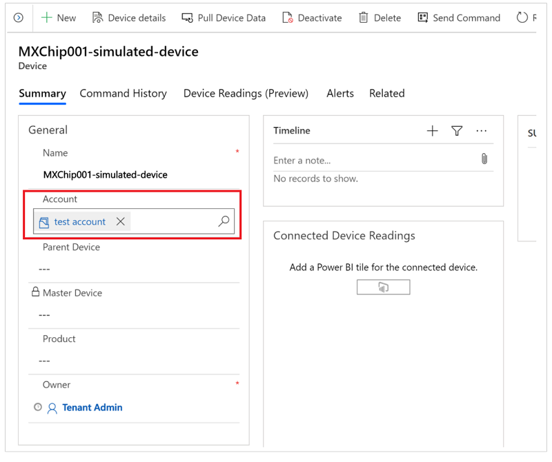

# 2 - Associate devices with customer accounts in Connected Customer Service

If an IoT device isn't associated with a customer account in Connected Customer Service, the system doesn't generate work orders or cases for incoming IoT alerts. Although associating devices with customer accounts is optional in Azure IoT Central, it’s required in Connected Customer Service.

This article explains how to associate an IoT device with a customer account so that Connected Customer Service can create cases or work orders when IoT alerts are received.

## Associate a device with a customer account

1. In the Connected Customer Service application, select **Devices** from the left navigation pane.

1. Select the device that you want to associate with a customer account.

   On the device details page, in the **Customer account** field, start typing the name of the customer account.

   > 

   > 
   > 

3. Select the customer account, and then select **Save**.

After you save the changes, the device is associated with the selected customer account. Connected Customer Service can now create cases or work orders when it receives IoT alerts for this device from Azure IoT Central.

### Related information

[Prerequisites for setting up Connected Customer Service for Azure IoT Central](cs-iot-prerequisites.md)  
[Receive IoT alerts in Connected Customer Service from Azure IoT Central](cs-iot-receive-alerts.md)
