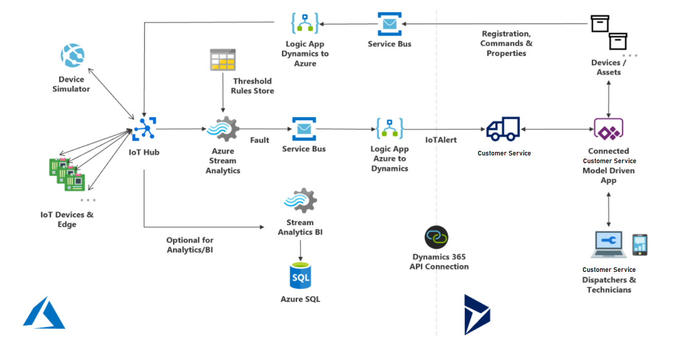

# Architecture of Connected Customer Service with Azure IoT Hub

Connected Customer Service with Azure IoT Hub integrates Azure IoT services with Dynamics 365 Customer Service. This article explains the architecture and how each component works together to support IoT-driven service scenarios.

## Concepts

To understand the content in this article, be familiar with the following concepts:

- **Connected Customer Service** refers to a set of solutions, entities, and processes built in Dynamics 365 Customer Service.
- In this article, **data** and **telemetry** refer to information sent from IoT devices to the cloud.
- **Devices** and **sensors** refer to internet-connected components—such as thermometers, pressure sensors, or gyroscopes—that collect measurements.
- An **asset** is a piece of equipment that can have one or more sensors attached.

## Architecture overview

> [!div class="mx-imgBorder"]
> 

- **IoT Devices & Edge**: Internet-connected sensors send telemetry to Azure IoT Hub, typically over WiFi or cellular networks. A single piece of equipment can contain multiple sensors that capture different measurements, such as temperature or pressure. In environments with collections of devices, an edge device can aggregate telemetry and forward it to IoT Hub.

- **Device Simulator**: Administrators can simulate devices and telemetry for testing and development before physical hardware is available. This helps validate how alerts flow into Customer Service and generate IoT alerts or cases.

- **Azure IoT Hub**: The gateway for ingesting device telemetry at scale. IoT Hub consists of services and processes designed for connected-device scenarios and is deployed as an Azure resource group.

- **Azure Stream Analytics**: Processes device data as it enters IoT Hub. Data passes through Stream Analytics but is not stored unless additional storage is configured.

- **Threshold rules store**: Evaluates incoming telemetry against predefined thresholds to detect abnormal conditions. When telemetry exceeds acceptable limits, the data is classified as a fault.

- **Azure Service Bus**: Stores detected faults in a queue to ensure reliable delivery to Customer Service. Queuing supports retry scenarios if faults fail to transfer immediately.

- **Azure Stream Analytics and Azure SQL**: Store telemetry for longer-term analysis. This configuration supports historical analysis and predictive scenarios but can increase Azure costs

- **Azure Logic Apps (Azure to Customer Service**: Connect Azure services with Dynamics 365 Customer Service. Logic Apps apply business logic, map entities, and trigger actions such as creating **IoT alert** records. For Azure IoT Central integrations, Power Automate is used instead of Logic Apps.

- **IoT alert**: An entity in Customer Service that represents actionable telemetry from devices. IoT alerts are created when faults require attention from a customer service team.

- **Connected Customer Service Model Driven App**: A set of entities and processes built on Customer Service that enables associating devices with customer assets, managing IoT alerts, and initiating service actions.

- **Customer service representatives**: The users who interact with IoT alerts, cases, and devices within Customer Service on desktop or mobile devices.

- **Devices (entity)**: Customer Service entities that represent managed devices and sensors responsible for generating telemetry.

- **Registration, Commands & Properties**: Enable bi-directional communication between Customer Service and IoT Hub. For example, commands can reboot a device or display a message on-device.

- **Azure Logic Apps (Customer Service to Azure)**: Send commands and data from Customer Service back to IoT Hub, which then forwards them to the connected devices.

## Component data flow diagram

A detailed data flow between Azure IoT Hub and Connected Customer Service components is available in the following downloadable diagram:

[Download the component data flow diagram](https://download.microsoft.com/download/3/A/7/3A744B76-3E04-49F5-A30B-938400CEB73E/AzureIoTCfsDataFlowDiagram.jpg)

The diagram shows the direction and order of data flow for a standard installation of Connected Customer Service with Azure IoT Hub.

[!INCLUDE[footer-include](../../includes/footer-banner.md)]
