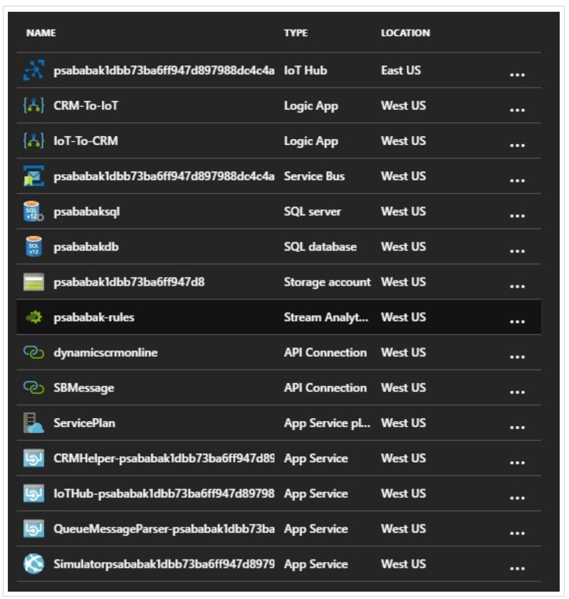

---
title: Extend Connected Customer Service solutions
description: Customize Connected Customer Service by extending standard components and adding custom Azure-based services.
ms.date: 03/30/2026
ms.topic: how-to
author: lalexms
ms.author: laalexan
ms.reviewer: laalexan
---

# Extend Connected Customer Service solutions

Connected Customer Service supports customization of standard components and the addition of custom Azure-based services. This extensible architecture supports a wide range of IoT devices and related services used in customer service scenarios.

## Extend Azure services

The Azure services and components used by Connected Customer Service—including those described in [Connected Customer Service architecture](cs-iot-connected-customer-service-architecture.md)—are designed for reliability, scalability, and extensibility. These services support customization and management through:

- UI-based administration  
- PowerShell and JSON-based deployments  
- REST APIs and client libraries (for example, .NET, Python, Java, and Node.js)  

After the standard installation, Connected Customer Service configures an Azure resource group that includes services similar to the following:

Learn about extending or adding Azure services in the following resources:

- **Microsoft Azure**: Visit [Azure](https://azure.microsoft.com/) for product documentation, pricing, tools, and downloads. The [Azure Documentation Center](/azure) provides guidance for developers and administrators. Common tools include the [Azure SDKs](https://azure.microsoft.com/downloads/), [Azure Storage Explorer](https://storageexplorer.com/), and the [Azure IoT Explorer](/azure/iot-fundamentals/howto-use-iot-explorer).

- **Channel 9**: Browse technical presentations and videos related to Azure on [Channel 9](https://channel9.msdn.com/).

## Extend Connected Customer Service

> [!NOTE]
> The Web API types and operations referenced in this section are available in your environment. You can explore them using the service document or tools such as Insomnia. Learn more in [Web API service documents](/power-apps/developer/data-platform/webapi/web-api-service-documents) and [Use Insomnia with Microsoft Dataverse Web API](/power-apps/developer/data-platform/webapi/insomnia).

The following table lists custom actions, workflows, and entities that Connected Customer Service uses to integrate with associated Azure services. These components are defined in `Microsoft.Dynamics.CRM.IoTConnector`.

| Display Name (ID) | Type | Description |
|------------------|------|-------------|
| IoT – Debounce IoT Alerts (`Microsoft.Dynamics.CRM.msdyn_ParentIoTAlerts`) | Action | Links potentially redundant alerts to an existing parent alert |
| IoT – Parent IoT Alerts | Workflow | Calls the **IoT – Debounce IoT Alerts** action and passes a 60‑second debounce interval |
| IoT – Register Custom Entity (`Microsoft.Dynamics.CRM.msdyn_RegisterCustomEntity`) | Action | Registers a custom entity and invokes the **IoT – Register Device** action |
| IoT – Register Device (`Microsoft.Dynamics.CRM.msdyn_RegisterIoTDevice`) | Action | Publishes registration requests for an IoT device |
| IoT – Send Test Alert (`Microsoft.Dynamics.CRM.msdyn_IoTSendTestAlert`) | Action | Reserved for future use |
| JSON-based Field Value – Get Boolean (`Microsoft.Dynamics.CRM.msdyn_JsonGetBoolean`) | Action | Reads a Boolean value from a JSON object |
| JSON-based Field Value – Get Number (`Microsoft.Dynamics.CRM.msdyn_JsonGetNumber`) | Action | Reads a numeric value from a JSON object |
| JSON-based Field Value – Get String (`Microsoft.Dynamics.CRM.msdyn_JsonGetString`) | Action | Reads a string value from a JSON object |
| IoT Alert (`Microsoft.Dynamics.CRM.msdyn_iotalert`) | Entity | Represents a notable event sent from an IoT hub |
| IoT Device (`Microsoft.Dynamics.CRM.msdyn_iotdevice`) | Entity | Represents a connected device that can register with an IoT hub |
| IoT Device Category (`Microsoft.Dynamics.CRM.msdyn_iotdevicecategory`) | Entity | Represents a logical grouping of IoT devices |
| IoT Device Command (`Microsoft.Dynamics.CRM.msdyn_iotdevicecommand`) | Entity | Represents an outgoing command sent to a connected device |
| IoT Device Registration History (`Microsoft.Dynamics.CRM.msdyn_iotdeviceregistrationhistory`) | Entity | Tracks device registration activity |

### IoT-enable an entity type

Entities in Customer Service can be associated with the IoT entities listed above so they can participate in IoT-related business processes and analyses.

You can IoT-enable an entity in the following ways:

- **Create a connection programmatically or through the UI**: Use Connection entities to associate records. Learn more in [Create connections to view relationships between records](/dynamics365/customer-engagement/basics/create-connections-view-relationships-between-records).

- **Register the entity through an action**: Call the **IoT – Register Custom Entity** action to associate an entity with an existing or new IoT device.

[!INCLUDE[footer-include](../../includes/footer-banner.md)]
