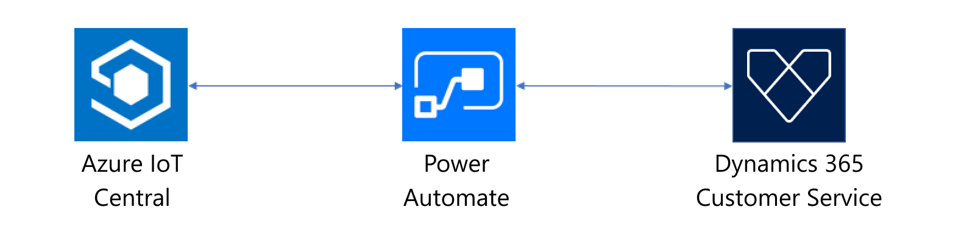
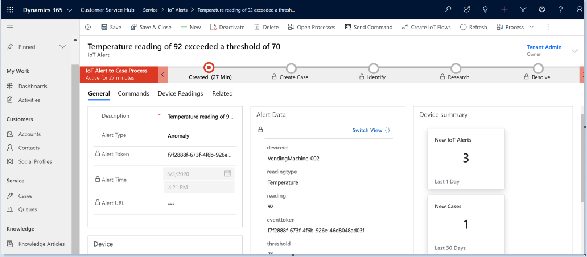
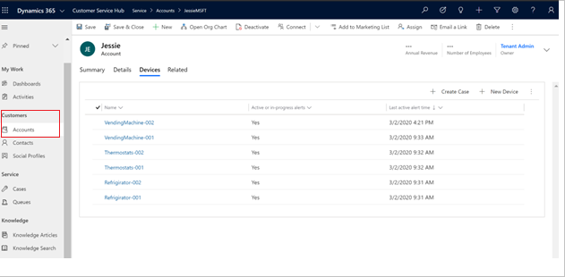
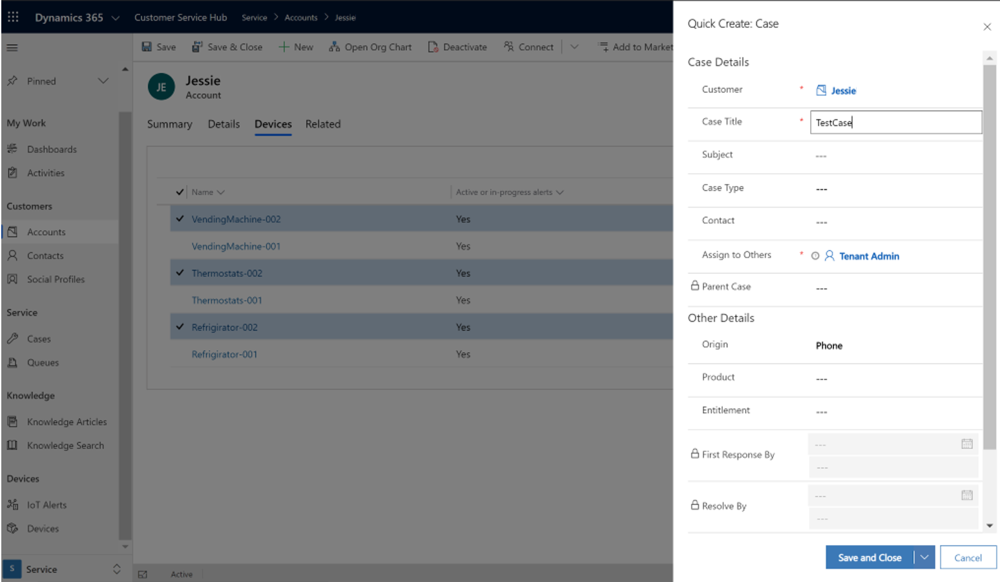
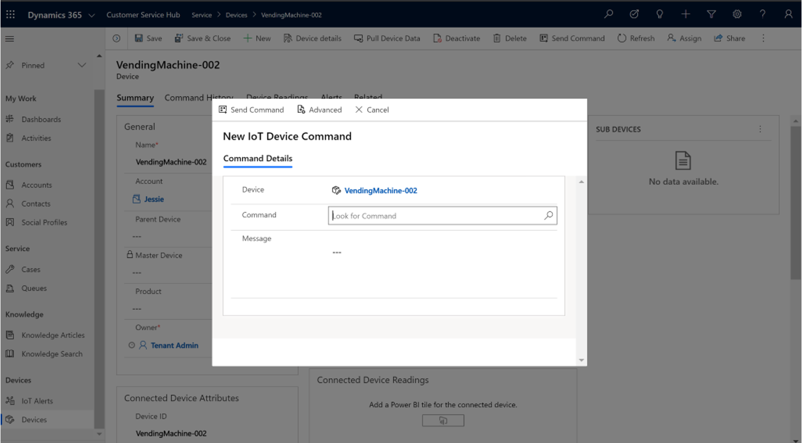
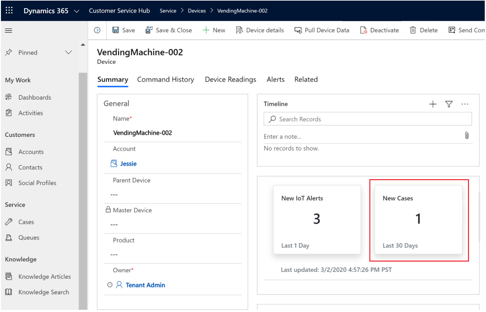
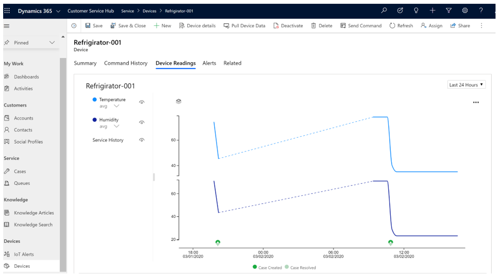
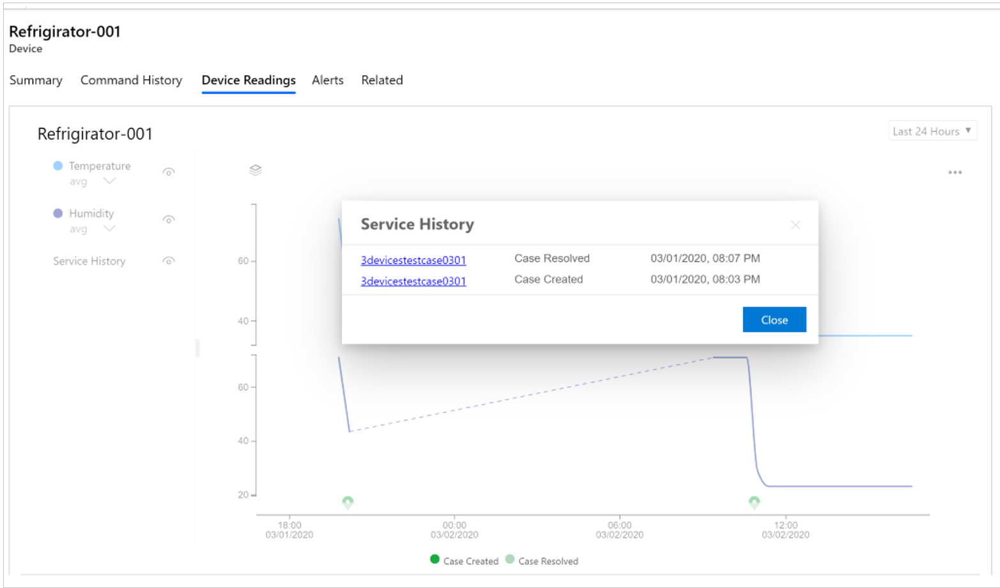
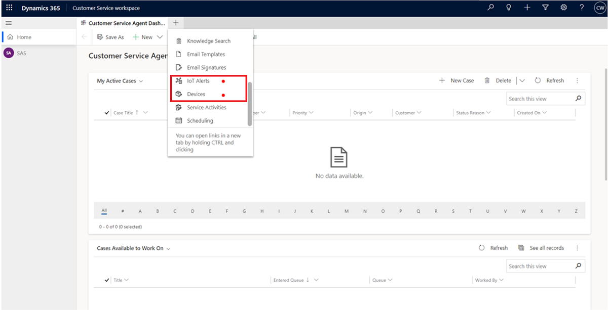

---
title: Connected Customer Service overview (IoT)
description: Learn how Connected Customer Service integrates Dynamics 365 Customer Service with Azure IoT Central and Azure IoT Hub to support IoT-based service scenarios.
ms.topic: overview
ms.service: dynamics365-customer-service
author: lalexms
ms.author: laalexan
ms.date: 03/30/2026
---

# Connected Customer Service - Overview

Connected Customer Service enables organizations to transform their service model into a proactive service model with the availability of IoT diagnostics, IoT commands or actions, and case management on one platform. Customer service representatives (service representatives or representatives) using Customer Service Hub can diagnose and fix issues remotely, which leads to cost savings and improved customer satisfaction.

> [!Note]
> Connected Customer Service is an IoT-based solution built on Azure IoT Central and Azure IoT Hub. It’s intended for organizations without existing IoT deployments and for specific IoT-driven service scenarios. It isn’t the default architecture for new Dynamics 365 Customer Service implementations, which should evaluate Copilot-powered experiences and modern extensibility options instead.

Key benefits of Connected Customer Service:

- Reduce downtime by connecting to IoT devices to diagnose problems before customers are aware of an issue.
- Address issues faster by remotely monitoring and updating devices and keeping customers in the loop.

There are two ways you can connect IoT-enabled devices to the Customer Service solution:

-	Connected Customer Service for [Azure IoT Central](https://azure.microsoft.com/services/iot-central/)
-	Connected Customer Service for [Azure IoT Hub](https://azure.microsoft.com/services/iot-hub/)

The following sections describe the differences between these solutions.

## Connected Customer Service for Azure IoT Central

Connected Customer Service for IoT Central provides a direct integration of Dynamics 365 Customer Service with Microsoft Azure IoT Central, a fully managed IoT software-as-a-service (SaaS) solution.

Microsoft Azure IoT Central enables builders to configure rules and actions. Based on those actions, IoT alerts are created in Connected Customer Service. Also, based on service activities in Connected Customer Service, information can be sent back to IoT Central. This is accomplished by using Power Automate, a SaaS offering for automating workflows across applications and services. 

> [!div class="mx-imgBorder"]
> 
 
The following end-to-end integration processes can be easily implemented based on a pure configuration experience:

- Azure IoT Central can send information about device anomalies to Connected Customer Service (as an IoT Alert) for diagnosis.
- Connected Customer Service can create cases or work orders triggered from device anomalies.

Azure IoT Central requires no extensive cloud development or coding skills to get an IoT solution up and running.  

With [Power Automate templates](https://powerautomate.microsoft.com/templates/), users can connect their accounts, take advantage of our prebuilt templates, and customize their own flows.

Check out our [Connected Customer Service for IoT Central tutorial](cs-iot-receive-alerts.md) to get started.

## Connected Customer Service for Azure IoT Hub

Connected Customer Service for Azure IoT Hub is an add-on solution that brings Azure IoT platform-as-a-service (PaaS) offering into Dynamics 365 for Customer Service. With this offering, you can run a deployment app that brings the Azure IoT services and Dynamics components together.
All Azure IoT services run in your own Azure cloud subscription. Additionally, we provide an enterprise-ready template that you can customize for each Azure IoT service.

## Privacy details for Connected Customer Service

After you install Connected Customer Service for Dynamics 365 and provide your Azure subscription information, the Azure resources are deployed. Your Customer Service instance sends data such as commands, to Azure to enable IoT–enabled scenarios that register devices. Then, commands are sent to and received from the registered devices.

The Azure components and services that are involved with Connected Customer Service functionality are described in the following sections.

[Service bus queue](/azure/service-bus-messaging/service-bus-dotnet-get-started-with-queues)

Connected Customer Service provides a queue for both inbound and outbound messages (commands) flowing between Dynamics 365 Customer Service and Azure. When an IoT alert is sent to Dynamics 365 Customer Service, or a command is sent from Dynamics 365 for Customer Service to the IoT hub, it's queued here.

[Logic Apps](https://azure.microsoft.com/services/logic-apps/)

Connected Customer Service provides an orchestration service that uses a Customer Service connector and a Queue connector. Dynamics 365 Customer Service connectors are used to construct entities that are specific to Customer Service and Queue connectors are used for polling the queue.

[Stream analytics](https://azure.microsoft.com/services/stream-analytics/)

This provides a fully managed, real-time event processing engine that helps to unlock deep insights from data. Stream Analytics makes it easy to set up real-time analytic computations on data streaming from devices, sensors, web sites, social media, applications, infrastructure systems, and more. It's functioning as a funnel to send selective IoT alerts to Dynamics 365 Customer Service.

[IoT Hub](https://azure.microsoft.com/services/iot-hub/)

Connected Customer Service uses the IoT Hub to manage the state of registered devices. In addition, the IoT Hub sends commands and notifications to connected devices—and tracks message delivery with acknowledgment receipts. Device messages are sent in a durable way to accommodate intermittently connected devices.

### Simulator

Simulator is a test web app for emulating the device that is sending commands or receiving commands from the IoT hub.

[Azure SQL Database](https://azure.microsoft.com/services/sql-database/)

Connected Customer Service uses SQL Azure to store device heartbeat messages for later use by Power BI to show the status of devices in Dynamics 365 Customer Service.

[Azure Blob Storage](https://azure.microsoft.com/services/storage/)

Queries that Stream Analytics uses are stored to Azure Blob storage.

- [Connected Customer Service Device Readings (Preview)](cs-iot-visualize-device-readings.md) uses [Azure Time Series Insight (Preview)](/azure/time-series-insights/) as part of the legacy Connected Customer Service Device Readings experience to store, process, and query IoT devices measurements from IoT Hub.

> [!NOTE]
> Learn more about additional Azure service offerings in [Microsoft Azure Trust Center](https://azure.microsoft.com/support/trust-center/).

## User experience for Connected Customer Service

Service representatives can perform the following actions in Connected Customer Service:

1. **Convert an IoT alert to a case**: Representatives can convert an IoT alert to a case that includes prepopulated IoT alert details.

  > [!div class="mx-imgBorder"]
  > 

2. **View a customer’s device alert history**: Representatives can view a customer’s device alert history by selecting the customer’s account. 

> [!div class="mx-imgBorder"]
> 

3. **Create a case with multiple devices**: Representatives can create a case by selecting multiple devices. 

> [!div class="mx-imgBorder"]
> 

4. **Send commands to IoT devices**: Representatives can send commands to IoT devices. 

> [!div class="mx-imgBorder"]
> 

5. **View device history summaries**: Representatives can view a device's history summary. 

> [!div class="mx-imgBorder"]
> 

6. **Check real-time device readings**: Representatives can check real-time device readings. 

> [!div class="mx-imgBorder"]
> 

7. **View case histories on devices**: Representatives can check a case history on a device. 

> [!div class="mx-imgBorder"]
> 

## Connected Customer Service in Copilot Service workspace

The Connected Customer Service solution is available in Copilot Service workspace, where service representatives can access the same IoT-driven capabilities within the modern workspace experience.

> [!div class="mx-imgBorder"]
> 

[!INCLUDE[footer-include](../../includes/footer-banner.md)]
