# 1 - Receive IoT alerts in Connected Customer Service from Azure IoT Central

After you configure the integration between Azure IoT Central and Connected Customer Service, alerts generated in IoT Central appear in Customer Service. These alerts surface on dashboards and can be used to create or relate to cases and work orders automatically.

## Configure alert integration by using Power Automate

Use a Power Automate template to send device alerts from Azure IoT Central to Connected Customer Service.

1. Sign in to your Azure IoT Central application, and then open **Devices**.

   > [!div class="mx-imgBorder"]
   > 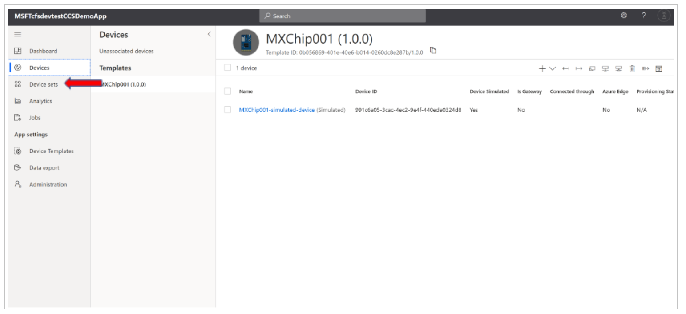

1. Select a device from the list.

   > [!div class="mx-imgBorder"]
   > 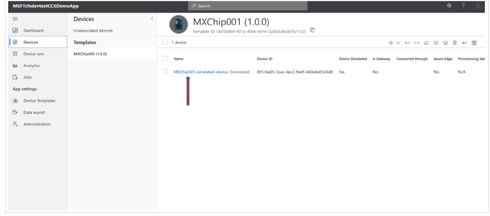

1. On the device details page, select **Rules**, and then create a rule (for example, a temperature threshold rule).

   Learn more about configuring rules in Azure IoT Central:  
   [Set up rules in Azure IoT Central](/azure/iot-central/tutorial-configure-rules)

   > [!div class="mx-imgBorder"]
   > 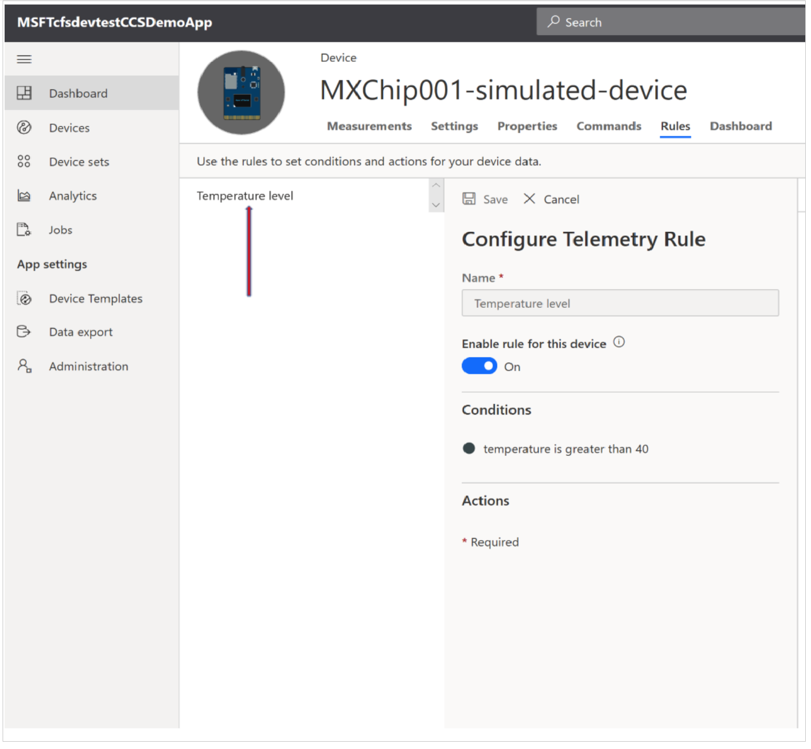

1. Under **Conditions**, select **Add** to define the threshold that triggers the alert.

   > [!div class="mx-imgBorder"]
   > 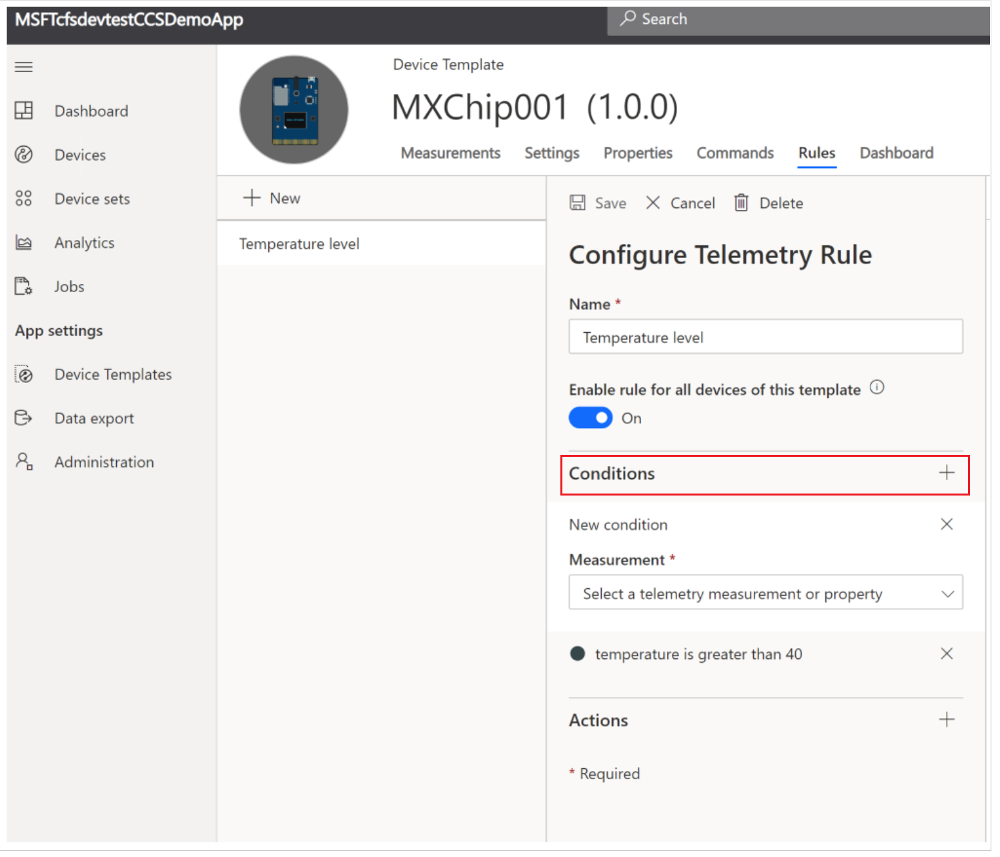

1. Under **Actions**, select **Add**, and then choose **Power Automate**.

   > [!div class="mx-imgBorder"]
   > 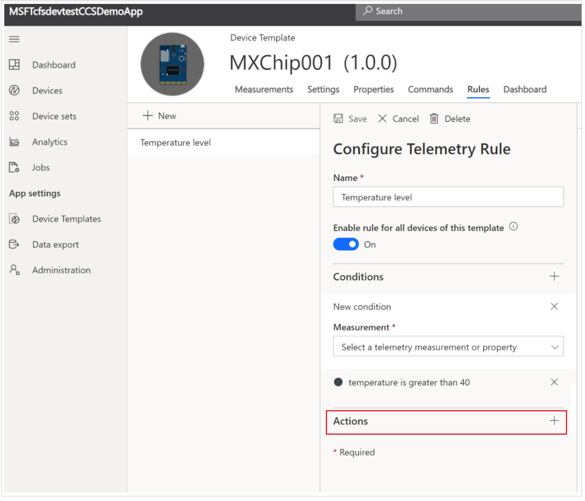

   The Power Automate template page for **Create Connected Service alerts from IoT Central** opens.

1. Select **Use this template**.

   If the template isn’t visible, search for it from the  
   [Power Automate templates gallery](https://powerautomate.microsoft.com/templates/).

   > [!div class="mx-imgBorder"]
   > 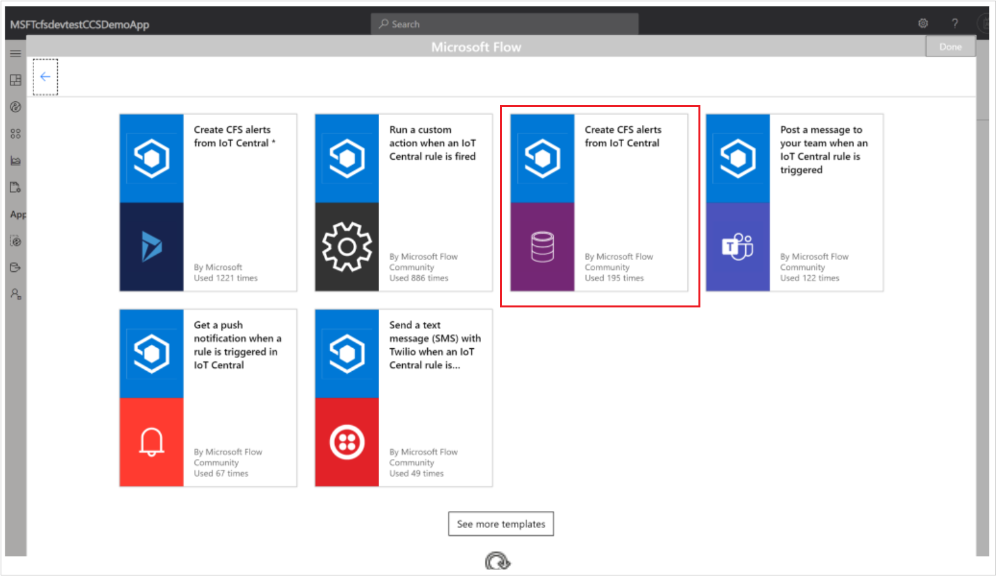

1. When prompted, sign in to both Azure IoT Central and Customer Service, and then select **Continue**.

   > [!div class="mx-imgBorder"]
   > 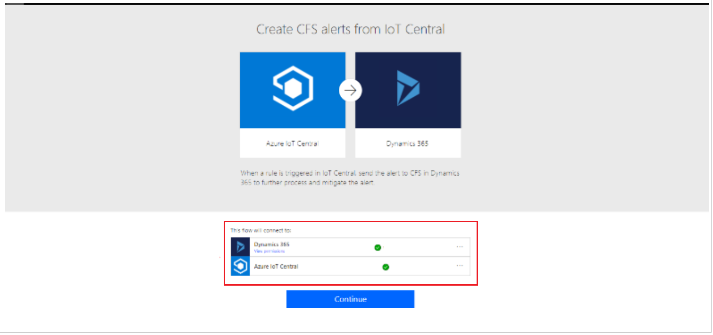

1. Configure the template fields:

   - Select your **Azure IoT Central application**
   - Select the **IoT rule** you created
   - Select your **Customer Service organization**
   - Set **Entity name** to **IoT Alerts**
   - Select **Show advanced options**
   - Set **Alert type value** to **Anomaly**
   - Save the flow

   > [!div class="mx-imgBorder"]
   > 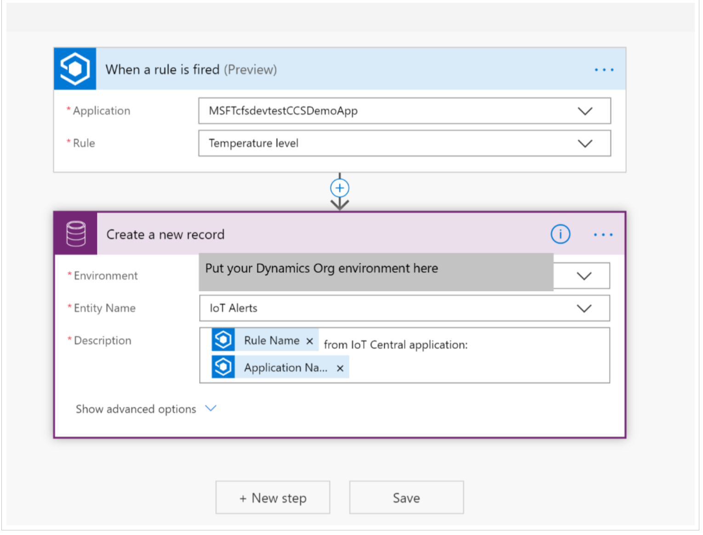

   > [!div class="mx-imgBorder"]
   > 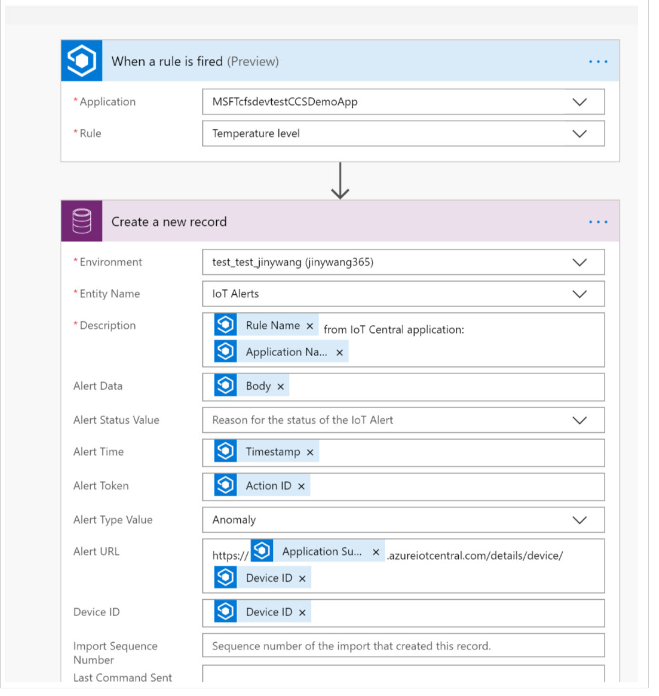

After you save the flow, it runs automatically whenever the IoT rule conditions are met.

## View IoT alerts in Connected Customer Service

1. Sign in to Customer Service, and then open **Connected Customer Service**.

   > [!div class="mx-imgBorder"]
   > 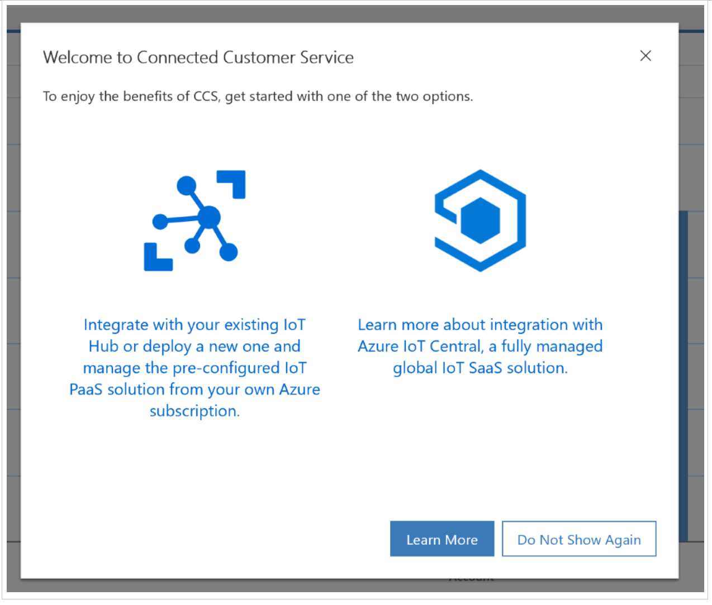

1. Review incoming IoT alerts on the dashboard.  
   Select an alert to view details such as device information, the violated rule, and threshold values.

   > [!div class="mx-imgBorder"]
   > 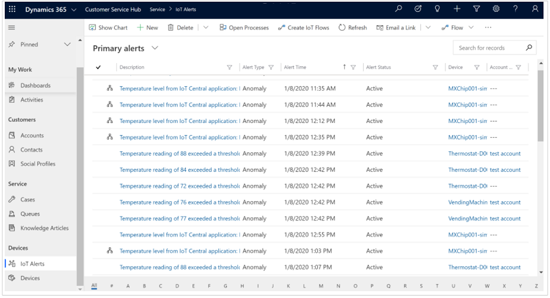

1. From the alert record, select the IoT Central URL to open the originating alert in Azure IoT Central.

   > [!div class="mx-imgBorder"]
   > 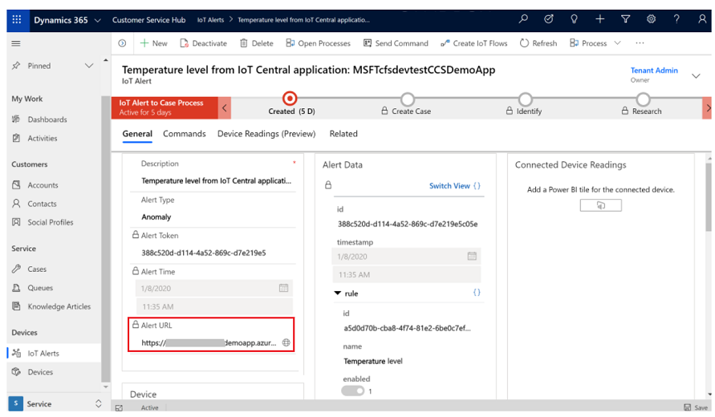

## Related information

[Prerequisites for setting up Connected Customer Service for Azure IoT Central](cs-iot-prerequisites.md)  
[Associate devices with customer accounts in Connected Customer Service](cs-iot-central-associate-devices.md)

[!INCLUDE[footer-include](../../includes/footer-banner.md)]

