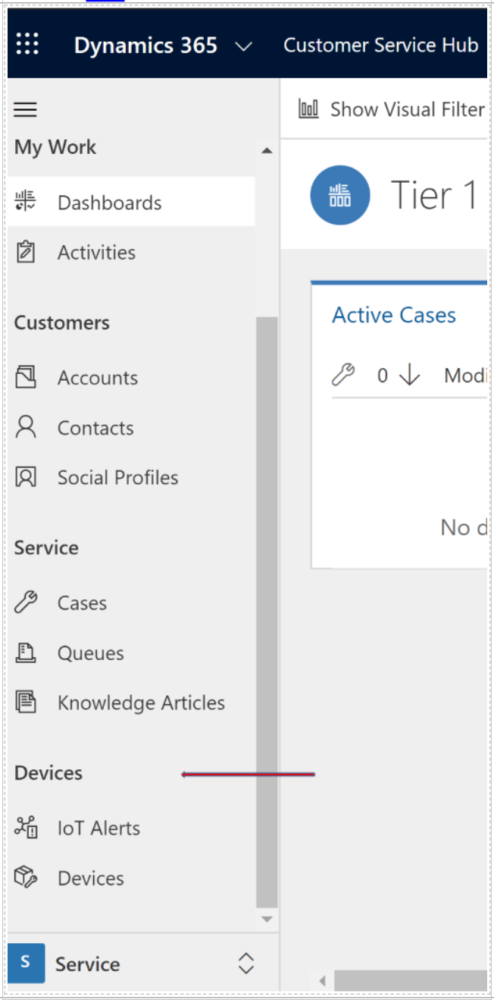
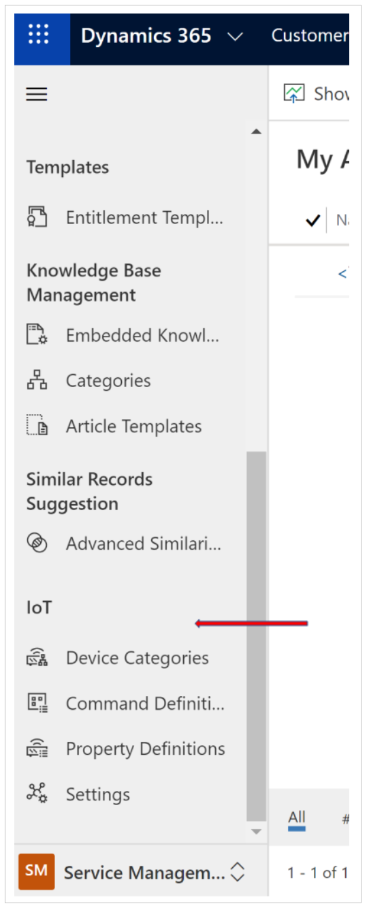

---
title: Security roles for Connected Customer Service
description: Learn how security roles for Connected Customer Service control access to Internet of Things (IoT) entities such as alerts, devices, assets, and commands.
ms.date: 03/30/2026
ms.topic: concept-article
author: lalexms
ms.author: laalexan
ms.reviewer: laalexan
---

# Security roles for Connected Customer Service

Security roles for Connected Customer Service control user access to Internet of Things (IoT) entities, including alerts, devices, assets, and commands. These entities are included with Customer Service version 9.0.20034.xx and later.

The Connected Customer Service–specific roles are intended to be added to existing Customer Service security roles, based on how users interact with IoT data.

## Service representatives working with IoT devices and alerts

Customer service representatives who register devices, view device data, or work with IoT alerts require access to IoT entities that support these activities.

Assign the following roles in addition to their existing Customer Service role:

- **IoT Administrator**
- **IoT Endpoint User**

These roles allow service representatives to view and manage device data, alerts, and related operations that originate from Azure IoT integrations.

[!div class="mx-imgBorder"]

In general, access to IoT entities should align with access to customer asset records for roles such as service representatives, dispatchers, and administrators.

## Administrators configuring IoT settings

Administrators who configure and manage Connected Customer Service and IoT integrations must have broader permissions. The **System Administrator** role is required to configure IoT settings, manage integrations, and administer related entities for Connected Customer Service.

[!div class="mx-imgBorder"]

[!INCLUDE[footer-include](../../includes/footer-banner.md)]
