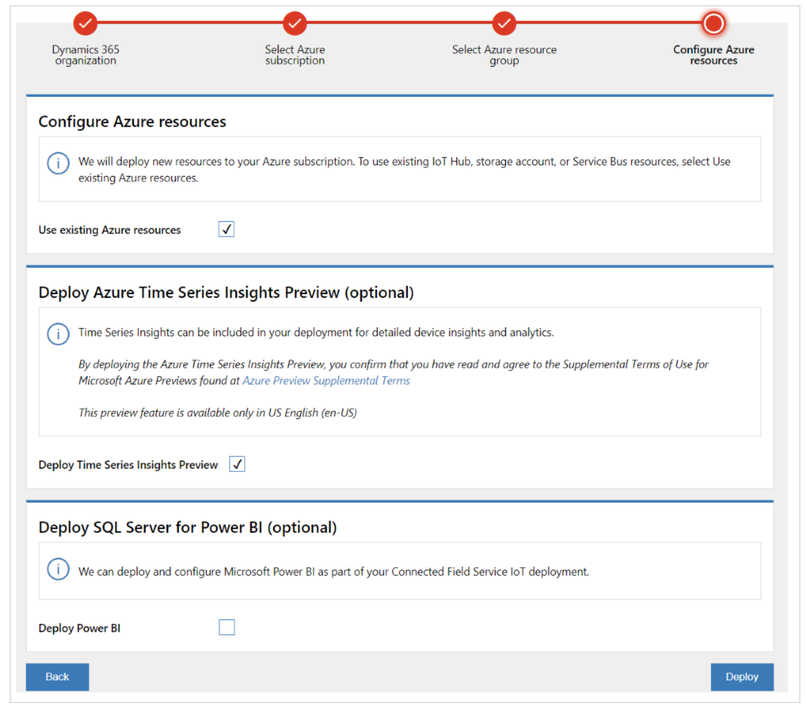
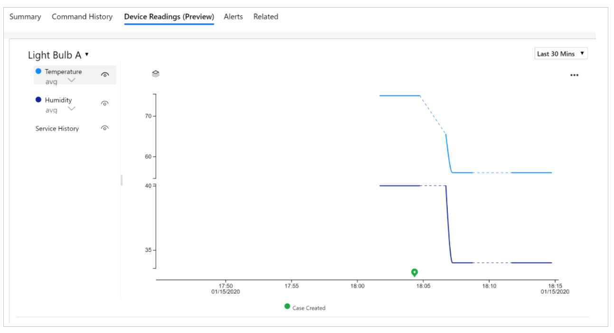
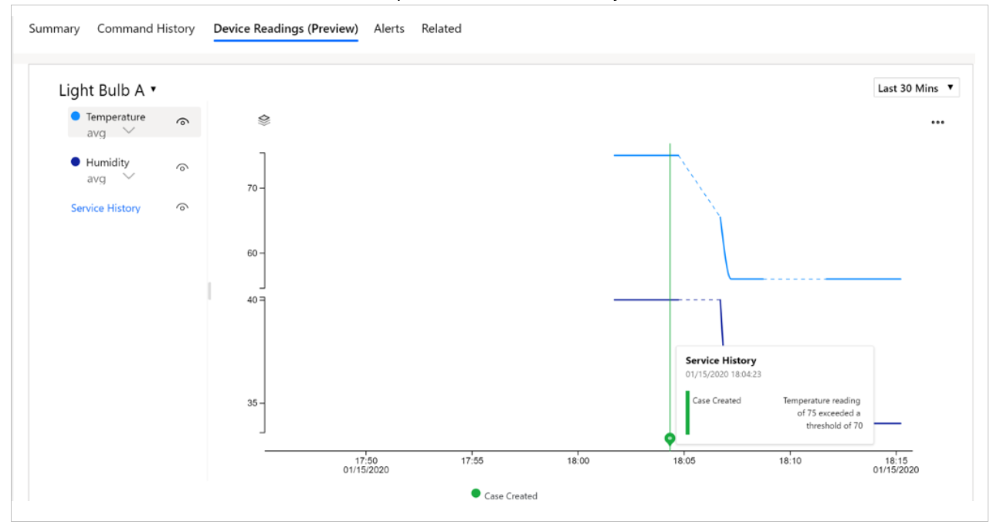
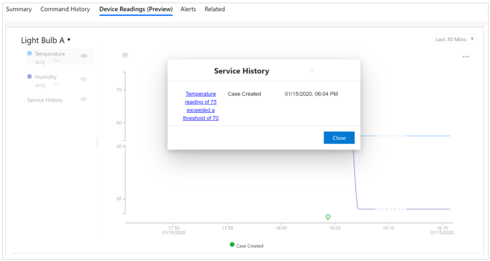

# Visualize device readings

[!INCLUDE[azure-ad-rename](../../includes/cc-azure-ad-rename.md)]

Connected Customer Service can display near–real-time device readings and historical sensor measurements in charts. These charts help you understand the current state of a device, review service history, and evaluate the impact of performed work orders.

The **Device Readings (Preview)** chart is available on the following forms:

- IoT alert  
- Work order  
- Case  
- Device  
- Asset  

To enable device readings, administrators must deploy **Azure Time Series Insights (Preview)** to the Azure subscription when deploying or upgrading Connected Customer Service with Azure IoT Hub. Deployment is completed by using the IoT Deployment app.

## Prerequisites

- Customer Service version 9.0.20034.20XX or later
- This feature is available only in United States English (en-US)

## Enable the device readings chart

1. Open the Connected Customer Service [IoT Deployment app](https://iotdeployment.dynamics.com/).
2. Select the Customer Service organization where the IoT solution is deployed.
3. Select the Azure subscription and resource group.  
   - Select **Upgrade deployment** if you’re updating an existing deployment.
4. Select **Deploy Time Series Insights (Preview)**.
5. Select **Deploy**.

> [!div class="mx-imgBorder"]
> 

6. Complete the remaining steps in the IoT Deployment app to finish the deployment:
   - Create an application (client) ID by following the steps in [Create a Microsoft Entra ID application](/entra/identity-platform/howto-create-service-principal-portal).
   - Create a client secret by following the steps in [Create a new application secret](/entra/identity-platform/howto-create-service-principal-portal#option-3-create-a-new-client-secret).

> [!NOTE]
> - Storage account selection is available only when upgrading an existing deployment.
> - The IoT Deployment app adds the **timeseriesinsightsconsumergroup** consumer group to Azure IoT Hub.

7. After deployment completes, the **Device Readings (Preview)** tab appears on IoT alert, work order, case, device, and asset forms.

## Use the device readings chart

The following table outlines the required data for each form.

| Form | Required data |
|---|---|
| Device | Device ID is populated. |
| Work order | Related IoT alert exists, and the alert is linked to a device with a populated device ID. |
| Case | Related IoT alert exists, and the alert is linked to a device with a populated device ID. |
| Asset | Device ID is populated in the **Connected Device Attributes** section. |
| IoT alert | Related device exists with a populated device ID. |

1. Open the **Device Readings (Preview)** tab on the relevant record.

> [!div class="mx-imgBorder"]
> 

1. Select a time range. If measurements exist for the selected period, the chart loads.
1. Select the eye icon next to a measurement to show or hide it.
1. Hover over the chart to view tooltips with measurement details.

> [!div class="mx-imgBorder"]
> 

1. Select the service history icon to view related service information.

> [!div class="mx-imgBorder"]
> 

1. Select the eye icon next to **Service history** to show or hide related cases.

> [!NOTE]
> If no work orders exist in the selected time period, the work order selector isn’t shown.

## Error codes

Use the following table to troubleshoot issues related to device readings.

| Error code | Possible root cause | Suggested corrective action |
|---|---|---|
| 5000101 | Local Config Store isn’t available | Contact Microsoft Support. |
| 4001002 | Search Span value is null | Verify required parameters. |
| 4000103 | From or To date isn’t valid | Verify date parameters. |
| 4000104 | Interval isn’t a valid duration | Use ISO 8601 duration format (for example, PT1H). |
| 4000201 | IoTDeviceId isn’t a valid GUID | Use msdyn_iotdeviceid value. |
| 4010202 | Insufficient permissions on Device entity | Grant access to msdyn_iotdevice. |
| 5000203 | Device ID not found | Ensure msdyn_DeviceId is populated. |
| 5000204 | Time Series Insights URL missing | Verify TSI deployment and IoT provider. |
| 5000205 | Client ID invalid | Update client ID in IoT Deployment app. |
| 5000206 | Client secret expired | Renew secret and redeploy. |
| 5000207 | Failed to acquire access token | Retry or update credentials. |
| 5000603 | Time Series Insights API failure | Retry or contact Support. |
| 5000604 | Unexpected TSI API response | Retry or contact Support. |

## Additional notes

- Available only in en-US
- Known issues:
  - Custom time zones always display local time.
  - You may see a temporary credential error immediately after creating a new app registration. Retry after one minute.
- Azure Time Series Insights (Preview) uses a pay‑as‑you‑go pricing model. Pricing details are available in the [Azure pricing documentation](https://azure.microsoft.com/pricing/details/time-series-insights/).

[!INCLUDE[footer-include](../../includes/footer-banner.md)]
