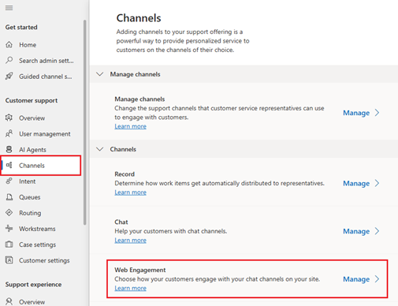
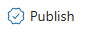

# Deploy chat widgets across websites using a single tag

[!INCLUDE[cc-feature-availability-embedded-yes](../../includes/cc-feature-availability-embedded-yes.md)]

The Live Chat Widget is deployed using a widget-specific script tag (learn more in [Embed chat widget in your website or portal](embed-chat-widget-portal.md)) and customized using JavaScript (learn more in [Develop a custom live chat widget](../develop/develop-live-chat-widget.md)). This method is easy to use and good for small chat deployments.

As your chat program grows, however, you may find it complicated to handle multiple workstreams and multiple sets of customizations. **Web Engagement Orchestration** simplifies development by enabling you to deploy a single script tag to your entire site. Workstream selection and customizations are handled through configurable business logic in the Admin Center, rather than through JavaScript on your pages.

This feature is found in the Customer Service Admin Center, inside the Channels tab of the Customer support section, labeled as “Web Engagement”. Select “Manage” to get started.

## Creating and managing rulesets

Web Engagement Orchestration is defined by a set of rules, which are collected into versions, which are part of a **Ruleset**. Rulesets allow you to group your rules for different purposes. Typically, you’ll use multiple rulesets if you support multiple brands or sites whose chat programs don’t overlap.

### Creating a ruleset

To add a new Ruleset simply click the New button: 

And then enter these values:

-  **Name**: Unique name for the group of rules.
-  **Description**: A short description to help you and your team remember the purpose of this ruleset. _Optional_.
-  **Function Path**: When using Web Engagement Orchestration, we retrieve any Custom Context values (learn more in [Manage context variables](manage-context-variables.md)) from the function you define here. This method is an easier way to provide Context Variables than the event listener method described here: [Send custom context during live chat](../develop/send-context-starting-chat.md). Web Engagement Orchestration uses those context variables for rule evaluation, and passes them to Contact Center should the customer start a new conversation. _Optional_.

### Retrieving your script tag

The primary benefit of Web Engagement Orchestration is allowing you to use a single script tag. You can retrieve this script tag by:

- Selecting the row of a particular Ruleset
- Selecting the “Copy Live Chat Widget Script” button from the top of the page 

This action places the script tag in your clipboard, which can then be used on your site. The script tag is unique per ruleset.

### Managing rulesets

You can Edit and Delete rulesets by selecting them and then using the appropriate button at the top of the screen.

- **Edit**: Change the name, description, or function path of an existing Ruleset
- **Delete**: Delete the Ruleset. This action is irreversible.

Selecting the underlined name of a Ruleset opens the Version page.

## Creating and managing versions

**Versions** are sets of Engagement Rules. They allow you to have a “live” set of rules while you’re working new changes, and to always roll back to an older set of rules if needed.

### Creating a version

Select the New button: 

And choose these values:

-	**Source Version Number**: Select a particular source to copy all Engagement Rules from that source version. Typically you’ll want to select the last version you created. If you are creating your first version, or if you want to create rules from scratch, select “No source – New”
-	**New Version Number**: A numerical ruleset number using the format “#.#”. We automatically increment the source version number you chose, but you can change this or edit it later.
-	**Description**: Something to help you remember the purpose of this version. _Optional_.

### Publishing a version

You can publish a version by:

-	Selecting the row of a particular version
-	Selecting the “Publish” button from the top of the page

Publishing a version means that the set of Engagement Rules inside will be used with this Ruleset’s script tag. Only one version can be published at a time – publishing a different version removes the published flag from the old version. Which version is published is shown under the “Publish Status” column.

### Managing versions

You can Edit, Delete, and Duplicate versions by selecting them and then using the appropriate button at the top of the screen.

-	**Edit**: Change the version number or description. Not available for the published version.
-	**Delete**: Delete the version. This action is irreversible.
-	**Duplicate**: Create a new version, pre-filling the source version with the selected version.

Selecting the underlined name of a version opens the Engagement Rules page.

## Engagement rules

These rules are the center of Web Engagement Orchestration, and how you configure which chat experience to show your customers.

### Creating an Engagement Rule

Select the New button to open the Rule Builder: 

The Rule Builder is divided into two sections: **Conditions** and **Actions**. Conditions decide whether a rule should fire, and Actions dictate how to engage the customer. Once a rule evaluates as true and the customer is engaged, Web Engagement Orchestration stops evaluating rules even when more exist in the ruleset.

#### Add name and description

For your reference, specify a rule name and description. Description is optional.

#### Conditions

Click the Add button to create new rows of conditions: [Button with add label](../media/weo_add.png)

You can add multiple rows, which you can then group into logical blocks where each row or any row must evaluate as true. To change the logical operator for groups: select multiple rows, select the “More commands” button at the end of the row, select “Group”, and then select the “And / Or” dropdown which appears above the new group.

Each conditional row is one of several types, selected under the first dropdown in a row:

- **Site Area**: Choose to fire a rule based on the customer's location on your site, decided by the URL. Site Areas can be selected and created by opening the "Site Area" dropdown in this row. Selecting "+ New Site Area" opens the "Create New Site Area" pane, where you choose:
  - **Site Area Name**: A readable name for your own reference
  - **Regular Expression**: A regex string to define the URL pattern of your site area, see: [Regular expressions - quick reference](https://learn.microsoft.com/dotnet/standard/base-types/regular-expression-language-quick-reference). For example, the regex “^.*contact-us.*$” matches any page with “contact-us” in the URL.
  - **Test Your Rule**: This field is not required, it is simply a space to test URLs to see if they match the regex specified above. A check or X mark appears to the right of this input if the URL matches or does not match with your expression.
- **Custom Context**: Choose to activate a rule depending on the contents of the Custom Context function you specified when creating the ruleset. Here, you define the type of value (text or numerical), provide the key name, and provide the value to evaluate against.
- **Custom Client Function**: Call a function on your page and retrieve a value. This option enables you to choose a Function Name on your page, define the type of value it returns (text or numerical), and provide the value to evaluate against. This option is useful when you have a semi-expensive call, like a backend request, that you don’t always want to make and place in the custom context function. It can also be used when you want to use a piece of data but not submit that data as a Context Variable. This is useful for data which does not need to be propagated across the conversation and displayed to Customer Service Representatives.

> [!NOTE]
> We are temporarily removing the Hours of Operation condition, and will re-release it with more functionality in the near future.

#### Actions

Select an Action using the dropdown:
- **Show Chat Button**: Display the chat button for a particular widget, or load a chat widget that has its chat button suppressed so it can be used with a custom chat button. Choose which widget to load by selecting one from the “Select Live Chat Widget” dropdown.
- **Open Chat Widget**: Load a chat widget and open the application. Typically used when the customer’s intent is clear, like for a page that loads after a customer selects a “Talk to a Representative” link.
- **Do Nothing**: Stops rule evaluation, otherwise known as a suppression rule. Used when you identify a condition where you do not want the customer to use messaging.

Additionally, you can also customize the chat experience by opening the Advanced Settings area.

- **Add Custom Context**: Add key / value pairs to be passed to the Copilot Agent and your Customer Service Representatives. This option gives you an alternative way to provide these values beside using the Context Variable function. Use the dropdown to select a key name, and use the value input to specify a value. Note: The keys must already be specified in the workstream of the select Live Chat Widget, learn more at: [Manage context variables](manage-context-variables.md)
- **Config Override JSON**: Specify configuration overrides for the Live Chat Widget, like changing the logo or styling. This field functions identically to the script based configuration, learn more in [Develop a custom live chat widget](../develop/develop-live-chat-widget.md). The Config Override JSON is a JSON-formatted version of the data-customization-callback function used in the above method.

### Activating rules

When a rule is created, it starts inactive. Simply click the check box in the “Active” column to activate or deactivate a rule. The change happens immediately – there is no save prompt.

### Prioritizing rules

Web Engagement Orchestration, on load, evaluates every rule in the order specified in the Priority column in ascending order until a rule evaluates as true. Once a rule triggers it does not check any other further rules, so it is important to make sure your rules are in the right order.
Priority can be changed by entering a new number inside the input in the Priority column. Gaps in the order of integers are allowed. Changes are applied immediately.

### Managing rules

You can Edit, Delete, and Duplicate rules by selecting them and then using the appropriate button at the top of the screen.
- **Edit**: Change any part of the Name, Description, Conditions, and Actions of a rule
- **Delete**: Delete the rule. This action is irreversible.
- **Duplicate**: Create a new rule, pre-filling the Conditions and Actions sections.

#### Frequently asked questions

> Is this feature backwards compatible with the old method of launching and customizing the Live Chat Widget?

Yes. The previous method still works, and may be preferable for very small or uncomplicated Live Chat programs.
You opt in to Web Engagement Orchestration by using the new script tag, and both methods can be used at once, though this is not recommended.

> How long does it take rule changes to propagate?

Please allow up to 10-15 minutes for changes to reflect in the front end experience. This applies for all settings configured in the Admin Center.

> Is this feature useable with the Contact Center Messaging SDKs for iOS and Android, or other channels?

No – Engagement Orchestration is only used for Web.

> Can I load an unpublished Ruleset version for testing?

Not currently, but this request a roadmap item which we will support in the near future.

> Can I use this feature with the Omnichannel Chat SDK instead of the Live Chat Widget?

Not currently, but in a future release we will support launching custom functions as an action, which can be used to fire your Omnichannel Chat SDK implementation.

#### Troubleshooting

To see verbose console logging during rule evaluation, modify your script tag to **change data-lcw-version="prod"** to **data-lcw-version="test"**. Your browser's console will now show which rules are executing and whether their conditions are met.

Known issues identified in our preview that are being addressed shortly after our initial release:
- The Hours of Operation condition is not functioning in a useful manner
- After adding and saving a configuration override JSON it cannot be removed completely, only emptied into a set of brackets
- The Rules page is sorting by creation date instead of by priority as intended
- JavaScript logs errors when custom context function path is not found, instead of warnings

#### Related information

[Supported browsers for live chat widget](../implement/system-requirements-omnichannel.md#browsers-for-chat)  
[Add a chat widget](add-chat-widget.md)  
[Embed chat widget in your website or portal](embed-chat-widget-portal.md)  
[Develop a custom live chat widget](../develop/develop-live-chat-widget.md)  

[!INCLUDEfooter-include]
