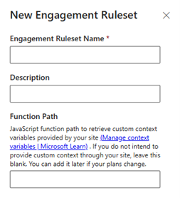

# Deploy chat widgets using a single tag

[!INCLUDE[cc-feature-availability-embedded-yes](../../includes/cc-feature-availability-embedded-yes.md)]

The live chat widget is deployed using a [widget-specific script tag](embed-chat-widget-portal.md) and customized using JavaScript. Learn more in [Develop a custom live chat widget](../develop/develop-live-chat-widget.md). This method is easy to use and good for small chat deployments.

However, as your chat program grows, you might find it complicated to handle multiple workstreams and multiple sets of customizations. Web engagement orchestration simplifies deployment by enabling you to deploy a single script tag to your entire site. The workstream selection and customizations are handled through configurable business logic in the admin center, rather than through JavaScript on your pages.

## Manage engagement rulesets

Web engagement orchestration is defined by a set of rules, collected into versions and are a part of a **Ruleset**. Rulesets allow you to group your rules for different purposes. Typically, you use multiple rulesets if you support multiple brands or sites whose chat programs don’t overlap.

### Create a ruleset    

1. In the site map of Copilot Service admin center, go to **Channels** &gt; **Web Engagement** &gt; **Manage**.

1. On the **Engagement Rulesets** page, select **New**, and enter the following details on the dialog.

   - **Name**: Unique name for the group of rules.
   - **Description**: Optionally, a short description to help you and your team remember the purpose of this ruleset.
   - **Function Path**: Optionally, path to the function to retrieve any custom context values that you define. Learn more in [Manage context variables](manage-context-variables.md). This method is an easier way to provide context variables than the event listener method described here: [Send custom context during live chat](../develop/send-context-starting-chat.md). Web engagement orchestration uses the context variables for rule evaluation, and passes them to the contact center should the customer start a new conversation.

:::image type="content" source="../media/weo_ruleset.png" alt-text="":::

### Retrieve your script tag

The primary benefit of web engagement orchestration is allowing you to use a single script tag. To retrieve the script tag,

1. Select the row of a particular ruleset.
1. Select **Copy Live Chat Widget Script**. The script tag is copied to your clipboard, which can then be used on your site. The script tag is unique per ruleset.

### Manage rulesets

You can edit and delete rulesets by selecting them and then using the appropriate button at the top of the screen.

- **Edit**: Change the name, description, or function path of an existing ruleset
- **Delete**: Deletes the ruleset. This action is irreversible.

## Create and manage versions

**Versions** are sets of engagement rules. They allow you to have a "live" set of rules while you’re working on new changes. You can always roll back to an older set of rules if needed.

### Create a version

Select a ruleset and on the **Versions** page, select **New**, and enter the following details:

-	**Source Version Number**: Select a particular source to copy all Engagement Rules from that source version. Typically you want to select the last version you created. If you're creating your first version, or if you want to create rules from scratch, select "No source – New"
-	**New Version Number**: A numerical ruleset number using the format "#.#". We automatically increment the source version number you chose, but you can change the version number or edit it later.
-	**Description**: Optionally, something to help you remember the purpose of this version.

### Publish a version

To publish a version:

1. Select the row of a particular version.
1. Select **Publish** on the command menu.

When you publish a version, the set of engagement rules that you have defined are applied with the ruleset script tag. You can publish one version only at a time. When you publish a different version, the published flag from the old version is removed. The **Publish Status** column displays the publish status.

### Manage versions

You can do the following with the versions by selecting a version.

-	**Edit**: Change the version number or description. Not available for the published version.
-	**Delete**: Delete the version. This action is irreversible.
-	**Duplicate**: Create a new version, prefilling the source version with the selected version.

Selecting the underlined name of a version opens the **Rules** page where you define the engagement rules.

## Manage engagement rules

These rules are the center of web engagement orchestration, and how you configure the chat experience to show your customers.

Select **New** to open the rule builder.

The **Rule Builder** is divided into two sections: 
- **Conditions**: Conditions decide whether a rule should run
- **Actions**: Actions determine how to engage the customer. After a rule evaluates as true and the customer is engaged, the web engagement orchestration stops evaluating the rest of the rules if they exist in the ruleset.

### Add name and description

For your reference, specify a rule name and description. Description is optional.

### Define conditions

Select **Add** to create new rows of conditions.

You can add multiple rows that you can then group into logical blocks where each row or any row must evaluate as true. 

Do the following steps to change the logical operator for groups.

1. Select multiple rows, then select **More commands** at the end of the row.
1. Select **Group**, and then select the **And/Or** dropdown that appears.
1. Select one of the following to define the conditions:
   - **Site Area**: Choose to run a rule based on the customer's location on your site, decided by the URL. Site areas can be selected and created by opening the **Site Area** dropdown in this row. Select **New Site Area** to open the **Create New Site Area** pane, where you enter the following details:
      - **Site Area Name**: A readable name for your own reference
      - **Regular Expression**: A regex string to define the URL pattern of your site area. Learn more in [Regular expressions&mdash;quick reference](/dotnet/standard/base-types/regular-expression-language-quick-reference). For example, the regex "^.*contact-us.*$" matches any page with "contact-us" in the URL.
      - **Test Your Rule**: This field isn't required. It's simply a space to test URLs to see if they match the regex you specified. A check or X mark appears to the right of this input if the URL matches or doesn't match with your expression.
   - **Custom Context**: Choose to activate a rule depending on the contents of the custom context function that you specified when creating the ruleset. Here, you define the type of value (text or numerical), provide the key name, and provide the value to evaluate against.
   - **Custom Client Function**: Call a function on your page and retrieve a value. This option enables you to choose a Function Name on your page, define the type of value it returns (text or numerical), and provide the value to evaluate against. This option is useful when you have a piece of data that's semi-expensive to request. It may be better to use this an only retrieve it when needed instead of always placing it in the custom context function. This condition type can also be used when you want to use a piece of data but not submit that data as a context variable. It is useful for data that doesn't need to be propagated across the conversation and displayed to customer service representatives (service representatives or representative).

### Configure actions

Select one of the following actions:
- **Show Chat Button**: Display the chat button for a particular widget. Choose the widget to load in **Select Live Chat Widget**.
- **Open Chat Widget**: Load a chat widget and open the application. Typically used when the customer’s intent is clear, like for a page that loads after a customer selects a **Talk to a Representative** link.
- **Do Nothing**: Stops rule evaluation, otherwise known as a suppression rule. Select when you identify a condition where you don't want the customer to use messaging.

Use the **Advanced Settings** area to further customize the chat experience.

- **Add Custom Context**: Add key-value pairs to be passed to the AI Agent and service representatives. This option gives you an alternative way to provide these values besides using the context variable function. Use the dropdown to select a key name, and use the value input to specify a value. Note: The keys must already be specified in the workstream of the select Live Chat Widget, learn more at: [Manage context variables](manage-context-variables.md)
- **Config Override JSON**: Specify configuration overrides for the live chat widget, like changing the logo or styling. This field functions identically to the script based configuration, learn more in [Develop a custom live chat widget](../develop/develop-live-chat-widget.md). The **Config Override JSON** setting is a JSON-formatted version of the data-customization-callback function used in the script method.

### Activate rules

A rule is inactive after you create it. To activate or deactivate a rule, select the checkbox in the **Active** column. The rule becomes active immediately; there's no save prompt.

### Prioritize rules

Web engagement orchestration, on load, evaluates every rule in the order specified in the **Priority** column in ascending order until a rule evaluates as true. After a rule condition is met, the system stops evaluating the other rules. Therefore, make sure your rules are in the right order. You can update the priority by reordering the value in the **Priority** column. Gaps in the order of integers are allowed. Changes are applied immediately.

### Manage rules

You can do the following actions with the rules.
- **Edit**: Change any part of the **Name**, **Description**, **Conditions**, and **Actions** of a rule.
- **Delete**: Delete the rule. This action is irreversible.
- **Duplicate**: Create a new rule, pre-filling the **Conditions** and **Actions** sections.

## Frequently asked questions

Some of the FAQs are as follows.

### Is this feature backwards compatible with the old method of launching and customizing the live chat widget?

Yes. The existing method still works, and might be preferable for small and straightforward live chat programs. while you can use both methods at once, we recommend that you use one method only.`

### How long does it take for the rule changes to propagate?

Allow up to 10-15 minutes for the changes to reflect. This wait time applies for all settings configured in the admin center.

### Can this feature be used with the contact center messaging SDKs for iOS and Android, or other channels?

No. Engagement orchestration is used for the web only.

### Can I load an unpublished Ruleset version for testing?

No. Currently you can't.

### Can I use this feature with the omnichannel chat SDK instead of the live chat widget?

No. Currently, it's not supported.

## Troubleshoot

To see verbose console logging during rule evaluation, modify your script tag to **change data-lcw-version="prod"** to **data-lcw-version="test"**. Your browser console shows the rules that are run and whether their conditions are met.

### Related information

[Supported browsers for live chat widget](/dynamics365/contact-center/implement/system-requirements-contact-center)  
[Add a chat widget](add-chat-widget.md)  
[Embed chat widget in your website or portal](embed-chat-widget-portal.md)  
[Develop a custom live chat widget](../develop/develop-live-chat-widget.md)  