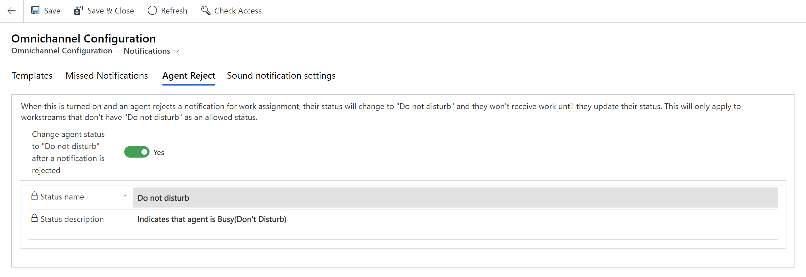

# Enable automatic update of presence on rejection of work assignment

[!INCLUDE[cc-feature-availability](../../includes/cc-feature-availability.md)]

You can enable agent presence to be updated automatically to **Do not disturb** when agents reject an incoming notification for a work assignment. No new tasks are assigned when agents reject notifications for incoming chat requests. Also, a message indicating that the agent presence has been changed is displayed at the top of the agent dashboard. Agents can reset their status by using the reset presence option that's displayed with the notification, or by manually changing their status.

> [!IMPORTANT]
> 
> - Work items will continue to be routed to the agent if **Do not disturb** is an allowed presence in the workstream. More information: [Create workstreams for unified routing](create-workstreams.md)
> - Automatic change of agent status when agent rejects a notification is not supported in Omnichannel for Customer Service on Unified Service Desk.

## Enable automatic update of agent presence

1. In the site map of Customer Service admin center or Contact Center admin center, select **Workspaces** in **Agent experience**.
1. On the **Workspaces** page, select **Manage** for **Notification templates**.
1. On the **Omnichannel Configuration** page, select the **Agent Reject** tab.  
1. Set the **Change agent status to "Do not disturb" after a notification is rejected** toggle to **Yes**. The **Status name** and **Status description** settings appear.
1. Select **Save**.

> [!div class=mx-imgBorder] 
> 

### Related information

[Manage notification settings and templates](/dynamics365/app-profile-manager/notification-templates)  
[View notifications](../use/oc-notifications.md)  

[!INCLUDE[footer-include](../../includes/footer-banner.md)]
