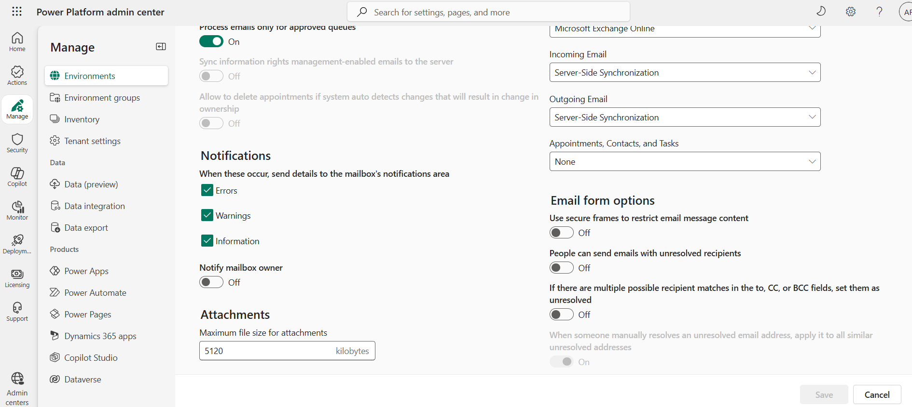

# Enable file attachments

[!INCLUDE[cc-feature-availability-embedded-yes](../../includes/cc-feature-availability-embedded-yes.md)]

You can enable or disable the capability for your customer service representatives (service representatives or representatives) and customers to send file attachments during a conversation. 

When you enable the option for customers in the **General settings** configuration of your channel, customers can include attachments with their messages. Similarly, when you enable the option for service representatives, they can send attachments from the communication panel to the customers. Representatives can upload files by dragging and dropping the file from the file explorer into the conversation canvas. Customers must use the **Attach** icon to upload files.

If one representative transfers the conversation to another, the representative who receives the chat can also access the files attached in the conversation.

Learn more about the representative and customer experience of using file attachments in chat in [Configure file attachment](configure-file-attachment.md).

Learn more about the file types that are supported in each channel in [Asynchronous channel support](card-support-in-channels.md).

## File size limit and unsupported extensions (types) for attachments

By default, the application has a file size limit of 5 megabytes (MB) (5,120 kilobytes). However, you can configure the file as per your organization's requirements.

> [!Tip]
> Refer to documentation for your channel when determining message size limits. When you are enabling file attachments for Facebook messenger, we recommend that you configure a maximum limit of 25 MB (25,600 kilobytes) because the Facebook messenger file size limit is 25 MB.

You can set the file extension types that customers and representatives can share.

## Configure file size limit

To configure the file size limit, complete the following steps:

1. Sign in to [Power Platform Admin portal](https://admin.powerplatform.com).

2. Under **Manage** menu, select your environment and navigate to **Settings** area using button in the ribbon

3. Open the **Email** menu and select **Email settings**

4. Under to **Attachments** section, in the **Maximum file size for attachments** field, enter the new value in kilobytes.

    > [!div class=mx-imgBorder]
    > 

5. Select **Save**.

## Configure file extensions

To configure unsupported file extensions, complete the following steps:

1. Sing in to Dynamics 365

2. Select the settings icon in the nav bar, and then select **Advanced Settings**.

3. Using left hand navigation, go to **Administration** menu under **System** group, and select **General** system settings

4. In the **Set blocked file extensions for attachments** field, add or edit the file types to be blocked.

    > [!div class=mx-imgBorder]
    > 

5. Click **Save**

### Related information

[Support for live chat and asynchronous channels](card-support-in-channels.md)  
[Configure file attachments](configure-file-attachment.md)  
[Configure a Facebook channel](configure-facebook-channel.md)   
[Configure a WhatsApp channel](configure-whatsapp-channel.md)   
[Configure a LINE channel](configure-line-channel.md)  
[Download file attachments from your Azure bot](../develop/download-attachments-bot.md)  

[!INCLUDE[footer-include](../../includes/footer-banner.md)]
