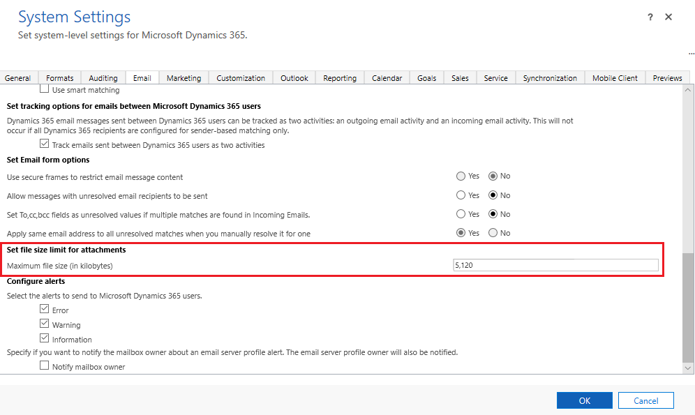
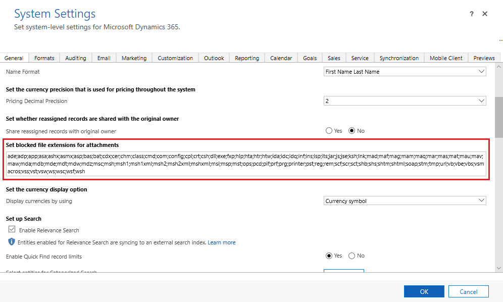

# Enable file attachments

[!INCLUDE[cc-feature-availability-embedded-yes](../../includes/cc-feature-availability-embedded-yes.md)]

You can Enable file attachments to allow customer service representatives (service representatives, representatives) and customers to share files during messaging conversations.

When you enable the option for customers in the **General settings** configuration of your channel, customers can include attachments with their messages. Similarly, when you enable the option for service representatives, they can send attachments from the communication panel to the customers. Representatives can upload files by dragging and dropping the file from the file explorer into the conversation canvas. Customers must use the **Attach** icon to upload files.

If a representative transfers the conversation to another representative, the receiving representative can access the files attached to the conversation.

Learn more about the representative and customer experience of using file attachments in chat in [Configure file attachment](configure-file-attachment.md).

Learn more about the file types that are supported in each channel in [Asynchronous channel support](card-support-in-channels.md).

## File size limit and unsupported extensions for attachments

By default, the application has a file size limit of 5 megabytes (MB) (5,120 kilobytes). You can change this limit based on your organization's requirements.

> [!Tip]
> Refer to documentation for your channel when determining message size limits. If you enable file attachments for Facebook Messenger, we recommend that you configure a maximum limit of 25 MB (25,600 kilobytes) because the Facebook Messenger file size limit is 25 MB.

You can set the file extension types that customers and representatives can share.

## Configure file size limit and file extensions

To configure the file size limit and file extensions, complete the following steps:

1. In the Customer Service or Contact Center app, select the **Settings** icon in the navigation bar, and then select **Advanced Settings**.

1. Go to **Settings** > **Administration** > **System Settings**.

1. In the **System Settings** window, go to the **Email** tab.

1. Go to the **Set file size limit for attachments** section, and in the **Maximum file size (in kilobytes)** field, enter the value in kilobytes.

    > [!div class=mx-imgBorder]
    > 

1. To specify unsupported file types, go to the **General** tab.

1. In the **Set blocked file extensions for attachments** field, add or edit the file types.

    > [!div class=mx-imgBorder]
    > 

1. Select **OK**.

Now, representatives and customers can share file attachments during their conversation.

### Related information

[Support for live chat and asynchronous channels](card-support-in-channels.md)  
[Configure file attachments](configure-file-attachment.md)  
[Configure a Facebook channel](configure-facebook-channel.md)   
[Configure a WhatsApp channel](configure-whatsapp-channel.md)   
[Configure a LINE channel](configure-line-channel.md)  
[Download file attachments from your Azure bot](../develop/download-attachments-bot.md)  

[!INCLUDE[footer-include](../../includes/footer-banner.md)]
