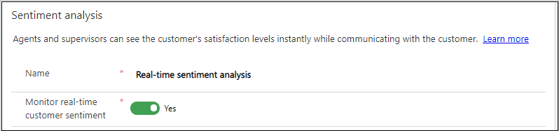
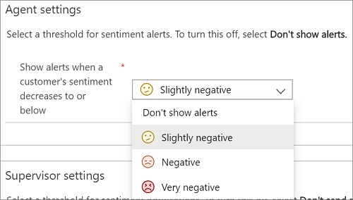
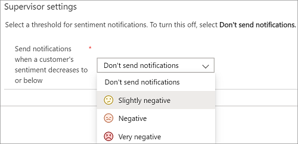

# Analyze real-time customer sentiment

[!INCLUDE[cc-feature-availability-embedded-yes](../../includes/cc-feature-availability.md)]

Sentiment analysis provides customer service representatives (service representatives or representatives) and supervisors with real-time insights into customer interactions with service representatives during conversations.

Specific licensing requirements apply when you enable real-time sentiment. Learn more in [Dynamics 365 Licensing Guide](https://go.microsoft.com/fwlink/?LinkId=866544).

> [!IMPORTANT]
> This feature is intended to help customer service managers or supervisors enhance their team's performance and improve customer satisfaction. This feature isn't intended for use in making, and customers shouldn't use it to make, decisions that affect the employment of an employee or group of employees, including compensation, rewards, seniority, or other rights or entitlements. Customers are solely responsible for using Dynamics 365 Customer Service, this feature, and any associated feature or service in compliance with all applicable laws. This responsibility includes laws that relate to accessing individual employee analytics and monitoring, recording, and storing communications with end users. This responsibility also includes the requirement that customers adequately notify end users that their communications with customer service representatives might be monitored, recorded, or stored and, as required by applicable laws, and obtain consent from end users before they use the feature with them. Customers are also encouraged to have a mechanism in place to inform their customer service representatives that their communications with end users may be monitored, recorded, or stored.

## Sentiment analysis

To let service representatives and supervisors view the customer's satisfaction level during a conversation, enable sentiment analysis.

> [!NOTE]
> Sentiment analysis is enabled by default.

### Enable sentiment analysis

You can enable sentiment analysis in the Copilot Service admin center app.

1. In the site map, select **Insights** in **Operations**.
1. In the **Sentiment analysis** section, select **Manage**.
1. Set **Monitor real-time customer sentiment** to **Yes**, and then select **Save**.

    > [!div class=mx-imgBorder]
    > 

After you enable real-time customer sentiment, you can view scores in the [Omnichannel Insights dashboards](../implement/configure-historical-sentiment-dashboard-supervisor.md).

## Service representative settings

Service representatives can view customer sentiment in the communication panel for an active conversation that's in focus. For a session that isn't in focus, the alert appears on the session panel.

You can show alerts when a customer's sentiment decreases to or below a selected value. The available values are:

- Don't show alerts
- Slightly negative
- Negative
- Very negative

For example, if you set the threshold to **Slightly negative**, an alert appears when the customer's sentiment reaches **Slightly negative** or a lower value.

1. Go to the **Sentiment analysis** page.
1. In the **Agent settings** section, select a value from **Show alerts when a customer's sentiment decreases to or below**:

    - Don't show alerts
    - Slightly negative
    - Negative
    - Very negative

    > [!div class=mx-imgBorder]
    > 

To turn off service representative alerts, select **Don't show alerts**.

## Supervisor settings

Supervisors can use the [**Ongoing conversations**](../use/realtime-ongoing.md) report to view customer sentiment during conversations between customers and service representatives.

You can show notifications when a customer's sentiment decreases to or below a selected value. The supervisor receives threshold alerts only when their presence is **Available** or **Busy** and they're assigned to a queue.

The available values are:

- Don't show notifications
- Slightly negative
- Negative
- Very negative

For example, if you set the threshold to **Slightly negative**, a notification appears when the customer's sentiment reaches **Slightly negative** or a lower value.

1. Go to the **Sentiment analysis** page.
1. In the **Supervisor settings** section, select a value from **Send notifications when a customer's sentiment decreases to or below**:

    - Don't send notifications
    - Slightly negative
    - Negative
    - Very negative

    > [!div class=mx-imgBorder]
    > 

To turn off supervisor notifications, select **Don't send notifications**.

## Multilingual sentiment

Multilingual sentiment scoring is enabled by default. Conversations in more than 40 languages are scored. The languages listed in the following table are supported in the analytics features.

<table>
<tbody>
<colgroup span = "3">
<col width = "34%"></col>
<col width = "33%"></col>
<col width = "33%"></col>
</colgroup>
<tr>
<td>Arabic 
Bulgarian 
Chinese (Hong Kong SAR) 
Catalan 
Chinese Simplified 
Chinese Traditional 
Croatian 
Czech 
Danish 
Dutch 
English 
Estonian 
Finnish 
French 
</td>
<td>German 
Greek 
Hebrew 
Hindi 
Hungarian 
Indonesian 
Italian 
Japanese 
Korean 
Latvian 
Lithuanian 
Malay 
Norwegian 
Polish 
</td>
<td>Portuguese 
Romanian 
Russian 
Serbian (Cyrillic) 
Serbian (Latin) 
Slovak 
Slovenian 
Spanish 
Swedish 
Thai 
Turkish 
Ukrainian 
Vietnamese 
</td>
</tbody>
</table>

### Related information

[Monitor, assign, and transfer conversations](../use/monitor-conversations.md)  
[Language availability](/dynamics365/contact-center/implement/international-availability#language-availability)  

[!INCLUDE[footer-include](../../includes/footer-banner.md)]
