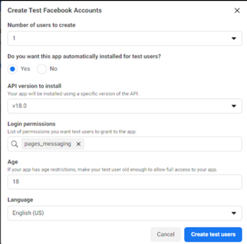

title: FAQ about Facebook channel
description: Review frequently asked questions (FAQ) about Facebook channel configuration in Omnichannel for Customer Service.
ms.date: 03/07/2024
ms.topic: conceptual
author: lalexms
ms.author: laalexan

# FAQ about Facebook channel setup

[!INCLUDE[cc-use-with-omnichannel](../../includes/cc-use-with-omnichannel.md)]

This article provides answers to frequently asked questions (FAQs) about configuring the Facebook channel in Omnichannel for Customer Service.

## Why aren't Omnichannel for Customer Service agents receiving messages that are sent on Facebook? 

If agents who use Omnichannel for Customer Service aren't receiving Facebook messages, it's likely because users lack the necessary roles or permissions. The assignment of roles or permissions may vary slightly, depending on whether the application is in production or development mode. 

**App in production mode**: The customer needs to request pages_messaging permission from their Facebook app. After it gets approval, any Facebook user can send messages to their page. 

**App in development mode**: If the Facebook app that you’re using is currently in development mode, then only those Facebook users who have roles within the app can send messages to the Facebook page. The messages can be received by or forwarded to Omnichannel for Customer Service. 

If you grant roles to an existing Facebook user, make sure the user has a Meta Developer account. They need to sign in and accept the assigned role invitation to the app from their account. 

If you're creating a test user within the Facebook app, select to automatically install the app, and select the pages_messaging permission.​

> [!div class=mx-imgBorder]
> 

### See also

[Configure a Facebook channel](configure-facebook-channel.md) 
[Understand and create workstreams](create-workstreams.md) 
[Configure automated messages](configure-automated-message.md) 
[Configure a prechat survey](configure-pre-chat-survey.md) 
[Configure a post conversation survey](configure-post-conversation-survey.md) 
[Delete a configured channel](delete-channel.md) 
[Support for live chat and asynchronous channels](card-support-in-channels.md)
