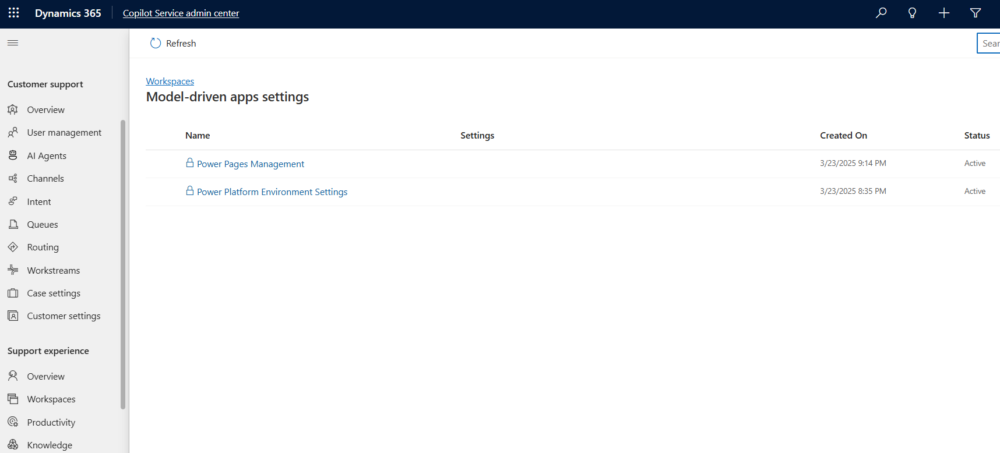

# Multisession navigation and productivity tools

[!INCLUDE[cc-feature-availability](../../includes/cc-feature-availability.md)]

The multisession navigation feature within the Dynamics 365 Customer Service workspace helps agents with increased productivity with a browser-like, tabbed experience. Agents can use an existing customized model-driven application to work on multiple cases and conversations. It's a modern, customizable, high-productivity app that allows agents to work on multiple sessions at a time in a single workspace.

This application uses artificial intelligence in productivity tools like Co-pilot to boost productivity. Features such as agent scripts and macros provide the agents with guidance and resources to automate repetitive tasks to achieve a great customer experience.

## Prerequisites

To configure the multisession navigation feature within your Dynamics 365 Customer Service workspace, make sure that the you follow the Customer Service workspace system requirements. Learn more about Customer Service workspace system requirements at [System requirements for Customer Service workspace](../implement/customer-service-workspace-system-requirements.md).

> [!NOTE]
> The same considerations and limitations with Customer Service workspace applies to a customized multisession app. Learn more about the Customer Service workspace at [Get started with Customer Service workspace](../implement/csw-overview.md)

## Application lifecycle management

The multisession navigation feature is aligned with application lifecycle management. You can enable this feature in a custom model driven app in your development environment, package the app, and then import to a testing or production environment without the need to re-apply the settings. 

To summarize this:
- You can enable this feature in a model driven app within an unmanaged solution.
- You can't enable this feature in a model driven app within a managed solution.
- This feature is not supported in model driven apps installed by default, such as Sales Hub.

Perform the following steps to add the multisession and productivity tools for your customized model-driven app.

1. Create a custom model-driven app from a solution in your development environment. Learn more in [Build your first model-driven app](/power-apps/maker/model-driven-apps/build-first-model-driven-app).

2. Use the Customer Service admin center to enable the multisession and productivity tools for your customized model-driven app.

3. In the app, validate the changes and test your customization. The productivity tools settings will be applied to your user account based on your organization's Agent Experience Profile settings. Learn more in [Agent experience profiles](./overview.md).

4. Export the solution from the development environment that contains the model-driven app and the corresponding sitemap. The multisession navigation settings are included in the app module by default. Learn more in [Export solutions](/power-apps/maker/data-platform/export-solutions).

5. Import the solution in your testing environment, validate the changes and test your customizations. Learn more in [Import solutions](/power-apps/maker/data-platform/import-update-export-solutions)

## Enable multisession navigation

Perform the following steps to enable the multisession navigation feature in the Customer Service workspace.

1. In the site map of Customer Service admin center, go to **Workspaces**. 

2. Select **Manage** in **Productivity settings for model-driven apps**.

3. Select the custom model-driven app you want to use and select **Edit**.

  > [!div class=mx-imgBorder]
  > 

> [!NOTE]
> A model driven app with the lock icon indicates that it is part of a managed solution and cannot be edited.

4. Select both **Productivity tools** and **Multisession navigation** features, and then select **Save**.

5. A popup screen appears. Review the custom support app information and select **Confirm**.

You can now validate the features in your custom model-driven app.

### Related information

[Build your first model-driven app](/power-apps/maker/model-driven-apps/build-first-model-driven-app)

