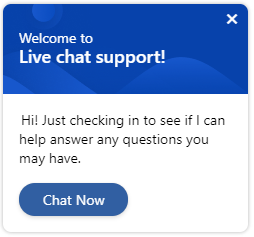
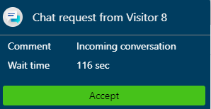
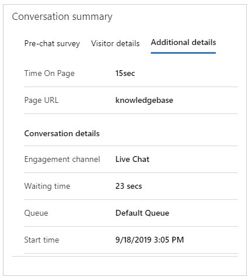

# Configure proactive chat

[!INCLUDE[cc-feature-availability](../../includes/cc-feature-availability.md)]

A chat channel allows your customers to engage with customer service representatives (service representatives or representatives) by using the chat widget on a website. Proactive chat allows service representatives to engage with customers by automatically inviting them to a chat conversation based on the configured rules. Proactively engaging with a customer when they need can improve customer experience and satisfaction.

Information such as a customer's journey through a website and time spent on a page can be used to determine when to initiate proactive chat. You can control the proactive chat experience by using personalized trigger messages and configurable rules to define the target audience, time frame, and target location.

> [!NOTE]
> Proactive chat can be triggered only on pages where the chat widget is embedded.

## Enable proactive chat in new admin apps

In admin center, go to the workstream of the chat widget in which you need to configure the settings, select edit for the required chat widget, and on the **Chat widget** tab of the **Chat channel settings** page, set the toggle for **Proactive chat** to **On**.

## Customer experience of proactive chat

When proactive chat is enabled, the chat invitation is displayed to customers based on the configured triggers.

> [!div class=mx-imgBorder]
> 

The customer can accept the chat invitation or close it. If the customer doesn't accept, the chat invitation is closed automatically after a minute. The one-minute timer for automatic closure can't be configured.

## Agent experience of proactive chat

When a customer accepts the proactive chat invitation, a service representative receives the notification.

> [!div class=mx-imgBorder]
> 

The representative then accepts the chat request and starts conversing with the customer to provide the required help. The [**Active Conversation**](../use/oc-customer-summary.md) is loaded and displayed if the customer's details match the stored data. 

If your administrator or developer configures the **Additional details** tab and if there are additional context variables, such as time spent on a page and the page URL from where the chat is initiated, they are displayed on the **Additional details** tab. 

> [!div class=mx-imgBorder]
> 

Learn more in [setContextProvider](../develop/reference/methods/setContextProvider.md).

## Videos

[Proactive chat in Omnichannel for Customer Service](https://go.microsoft.com/fwlink/p/?linkid=2114614)

[!INCLUDE[footer-include](../../includes/footer-banner.md)]
