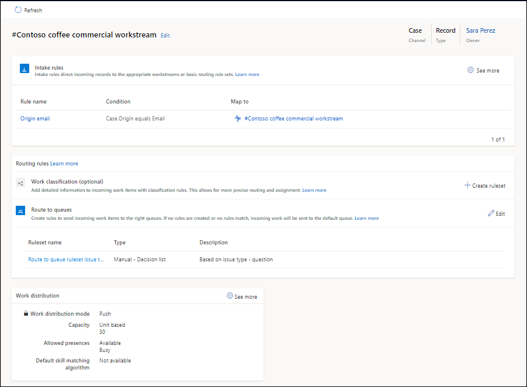

# Set up unified routing for records

You can configure unified routing for records in the Copilot Service admin center app.

> [!IMPORTANT]
> - Enabling unified routing involves a solution import that can affect SQL load and runtime operations.
> - If you're upgrading your environment and Dynamics 365 Contact Center is also installed, you might have existing workstreams for record routing. Provision unified routing only after you recreate those workstreams in Copilot Service admin center.
> - If you're an existing customer, configure and test unified routing in a test or development environment before configuring it in your production environment.
> - If you experience technical or performance issues when making multiple updates at the same time with unified routing, contact Microsoft Support for help.

## Prerequisites

- To set up record routing for Customer Service, unified routing must be enabled in your environment. Learn more in [Provision unified routing for Customer Service](provision-unified-routing.md).
- To route records, you must enable them for routing in the records channel configuration. Learn more in [Records routing](enable-entities-for-queues.md).
- You must have the System Administrator role to configure record routing.
- You must configure users as bookable resource. Learn more in [Set up the user as a bookable resource](users-user-profiles.md).

## Configure unified routing for records

You must complete all the steps in this section to route records using unified routing.

> [!NOTE]
> After you enable unified routing, the active basic routing rule won't route records until you configure intake rules.

1. In the site map of Copilot Service admin center, under **Customer support**, select **Routing**. The **Routing** page appears.

1. Select **Manage** for **Record routing**.

1. On the **Record routing** page, select **Add**.

1. In the **Add a record type** dialog box, select a record from the **Record type** list, and then select **Add**. The record appears on the **Record routing** page.

1. Configure the following settings:
   1. Workstreams
   1. Intake rules

### Create workstreams for record routing

1. In the site map, under **Customer support**, select **Workstreams**.
   
1. Select **New workstream**.

1. In the **Create a workstream** dialog box, enter the following details:
    - **Name**: Enter a descriptive name, such as *Contoso case workstream*.
    - **Work distribution mode**: Select **Push** or **Pick**.
    - **Type**: Select **Record**.
    - **Record type**: Select a record from the list.

1. Select **Create**. The workstream is created.

### Configure intake rules

Intake rules help determine the workstream to use to assign an incoming record work item.

You can also create intake rules independently and map them to basic routing rulesets. However, on any workstream details page, only those intake rules are displayed that are mapped to the workstream.

To change the order in which intake rules are evaluated at runtime, select **See more** on the workstream details page and reorder the rules in the **Decision list**.

Perform the following steps:

1. Select the workstream that you configured to route records, such as the cases.

1. In **Intake rules**, select **Create rule**.

1. In the **Create intake rule** dialog box, enter a name and define the rule conditions. By default, the root record is selected and displayed at the top of the condition builder so that you can identify the record you're creating the rule for. You can define conditions for up to two levels of the related records and attributes.

1. Map the intake rule to a workstream or an active basic routing rule.

   :::image type="content" source="../media/ur-intake-rule.png" alt-text="Define conditions for an intake rule.":::

1. Select **Create**.

   The following screenshot shows a workstream with the required intake rule and route to queues.

    

   You can reorder the rules and create copies to meet your business requirements.

    :::image type="content" source="../media/manage-intake-rules.png" alt-text="Manage your intake rules.":::

### Configure routing rules

Routing rules for a workstream consist of work classification rules and route-to-queue rules. For configuration instructions, read the following articles::

- [Configure work classification rules](configure-work-classification.md#create-work-classification-rulesets)  
- [Configure route to queues](configure-route-to-queue-rules.md)

### Configure work distribution and advanced settings

1. In the **Work distribution** area, accept the default settings or select **See more** to update the following options:

   - **Capacity**: Select one of the following options:
     - **Unit based**: Enter a value if your organization uses unit-based capacity.
     - **Profile based**: Select a profile from the list if your organization uses profile-based capacity. Learn more in [Create and manage capacity profiles](capacity-profiles.md).

   - **Allowed presences**: Select the presences in which customer service representatives (service representatives or representatives) can receive work. To route records in Customer Service Hub, add all the required presences.

   - **Default skill matching algorithm**: Select **Exact Match** or **Closest Match**.

2. Expand **Advanced settings** to configure the following options:
   - [Sessions](session-templates.md)
   - [Customer service representative notifications](notification-templates.md#out-of-the-box-notification-templates)

   > [!NOTE]
   > - Notifications you configure for unified record routing appear only in the Copilot Service workspace app.
   > - Make sure that the representatives in the queues have correct permissions to handle the incoming work items in the queue. If a representative doesn't have permission to access an assigned work item, the system stops the assignment and closes the conversation to protect it.

### Next steps

 [Enable routing diagnostics](unified-routing-diagnostics.md#manage-routing-diagnostics)  
 [Process for setting up unified routing](set-up-routing-process.md)  

### Related information

[Overview of unified routing](overview-unified-routing.md)  
[Create and manage workstreams](create-workstreams.md)  
[Configure routing for email records](configure-routing-for-email-records.md)  
[Assign roles and enable users](../implement/add-users-assign-roles.md)  
[Understand how unified routing affects queue items and live work items for routed records](../develop/unified-routing-impact-on-APIs.md)  
[How to close live work items or deactivate queue items](../develop/deactivate-queue-items.md)  
[Release capacity for representatives](capacity-profiles.md#release-capacity-for-representatives)  
[FAQ about time taken by configuration changes in unified routing](faqs.md#how-long-does-a-configuration-change-to-the-dynamics-365-contact-center-and-unified-routing-settings-take-to-update)  

[!INCLUDE[footer-include](../../includes/footer-banner.md)]
