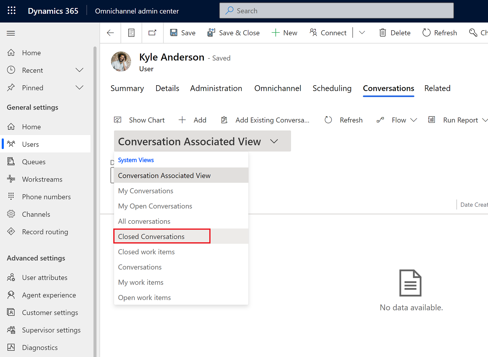
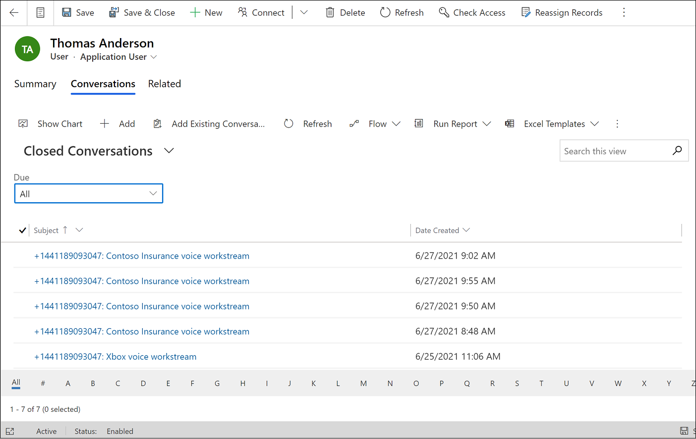

# Configure call recording, transcription, and real-time translation

[!INCLUDE[cc-feature-availability-embedded-yes](../../includes/cc-feature-availability-embedded-yes.md)]

[!INCLUDE[cc-rebrand-bot-agent](../../includes/cc-rebrand-bot-agent.md)]

As an administrator, you can enable live translation, transcription, and recording of calls. These options allow customer service representatives (service representative or representative) and supervisors to view the conversations with the customers in the language that's set as the default for them, and also transcripts of customer calls.

> [!IMPORTANT]
>
> - Many countries/regions and states have laws and regulations that apply to the recording of Public Switched Telephone Network (PSTN), voice, and video calls, and may require that users first consent to the recording of their communications. It is your responsibility to use the call recording and transcription capabilities in compliance with the law. Before using call recording features, you must obtain consent from the parties of recorded communications in a manner that complies with all applicable laws for each participant.  
> - Irrespective of whether you enable recording and transcription for voice, if you use AI agents created in Copilot Studio, a conversation transcript is automatically generated in Copilot Studio. However, when the AI agent is enabled for Dual Tone Multi-Frequency (DTMF) input only, the spoken input from the caller is ignored. The caller keypad entries (DTMF tones) only are captured. The speech input isn't stored in the Copilot Studio transcript.

## Prerequisites

- You must have the **System Administrator** role.
- For call recording to work as expected, allow the audio and mpeg MIME type for your environment in Power Platform admin center. Learn more in [Manage privacy and security settings](/power-platform/admin/settings-privacy-security).

## Enable call recording and transcription for voice

1. To enable call recording and transcription for voice, you must first configure your applications to listen to Azure Communication Services events by registering Event Grid system topics. Learn more in [Enable call recording and SMS services](voice-channel-configure-services.md).

1. In the Copilot Service admin center app, select the workstream for which you want to enable recording and transcription.

1. In the **Phone number** section, next to the pencil icon, select **Edit**.

1. On the **Voice settings** page, select the **Behaviors** tab.

1. In the **Transcription and recording** section, select the **Transcript and recording** dropdown menu, and then select **Transcription** or **Transcription and recording**.

1. Under **Start setting**, set the toggle to **Automatic** if you want calls to be automatically recorded and transcribed when they begin, or **Manual** if you want representatives to record and transcribe their calls.

    > [!NOTE]
    > When the **Start setting** is set to **Manual**, the recording button appears as **Resume recording and transcript by default** in Copilot Service workspace. This is standard behavior and doesn’t mean that the recording was previously started and paused.   

    :::image type="content" source="../media/transcription-setting-manual-mini.png" alt-text="Screenshot of manual option for transcription and recording." lightbox="../media/transcription-setting-manual.png":::

7. Set the **Allow customer service representatives to pause and resume** toggle to **Yes** to let representatives control parts of conversations that they need to record and transcribe.

8. Set the **Allow automatic pause and resume when agent hold and un-hold the customer** toggle to **Yes** to pause recording and transcription when the representative puts the customer on hold and resume when the representative takes the customer off hold.
 
    :::image type="content" source="../media/screenshot-enable-transcription-recording.png" alt-text="Screenshot of enabling transcription and recording options for voice workstream." lightbox="../media/screenshot-enable-transcription-recording.png":::

9. Select **Save**.

## Enable real-time translation of calls

To view translated voice transcripts for calls, you must enable call recording, transcription, and real-time translation. To enable real-time translation, refer to [Enable real-time translation for representative and customer conversations](enable-real-time-translation.md#enable-real-time-translation-for-representative-and-customer-conversations)

## View call transcripts

 You can view call transcripts in Copilot Service workspace only.
 
1. In the site map, go to manage **Users**, and then select the user whose conversations you want to view.
2. Select the **Related** tab, and then select **Conversations** from the dropdown menu.
3. Select **Closed conversations** from the dashboard dropdown menu.

   > [!div class="mx-imgBorder"]
   > 

4. Select the conversation for which you want to access the recording and transcript.
  
   > [!div class="mx-imgBorder"]
   > 
> [!NOTE]
> Transcript timestamps are grouped by two-minute intervals to account for potential drifts caused by delays. Drift occurs when a system's recorded timestamps gradually diverge from actual event times due to polling delays and other timing inconsistencies. Grouping events into two-minute intervals helps maintain consistency by accounting for these small but accumulating discrepancies.
   
## Set up bulk download of call recordings

You can create a Power Automate flow to download call recordings in bulk. Learn more in [Download call recordings in bulk](/dynamics365/contact-center/extend/download-call-recordings-bulk).

### Storage location of your recordings and cost

For components within the Microsoft stack, the data doesn’t cross geographical boundaries during transit. The bring-your-own-carrier model has dependencies on third parties with components outside the Microsoft stack, and the data needs to be reviewed end-to-end. 
The components can be in a different geographic location from the Azure Communication Services location as shown in the following illustration.

:::image type="content" source="../media/vc-data-residency.png" alt-text="Storage location information" lightbox="../media/vc-data-residency-enlarged.png":::

**Legend**

| Number | Description |
|-----|-------------------|
|1 | **Session Border Controller**   For Microsoft calling plans where Microsoft is the carrier, Microsoft determines the location to store data.  **Direct Routing**:  For the bring-your-own-carrier model, the data resides in the region where the Session Border Controller is hosted. |
|2 | **Azure Communication Services**:   The data resides in the location where the Azure Communication Services subscription is acquired. |
|3 | **Microsoft Dataverse**:   The Microsoft Dataverse server location, Dynamics 365 tenant, Cosmos DB, and Azure Speech Service should all be in the same location chosen during purchase. |
|4 | **Kusto**:  Microsoft stores the data for telemetry in Kusto, which is located either in the EMEA or the East US cluster. |

The maximum file size of a recording can be 512 MB. The data storage cost with two participants only is calculated approximately as follows, and the cost can fluctuate:

- 20-minute call recording = 10240 KB
- 20-minute call transcript = 40 KB

Learn more about long term data retention with Dataverse in [Dataverse long term data retention overview](/power-apps/maker/data-platform/data-retention-overview).

## Set retention rules for omnichannel screen recordings and transcripts

Administrators can configure retention rules for omnichannel call recordings and transcripts in Dynamics 365 Contact Center by using **Bulk Record Deletion** jobs. Setting appropriate retention periods helps organizations comply with regulatory requirements and manage storage efficiently.

By default, call recordings and Omnichannel transcripts are retained indefinitely. Microsoft Copilot Studio transcripts are retained for 30 days.

## Set retention for screen recordings

1. Sign in to your Dynamics 365 environment.
1. In your browser, go to the following URL:
https://yourURL.crm.dynamics.com/tools/bulkdelete/home_bulkDeletionJobs.aspx and replace yourURL with your organization’s Dynamics 365 URL.
1. On the **Bulk Record Deletion** page, select **New** to start a new bulk delete job.
1. In **Bulk Deletion Wizard**, select **Next**.
1. In **Define search criteria**, in the **Look for** dropdown, select **Screen recordings**.
1. Select the **Select** hyperlink and then select **Created On**.
1. Set the condition to **Older Than X Days**. Enter the retention period in days (for example, 365 for one year) in the **Choose Date **text box. 
1. Select **Next**.
1. Enter a name for the job, such as **Bulk Delete Screen Recordings Older Than 1 Year**.
1. Schedule the job during a low-activity period (for example, 3:00 AM).
1. Set the job recurrence (daily or every few days). Optionally, enable email notifications for job completion.
1. Select **Next**.
1. In **Review and Submit Bulk Deletion Details**, review your configuration.
1. Select **Submit** to create the bulk delete job.

[!WARNING]
Deleted call recordings can’t be recovered. Verify your criteria carefully before submitting the job.

## Set retention for omnichannel transcripts

To configure retention for omnichannel transcripts, repeat the same steps used for screen recordings except for the following:

In the **Look for **list, select **Transcripts* *instead of **Screen Recordings**.

### Related information

[Overview of the voice channel](voice-channel.md)  
[Agent experience: View call recordings and transcripts](/dynamics365/contact-center/use/voice-channel-agent-experience)  
[Enable call recording and SMS services](voice-channel-configure-services.md)
[Supported cloud locations, languages, and locale codes](voice-channel-region-availability.md)  
[Delete call recordings](voice-channel-delete-calls.md)
  
[!INCLUDE[footer-include](../../includes/footer-banner.md)]
