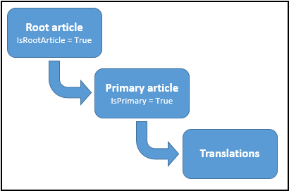

# Work with the KnowledgeArticle table

[!INCLUDE[cc-feature-availability](../../includes/cc-feature-availability.md)]

Use the `KnowledgeArticle` table to build knowledge management capabilities into your Dynamics 365 Customer Service solutions. This article describes how to create articles, manage versions and translations, publish content, and integrate knowledge articles with other customer service entities.

## Prerequisites

Make sure that you have the required [roles and privileges](set-up-knowledge-management-embedded-knowledge-search.md#prerequisites).

## Create a knowledge article  

When you create a knowledge article record, Dynamics 365 Customer Service internally creates a root article for the record. The root article acts as a container for the primary knowledge article you create along with all the article versions and translations that you might create in future. The following diagram depicts the table model for the `KnowledgeArticle` table.  
  
   
  
When you create a knowledge article record, you create it in the `Draft` state. By using the new `KnowledgeArticle` table, you can create an article by specifying its contents and formatting in HTML format. You can specify your own value for the `KnowledgeArticle`.`ArticlePublicNumber` attribute while creating a knowledge article record programmatically. Otherwise, the value is automatically generated based on the format you specified in the Dynamics 365 Customer Service settings area in the web client. The `KnowledgeArticle`.`ArticlePublicNumber` attribute stores the ID exposed to customers, partners, and other external users to reference and look up knowledge articles. It remains the same across knowledge article versions and translations.  
  
The following sample code shows how you can create a knowledge article record.  
  
```csharp  
KnowledgeArticle newKnowledgeArticle = new KnowledgeArticle  
{  
   Title = "Sample Knowledge Article",  
   Content = "<p>This is the article content.</p>"  
};  
knowledgeArticleId = _serviceProxy.Create(newKnowledgeArticle);  
Console.WriteLine("Created {0}", newKnowledgeArticle.Title);  
```  
  
<a name="Version"></a> 

## Create major and minor versions of a knowledge article  

When you create a knowledge article record, the major version is automatically set to 1 and the minor version is set to 0. Use the `CreateKnowledgeArticleVersion` message (<xref href="Microsoft.Dynamics.CRM.CreateKnowledgeArticleVersion?text=CreateKnowledgeArticleVersion Action" /> or <xref:Microsoft.Crm.Sdk.Messages.CreateKnowledgeArticleVersionRequest>) to create a major or minor version of a knowledge article. In the request message, set `IsMajor` to `true` to create a major version, or set it to `false` to create a minor version. The new version record uses the following attributes:  
  
- `KnowledgeArticle`.`RootArticleId` attribute to maintain the association with the root knowledge article record.  
  
- `KnowledgeArticle`.`PreviousArticleContentId` attribute to point to the previous version of the record.  
  
The following sample code shows how to create a major version of a knowledge article record by using <xref:Microsoft.Crm.Sdk.Messages.CreateKnowledgeArticleVersionRequest>.  
  
```csharp  
CreateKnowledgeArticleVersionRequest versionRequest = new CreateKnowledgeArticleVersionRequest  
{  
   Source = new EntityReference(KnowledgeArticle.EntityLogicalName, knowledgeArticleId),  
   IsMajor = true  
};  
CreateKnowledgeArticleVersionResponse versionResponse = (CreateKnowledgeArticleVersionResponse)_serviceProxy.Execute(versionRequest);  
```  
  
<a name="Translation"></a>   

## Create a knowledge article translation  

Use <xref href="Microsoft.Dynamics.CRM.CreateKnowledgeArticleTranslation?text=CreateKnowledgeArticleTranslation Action" /> (Web API) or <xref:Microsoft.Crm.Sdk.Messages.CreateKnowledgeArticleTranslationRequest> (organization service) to create a translation for a knowledge article record. You can translate your knowledge article into more than 150 languages. Information about these supported languages is available in the new `LanguageLocale` table.
 
Learn more in [LanguageLocale table](/power-apps/developer/data-platform/reference/entities/languagelocale).

By using <xref href="Microsoft.Dynamics.CRM.CreateKnowledgeArticleTranslation?text=CreateKnowledgeArticleTranslation Action" /> (Web API) or <xref:Microsoft.Crm.Sdk.Messages.CreateKnowledgeArticleTranslationRequest> (organization service), you create a new knowledge article record with the title, content, description, and keywords copied from the source record to the new record. You set the language of the new record to the one you specify in the request. You also need to specify whether the new record is a major or minor version. The new record uses the `KnowledgeArticle`.`ParentArticleContentId` attribute to maintain the association with the primary knowledge article record.  
  
After you execute this message and get a response, retrieve the knowledge article record from the response object, and then update the title, content, description, and keywords to add the translated content.  
  
The following sample code shows how to create a knowledge article translation by using <xref:Microsoft.Crm.Sdk.Messages.CreateKnowledgeArticleTranslationRequest>:  
  
```csharp  
CreateKnowledgeArticleTranslationRequest translationRequest = new CreateKnowledgeArticleTranslationRequest  
{  
   Source = new EntityReference(KnowledgeArticle.EntityLogicalName, knowledgeArticleId),  
   Language = new EntityReference(LanguageLocale.EntityLogicalName, languageLocaleId), //languageLocaleId = GUID of the Primary Key of LanguageLocale record  
   IsMajor = true    // Creating a major version   
};  
CreateKnowledgeArticleTranslationResponse translationResponse = (CreateKnowledgeArticleTranslationResponse)_serviceProxy.Execute(translationRequest);  
  
// Retrieve the new knowledge article record  
KnowledgeArticle respObject = (KnowledgeArticle)_serviceProxy.Retrieve(KnowledgeArticle.EntityLogicalName,   
      translationResponse.CreateKnowledgeArticleTranslation.Id, new ColumnSet(true));  
```  
  
> [!NOTE]
>  The GUID value of the primary key (`LanguageLocaleId`) for each language record in the `LanguageLocale` entity is the same across all Dynamics 365 Customer Service organizations.  
  
<a name="KnowledgeLifecycle"></a>   
## Knowledge article lifecycle: Change the state of a knowledge article  
 During its lifecycle, a knowledge article can be in the following states:  
  
- 0: Draft (after you create a knowledge article)  
  
- 1: Approved (after you approve a knowledge article)  
  
- 2: Scheduled (after you schedule a knowledge article to be published)  
  
- 3: Published (after you publish a knowledge article)  
  
- 4: Expired (after a knowledge article expires as per the expiration date specified while publishing)  
  
- 5: Archived (after you archive a knowledge article)  
  
- 6: Discarded (after you discard a knowledge article)  
  
To change the state of the article, use the `Update` message on the knowledge article record to update the `KnowledgeArticle.StateCode` attribute. For early bound types, use the `KnowledgeArticleState` enumeration to set the possible states. Learn more in [Perform specialized operations using Update](/powerapps/developer/data-platform/special-update-operation-behavior).    
  
The following sample code shows how to publish a knowledge article record.  
  
```csharp  
// Retrieve the knowledge article record  
KnowledgeArticle myKnowledgeArticle = (KnowledgeArticle)_serviceProxy.Retrieve(  
        KnowledgeArticle.EntityLogicalName, knowledgeArticleId, new ColumnSet("statecode"));  
  
// Update the knowledge article record  
myKnowledgeArticle.StateCode = KnowledgeArticleState.Published;  
UpdateRequest updateKnowledgeArticle = new UpdateRequest  
{  
    Target = myKnowledgeArticle  
};  
_serviceProxy.Execute(updateKnowledgeArticle);  
  
```  
  
<a name="Associate"></a>   

> [!NOTE]
> `statecode` values such as Draft (0) indicate the article's lifecycle stage, and not confidentiality or visibility. Users with the appropriate Read and Write privileges can access draft articles.

## Associate a knowledge article record with a Dynamics 365 Customer Service entity instance  

When you enable embedded knowledge search for a table in Dynamics 365 Customer Service by using the web client, the system automatically creates a many-to-many relationship named `msdyn_`***<Entity_Name>***`_knowledgearticle`. Use this relationship to programmatically associate or link a `KnowledgeArticle` instance with a Dynamics 365 Customer Service table instance. When you associate a `KnowledgeArticle` instance with a table instance, you create a record for the relationship in an intersect table called `msdyn_`***<Entity_Name>***`_knowledgearticle`. For example, when you associate a `KnowledgeArticle` instance with an `Account` instance for the first time, you create an intersect table called `msdyn_account_knowledgearticle`, and you create a record with the association mapping in this intersect table. By default, the `Incident` (Case) table is enabled for the embedded knowledge search. When you link a `KnowledgeArticle` record to an `Incident` record, you create an association record in the `KnowledgeArticleIncident` intersect table.  
  
 The following sample code demonstrates how to associate a `KnowledgeArticle` instance with an `Account` instance:  
  
```csharp  
// Associate the knowledge article record with an account record  
  
// Step 1: Create a collection of knowledge article records that will be   
// associated to the account. In this case, we have only a single  
// knowledge article record to be associated.  
EntityReferenceCollection relatedEntities = new EntityReferenceCollection();  
relatedEntities.Add(new EntityReference(KnowledgeArticle.EntityLogicalName, knowledgeArticleId));  
  
// Step 2: Create an object that defines the relationship between knowledge article record and account record.  
// Use the many-to-many relationship name (msdyn_account_knowledgearticle) between knowledge article  
// record and account record.  
Relationship newRelationship = new Relationship("msdyn_account_knowledgearticle");  
  
// Step 3: Associate the knowledge article record with the account record.  
_serviceProxy.Associate(Account.EntityLogicalName, accountId, newRelationship, relatedEntities);  
  
```  
  
<a name="IncrementViewCount"></a>   
## Increment knowledge article view count  
 Use the <xref:Microsoft.Crm.Sdk.Messages.IncrementKnowledgeArticleViewCountRequest> message to increment the view count of a knowledge article record for a given day in the `KnowledgeArticleViews` table. If a record doesn't exist for a knowledge article for a specified day, the operation creates a record and sets the specified view count value in the `KnowledgeArticleViews`.`KnowledgeArticleView` attribute. If a record already exists for a knowledge article for the specified day, the operation increments the view count in the `KnowledgeArticleViews`.`KnowledgeArticleView` attribute of the existing record.  
  
<a name="Search"></a>   
## Search knowledge articles using full-text search  
  Knowledge articles in Dynamics 365 Customer Service, including their versions and translations, are full-text indexed and support SQL Server full-text search. Learn more about full-text search, in [SQL Server: Full-text Search](/sql/relational-databases/search/full-text-search).    
  
 Use the <xref:Microsoft.Crm.Sdk.Messages.FullTextSearchKnowledgeArticleRequest> message to search knowledge articles from your applications to find the information you are looking for. The <xref:Microsoft.Crm.Sdk.Messages.FullTextSearchKnowledgeArticleRequest> message lets you use inflectional stem matching (which allows for a different tense or inflection to be substituted for the search text) and specify query criteria (by using FetchXML or QueryExpression to specify filtering, ordering, sorting, and paging) to find knowledge articles with specified text. You can also choose to remove multiple versions of the same articles in the search results and filter on the knowledge article state while searching for a text.  

## Deprecated knowledge entities  

The following legacy entities are deprecated. Learn more in [Deprecated knowledge entities](../implement/deprecations-customer-service.md#deprecatedkmentities).

- [KbArticle](/power-apps/developer/data-platform/reference/entities/kbarticle) 
- [KbArticleComment](/power-apps/developer/data-platform/reference/entities/kbarticlecomment) 
- [KbArticleTemplate](/power-apps/developer/data-platform/reference/entities/kbarticletemplate)  

As of December 1, 2020, you can't access legacy knowledge entities. Move to the KnowledgeArticle table. Learn more in [Create and manage knowledge articles](../use/customer-service-hub-user-guide-knowledge-article.md).    

For help with migration, use the following resources:  
- Use SDK, WebAPI, or Microsoft Power Automate depending on your scenarios.  
- Use the open source migration tool with [MIT license](https://github.com/microsoft/dynamics365-kbmigration/blob/master/LICENSE).  


> [!IMPORTANT]
> - Microsoft doesn't support the open source migration tool. You might need to modify it to suit your scenarios.  
> - Always run a test environment before using in production.  
> - Check the license and readme before you use the tool.

## Related information

- [Knowledge Base Entities](../../customerengagement/on-premises/developer/knowledge-management-entities.md)
- [KnowledgeArticle table](/power-apps/developer/data-platform/reference/entities/knowledgearticle)
- [KnowledgeArticleViews table](/power-apps/developer/data-platform/reference/entities/knowledgearticleviews)
- [KnowledgeBaseRecord table](/power-apps/developer/data-platform/reference/entities/knowledgebaserecord)
- [LanguageLocale table](/power-apps/developer/data-platform/reference/entities/languagelocale)
- [Important changes coming in future releases of Microsoft Dynamics 365](/previous-versions/dynamicscrm-2016/developers-guide/dn281891(v=crm.8)#bkmk_CrmKMEntities) 


[!INCLUDE[footer-include](../../includes/footer-banner.md)]
