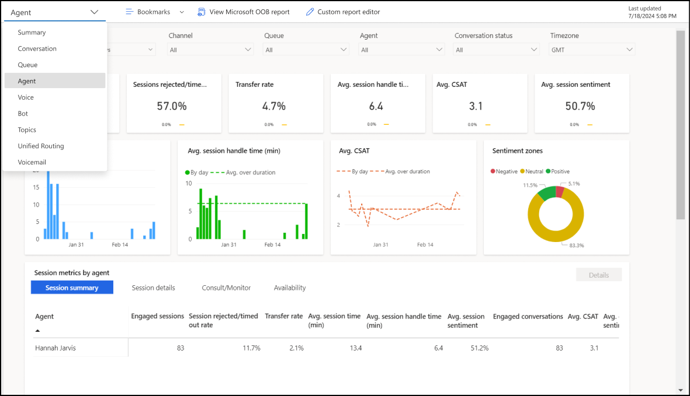
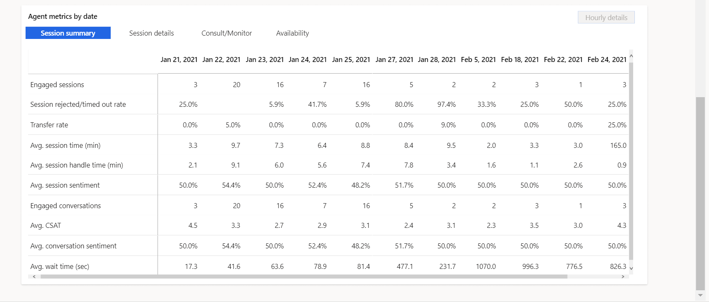
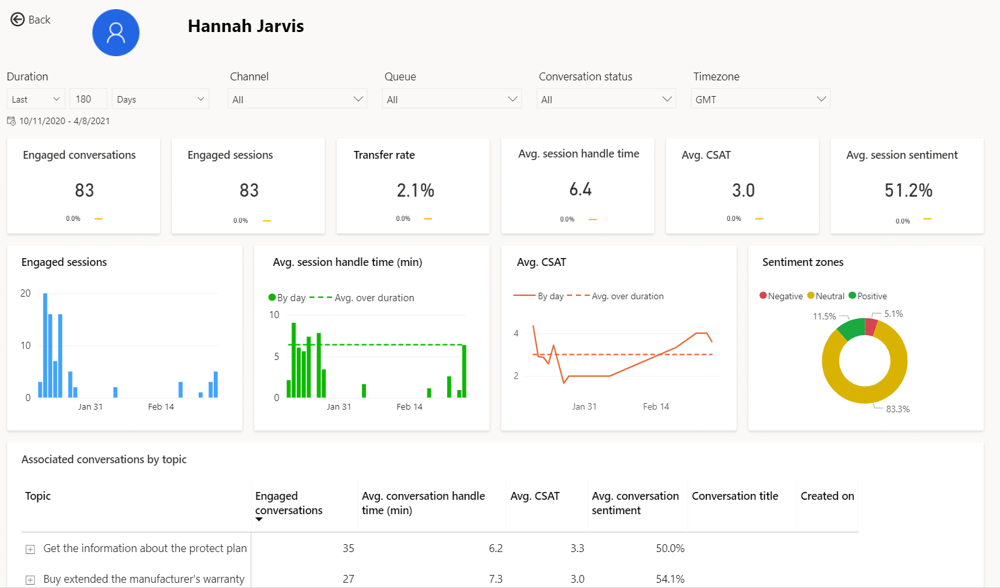
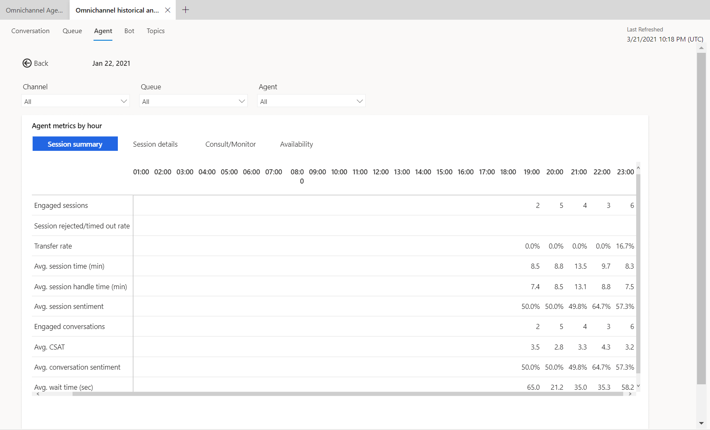

# Agent dashboard

> [!IMPORTANT]
>
> This feature is intended to help customer service managers or supervisors enhance their team's performance and improve customer satisfaction. This feature is not intended for use in making, and should not be used to make, decisions that affect the employment of an employee or group of employees, including compensation, rewards, seniority, or other rights or entitlements. Customers are solely responsible for using Dynamics 365 Customer Service, this feature, and any associated feature or service in compliance with all applicable laws, including laws relating to accessing individual employee analytics and monitoring, recording, and storing communications with end users. This also includes adequately notifying end users that their communications with agents may be monitored, recorded, or stored and, as required by applicable laws, obtaining consent from end users before using the feature with them. Customers are also encouraged to have a mechanism in place to inform their agents that their communications with end users may be monitored, recorded, or stored.

The Agent dashboard shows charts and KPIs that you can use to guide agents and understand overall agent performance.

> [!div class="mx-imgBorder"]
> 

You can view the Agent dashboard in the Omnichannel for Customer Service app. On the **Home** tab, select the plus (**+**) icon, and then select **Analytics and insights**. On the page that appears, select the **Agent** tab.

## Report details

The reports summarize the key performance indicators for the specified time period and percentage change over a period of time. You can filter these areas by duration, channel, queue, agent, conversation status, and timezone.

| KPI | Description |
| ------------------------ | ----------------- |
| Engaged sessions | The number of sessions accepted by an agent |
| Rejected/ timed-out sessions rate | The number of sessions presented to an agent and not accepted |
| Transfer rate | The percentage of conversations that are transferred to another agent/queue |
| Avg session handle time | The average total session active time across engaged sessions  |
| Avg CSAT | Average of customer satisfaction rating provided by customers. Only available if Customer Voice has been configured as a post conversation survey tool. |
| Avg session sentiment | Average predicted sentiment of a customer based on the conversation transcript from the session |

The charts display the following metrics.

| Title | Description |
| ---------------- | ---------------- |
| Engaged sessions | The number of sessions accepted by an agent by day |
| Avg session handle time | Average of the time an agent actively spends on a session by day |
| Avg CSAT | Customer CSAT trend based on Customer Voice survey responses |
| Sentiment zones | Breakdown of customer sentiment across sessions by level  |

> [!div class="mx-imgBorder"]
> 

| Session summary | Description 
| ------------------ | --------------- |
| Engaged sessions | Number of sessions presented to an agent and accepted |
| Session rejected/timed out rate | Number of sessions presented to an agent and not accepted  |
| Transfer rate | Number of sessions transferred by an agent |
| Avg. session time (min) | Average time of the total session duration across engaged sessions |
| Avg. session handle time (min) | Average of the total session active time across engaged sessions |
| Avg. session sentiment | Average predicted sentiment of the customer across engaged sessions  |
| Engaged conversations | Number of conversations presented to an agent and accepted |
| Avg. CSAT | Average CSAT score provided by customers from Customer Voice survey responses |
| Avg. conversation sentiment | Average predicted sentiment of the customer across engaged conversations |
| Avg. wait time (sec)  | The average time customers waited before connecting to agents. Similar to “speed to answer” but includes time waited on each session within a conversation |

| Session details | Description |
| --------------------- | ---------------- |
| Avg. session active time (min) | The average total session active time across engaged conversations. |
| Avg. session inactive time (min) | The average total session inactive time across engaged sessions |
| Avg. incoming messages | Average total number of incoming messages from a customer per session |
| Avg. outgoing messages | Average total number of outgoing messages from an agent per session |
| Incoming messages | Total incoming messages per session from customer |
| Outgoing messages | Total outgoing messages from an agent per session |

| Consult/Monitor | Description |
| --------------- | --------------- |
| Consult sessions | Number of sessions where the agent has participated in consult mode |
| Avg. consult time (min) | Average time an agent spent during a session in consult mode |
| Monitor sessions | Number of sessions where the agent has participated in monitor mode |
| Avg. monitor time (min) | Average time agent spent on a session in monitoring mode |

| Availability | Description |
| --------------- | ---------------- |
| Agent total login time (hrs) | Time an agent is logged into the Omnichannel application |
| Agent available duration (hrs) | Time an agent is in the available state in the Omnichannel application |
| Agent busy duration (hrs) | Time an agent is in the busy state in the Omnichannel application |
| Agent busy (DND) duration (hrs) | Time an agent is in the busy do not disturb (DND) state in the Omnichannel application |
| Agent away duration (hrs) | Time an agent is in the Away state in the Omnichannel application |
| Agent offline duration (hrs) | Time an agent is logged out of the Omnichannel application |

## Agent drill down view

The Agent drill down view provides supervisors with a holistic look into individual agent performance on metrics and can be valuable in training or coaching scenarios for agents.  

To access the drill down, select any metric value for the desired agent and select **Details**.  

> [!div class="mx-imgBorder"]
> 

## Agent Hourly details drill down view

The Agent hourly details drill down view provides more granular insight into the hour-by-hour breakdown of key conversation metrics within the contact center. The Session summary, Session details, Consult/Monitor, and Availability metrics are the same as the day-by-day view ensuring that supervisors can consistently analyze their contact center operation regardless of desired duration granularity. 
To view the drill down, select any single metric value on the desired day, then select **Hourly details**. 

> [!div class="mx-imgBorder"]
> 

### See Also

[Conversation dashboard](oc-conversation-dashboard.md)  
[Dashboard overview](customer-service-analytics-insights-csh.md)  
[Queue dashboard](oc-queue-dashboard.md)  
[Bot dashboard](oc-bot-dashboard.md)  
[Conversation Topics dashboard](oc-conversation-topics-dashboard.md)  