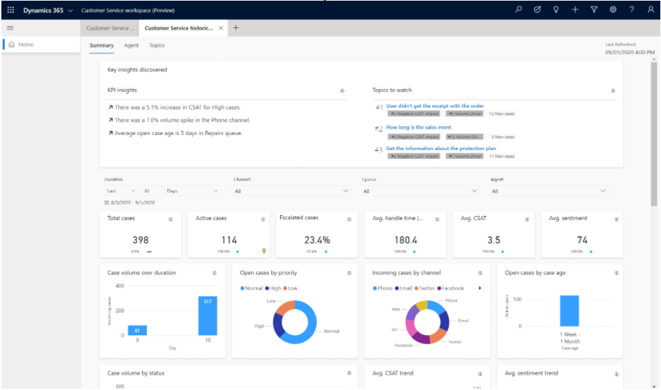

# Preview: Discover insights from your customer service data

[!include[cc-beta-prerelease-disclaimer](../includes/cc-beta-prerelease-disclaimer.md)]

> [!IMPORTANT]
>
> - A preview is a feature that is not complete, as it may employ reduced privacy, security, and/or compliance commitments, but is made available before it is officially released for general availability so customers can get early access and provide feedback. Previews are provided "as-is," "with all faults," "as available," and without warranty.
> - This preview feature does not come with technical support and Microsoft Dynamics 365 Technical Support won't be able to help you with issues or questions.  If Microsoft does elect to provide any type of support, such support is provided "as is," "with all faults," and without warranty, and may be discontinued at any time.
> - Previews are not meant for production use, especially to process Personal Data or other data that is subject to heightened compliance requirements, and any use of "live" or production data is at your sole risk. All previews are subject to separate [Terms and Conditions](../legal/supp-dynamics365-preview.md).

Customer Service Insights is now part of the embedded experience for Customer Service Hub and Customer Service Workspace, giving you an easy way to monitor and improve your support operations. Built-in dashboards, interactive charts, and visual filters provide views into support operations data across channels, and highlight areas for improvement that can have the greatest impact, helping you quickly evaluate and respond to key performance indicators (KPIs) and customer satisfaction levels.  

Customer Service Insights uses AI-generated topics to automatically group your cases, from across different channels, using natural language understanding. As a supervisor, you can see view notable trends in metrics sorted by topics, channels, queues, and agents. By better understanding what impacts your support operations you can feel empowered to make more informed decisions about how to improve resolution rates, reduce wait times, and decrease customer service costs. 

  > [!div class=ms-imgBorder]
  > 
    
By pinpointing and fixing issues before they impact customers, you can adapt to current and emerging trends, improve brand sentiment, and deliver better customer service experiences.

For a walkthrough of how to enable Customer Service Insights for your customer support system, see the admin guide to Configure Customer Service Analytics and Insights.

For more information about dashboards and reports, see the Dashboard overview.

For more details about specific Customer Service Insights dashboards, see the following: 

- Summary Dashboard 

- Agent Dashboard 

- Topics Dashboard 

In addition to the dashboards above, organizations can now gain insights into how agents are using knowledge article to resolve cases. These insights can help you identify outdated documentation, improve existing articles, and create new ones to empower your support team. To preview this feature, see Opting in to KM. 

For more information on enabling knowledge search analytics, see Knowledge search analytics documentation.

### Dashboard overview

The Insights dashboards for Customer Service contain a variety of charts and metrics to help you to understand the factors that have the greatest impact on your customer service. Key performance indicators and graphical breakdowns of your system's support cases are coupled with artificial intelligence generated Insights on cases and topics that contribute to overall trends.

Customer Service Management dashboards give you a performance Summary in addition to detailed reports on Agents and Topics.  

By right-clicking a chart entry and hovering over **Drill through**, and then selecting Agent Details or Topic details brings up a more detailed report specific to the selected topic or agent.  

By navigating to the **Knowledge Management** tab, you can view the **Search Term Insights** dashboard to understand what search terms agents and smart agent assist are using to find knowledge articles related to cases.

## Customer Service Management Dashboards

The Summary dashboard gives you a broad overview of the customer service experience at your organization. It uses AI technology to show you topics that are generating the highest volume and emerging topics with the highest rate of change in volume. 

The KPI summary dashboard includes a variety of charts with graphical views of your system's key performance indicators. For information about each chart, click the link for the chart in the following list or scroll to locate the chart later in this topic. 

   > [!div class=ms-imgBorder]
   > 
    
The Summary dashboard provides information about the following areas:

- Key Insights card 

- KPI summary charts and additional KPI charts 

- Case volume over duration chart 

- Open cases by priority chart 

- Incoming cases by channel chart 

- Open cases by base age chart 

- Case volume by status chart 

- Avg. CSAT trend chart 

- Avg. sentiment trend chart 

- Top 10 volume topics chart 

- Emerging case volume by topic chart 

- Emerging case volume by topic chart 

- Avg. incoming case time 24 hrs chart 

- Case metrics by channel chart 

### Key Insights card

The Key Insights Discovery card has two areas  

- KPI insights 

- Topics to watch 

 > [!div class=ms-imgBorder]
 > 

#### KPI insights 

Important subjects that impact performance.  

#### Topics to watch 

Topics that rank high across the following three key areas are shown under Topics to watch, to make it easier for customer service managers to discover top issues: 

- Volume driver shows topics with the largest volume of cases created in the selected time period. 

- Negative CSAT impact shows topics that have the greatest negative impact on your total CSAT score. CSAT data is collected from surveys. 

- The emerging rate gives you a "heads-up" about topics that have a high rate of new incoming cases in the selected time period. 

When you select the light bulb icon, a short inline explanation of the reason for showing these topics is displayed with recommendations of possible actions to take. 

[!INCLUDE[footer-include](../includes/footer-banner.md)]