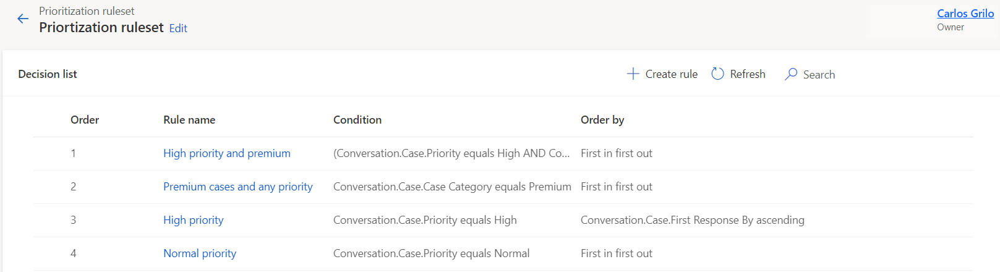
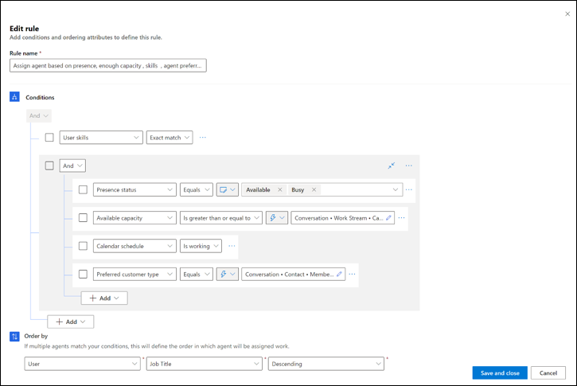

# Assignment methods for queues

Assignment methods determine how a work item is assigned. You can use the out-of-the-box assignment methods or build custom assignment rules by configuring the prioritization rules and assignment rulesets. You can set up assignment methods only through the **Customer Service Hub** or **Omnichannel admin center** app.

## Types of assignment methods

The following assignment methods are available out of the box:

- **Highest capacity:** Assigns work item to the agent with the highest capacity, amongst those who has the skills identified during the classification stage, and has the presence as specified in the allowed presence option of the work stream.
- **Round robin:** Assigns work item to the agent in the list order who matches the criteria for skills and presence.

The custom assignment method lets you use your own rulesets and rules to configure priority, severity, and capacity for choosing the queues to which work items need to be routed. You can create the following rulesets:

- **Prioritization rulesets:** Lets you define the order in which the work items will be assigned to agents when they are available to take more work.
- **Assignment rulesets:** Represent a set of conditions that are used to select agents and use an order by option to sort the matching agents.

## How prioritization ruleset works

A prioritization ruleset is an ordered list of prioritization rules. Every prioritization rule represents a priority bucket in the queue.  In a prioritization rule you can specify a set of conditions and order by attributes. During evaluation, the prioritization rules will be run in the order they are listed. For the first prioritization rule, the work items in the queue that match its conditions will be put in the same priority bucket. In the priority bucket, the items will be further sorted by the order specified in the prioritization rule. The second rule will run on the rest of the items in the queue, to identify the next priority bucket, and sort that bucket by the order by attribute till all rules are evaluated.

You can create only one prioritization ruleset per queue.

As an example, let us look at the prioritization rule as seen in the following screenshot. This rule will match all the work items where the routed record (case) contains data and priority equals high. The matched items will be further sorted based on first in and first out attribute.

> 

1. Create a prioritization ruleset
2. Create a decision list of rules

## How assignment rulesets work

The assignment ruleset is an order list of assignment rules. Each assignment rule represents a set of conditions that is used to determine the agents to select and an order by field to sort the matching agents. At runtime, the assignment rule with the top order is evaluated first. The agents are matched as per the conditions specified in the rule. If more than one matching agents exist, then they are sorted by the ordered by field, and the top agent is assigned the work. If no agents are matched, then the next assignment rule in the rule set is evaluated. This can be thought of as gradual relaxation of constraints in the assignment such that first the strictest criteria is applied, and then the conditions are slowly reduced so that the best agent is found.

A sample assignment rule is explained in the following scenario with a screenshot.

>

The first condition specifies the "user skills" on which the operator is exact match. Then the user attributes are evaluated. The different user attributes are specified with operators and values for each attribute, such as the **Presence status** attribute should be equal to "Available" or "Busy". On the right of the operator, you can specify the value that you want the attribute to be matched against. The values can be "static", such as "presence status equals Available or Busy". If you specify "dynamic," the condition will be matched at runtime based on the expression you specify. For example, if you specify "Preferred Customer Type Equals Conversation.Contact.Membership Level."
The "preferred customer type" of every agent will be matched against the dynamically calculated membership level of the customer associated with the chat.

Dynamic matching reduces the effort of having to write and maintain multiple static rules for each permutation and combination of the possible value.

The process of creating assignment rulesets involves the following steps:

1. **Create assignment rulesets:** For each assignment ruleset, you'll configure the conditions and order by option.
2. **Create selection criteria:** If you create more than one assignment ruleset, you'll need to define the rules for the selection criteria. The selection criteria determines which ruleset out of the many should be run. More information: [Configure selection criteria](#configure-selection-criteria).

## Create an assignment method

Perform the following steps to create a custom assignment method:

1. In Omnichannel admin center, in the site map, select **Queues**. In Customer Service Hub, in Service Management, in the site map, select **Advanced queues** under **Unified Routing**.
2. On the **Assignment method** page of a queue, select **Create New**.
3. On the **Create work assignment** dialog box, enter a name and description for the ruleset, and select **Create**.
4. Select the ruleset, and select **Edit**. The options to configure prioritization rulesets and assignment rulesets are displayed.
   1. Do the following to set up prioritization rulesets:
   2. On the **Create Prioritization Ruleset** dialog box, enter a name and description for the ruleset, and select **Create**.
   3. On the **Decision list** page, select **Create rule**, and on the **Create prioritization rule** dialog box, enter a rule name and define the conditions when the rule should be run.
   4. Select the attribute on which you want to define the order by to route the work item to agents.
   5. Create as many rules as are needed.
5. To create an assignment ruleset, on the **Assignment method** page, select **Create ruleset**.
6. Enter a name and description for the ruleset, and select **Create**. The ruleset is created.
7. On the **Assignment ruleset** page that appears, select **Create rule**.
8. On the **Create assignment rule** dialog box, do the following steps to add conditions and ordering attributes:
   1. **Rule Name:** Enter a rule name.
   2. **Conditions:** Select **Add** to select an attribute or related entity and define condition.
   3. **Order by:** Select an attribute to define the order of work assignment if multiple agents match the condition.
   4. Select Create.
   5. Repeat the steps 1 through 4 to configure multiple rules.
9. You can sort the order in which the rules should be evaluated during work assignment.
10. If you create more than one assignment ruleset, a warning message is displayed that alerts you to define the selection criteria to run the rulesets.

You can create a sample assignment rule with the following conditions.

| Attribute | Operator | Match type | Attribute value|
|----|----------|-----|-----|
| User skills | Exact match | |All skills |
| Presence status | Equals | Dynamic match | Conversation.Workstream.Allowed Presences|
| Capacity | Is greater than or equal to | Dynamic match | Conversation.Workstream.Capacity |
| Available capacity | Is greater than | Static value | 50 |
||||

### Configure selection criteria

When you configure more than one assignment ruleset in the custom assignment method, you must define selection criteria. The selection criteria lets you define a set of conditions to determine the ruleset to be run when condition is met. After the ruleset is picked up by the work assignment engine, if no rule matches in the selection criteria or if no selection criteria is met, the default ruleset will be run by the system.

Do the following steps to configure the selection criteria for the assignment rulesets:

1. For the assignment method, in the **Assignment** section, select **Create rule**, and in the **Decision list** area, select **Create rule**.
2. In the **Create selection criteria rule** dialog box, enter a rule name, and define the conditions.
3. In **Execute ruleset**, select the assignment ruleset that must be run when the conditions are met, and then select **Create**. The rule is listed in the Decision list area.
4. Define as many rules as the number of assignment rulesets.
