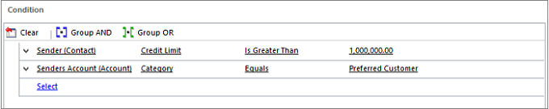

# Automatically create a case from an email

[!INCLUDE[cc-applies-to-update-9-0-0](../includes/cc_applies_to_update_9_0_0.md)]

Reduce the need for manually creating cases from incoming emails and increase the efficiency of customer service agents by creating automatic case creation rules in [!INCLUDE[pn_dynamics_crm](../includes/pn-dynamics-crm.md)]. The conditions in these rules automatically convert emails to support cases.  
  
> [!NOTE]
> This feature was introduced in [!INCLUDE[pn_crm_8_1_0_online.md](../includes/pn-crm-8-1-0-online.md)].
  
## Create cases automatically using rules  
  
1. [!INCLUDE[proc_permissions_custsvcmgr_sysadmin_and_customizer](../includes/proc-permissions-custsvcmgr-sysadmin-and-customizer.md)]  
  
     When a case creation rule is activated, a corresponding workflow is created automatically. If you create or assign a rule, you must have permissions to perform the same action on workflows. The case creation rule is applied and a case is created in context to the permissions that the owner of the case creation rule has.  
  
    #### Check your security role  
  
    - [!INCLUDE[proc_follow_steps_in_link](../includes/proc-follow-steps-in-link.md)]  
  
    - [!INCLUDE[proc_dont_have_correct_permissions](../includes/proc-dont-have-correct-permissions.md)]  
  
2. In the Customer Service Hub sitemap, go to **Service Management** > **Automatic Case Creation Rules**. 
  
4.  To create a new case creation rule, click **New**.  
  
     -OR-  
  
     To edit an existing rule, in the list of rules, select a rule, and then on the command bar, click **Edit**.  
  
5.  Type or modify information in the fields.  
  
     Hover over the field labels to see what to enter.  
  
    - **Name**. Type the name of the queue the rule is defined for.  
  
    - **Source Type**. Select **Email** to indicate that cases will be created automatically from email messages.  
  
    - **Queue**. Select the queue that the rule applies to. For example, if you want to convert email messages and then send them to the Support queue, select that queue here.  
  
        > [!NOTE]
        >  You can associate only one rule per source type to a specific queue. If you’re creating a rule to convert an email to a case, make sure you specify an email address for this queue.  Otherwise, automatic case creation for email won’t work. [!INCLUDE[proc_more_information](../includes/proc-more-information.md)] [Create and manage queues](create-manage-queues.md)
  
6.  In the **Specify Conditions for Case Creation** section, select the conditions for creating the case automatically. You can add multiple conditions here and arrange them in the desired order. The conditions are considered in the same order. Only one item that has conditions matching the incoming email is applied.  
  
    #### Specify conditions for email to case creation  
  
    1. **Create cases for email from unknown senders**. If you select this check box, all email messages from unknown senders (a sender whose email address is not present in any Dynamics 365 records) are converted to cases. A contact record is also created for this unknown sender.  
  
        > [!NOTE]
        >  If this option is not selected, cases are created only for email messages that have a [!INCLUDE[pn_crm_shortest](../includes/pn-crm-shortest.md)] contact or account as the senders. Email messages from sender that are present as other record types in [!INCLUDE[pn_crm_shortest](../includes/pn-crm-shortest.md)] won’t be converted to cases.  
  
         This option, in conjunction with the **Automatically create records in Microsoft Dynamics 365** option in the rule owner’s Personal Options, determines whether a case and contact record is created (see [Set personal options](../basics/set-personal-options.md)):  
  
         This table shows if a contact and case record is created based on the values set for the **Automatically create records in Microsoft Dynamics 365** field in Personal Options and the **Create cases for email from unknown senders** check box in the automatic case creation rule:  
  
        |“Automatically create records in [!INCLUDE[pn_dynamics_crm](../includes/pn-dynamics-crm.md)]” option is set to:|If “Create case from unknown sender” option in this rule is set to:|Contact or case created?|  
        |-------------------------------------------------------------------------------------------------------------------------|-------------------------------------------------------------------------|------------------------------|  
        |Create Lead|Selected|Both, contact and case, created|  
        |Create Lead|Not selected|None|  
        |Create Contact|Selected|Both, contact and case, created|  
        |Create Contact|Not selected|Only contact created|  
        |None|Selected|Both, contact and case, created|  
        |None|Not selected|None|  
  
    2.  Create case if a valid entitlement exists for the customer. If you select this check box, [!INCLUDE[pn_dynamics_crm](../includes/pn-dynamics-crm.md)] creates a case only if an active entitlement exists for the customer.  
  
         If the sender of the email is a contact with a parent account, [!INCLUDE[pn_dynamics_crm](../includes/pn-dynamics-crm.md)] creates a case if the contact’s parent account has a valid entitlement, and the contact is listed in the **Contacts** section of the entitlement or if the **Contacts** section is empty (which means the entitlement is applicable to all contacts for the customer).  
  
    3. **Create cases for activities associated with a resolved case**. If you select this check box, [!INCLUDE[pn_dynamics_crm](../includes/pn-dynamics-crm.md)] creates a case if the email is related to a resolved case. If the email is related to an active case, a new case won’t be created.  
  
    4. **Create case when the case associated with the activity is resolved since**. If you select the **Create cases for activities associated with a resolved case** check box, select the duration here. [!INCLUDE[pn_dynamics_crm](../includes/pn-dynamics-crm.md)] creates a case only if the case is resolved earlier than the duration you specify. If the incoming email is related to a case resolved later than the specified duration, [!INCLUDE[pn_dynamics_crm](../includes/pn-dynamics-crm.md)] only associates the incoming email with the existing resolved case; a new case won’t be created.  
  
    5.  Under **Specify Autoresponse Settings**, select the **Send automatic email response to customer on case creation** check box if you want to automatically send email responses to the sender of the email after a case for the email is created.  
  
    **Select email template to respond to customer.**  If you select the **Send automatic email response to customer on case creation** check box, select an email template (global email template or email template of case entity type). If you don’t select a template, an automatic response won’t be sent.  
  
7. [!INCLUDE[proc_click_or_tap_save](../includes/proc-click-or-tap-save.md)]  
  
8.  In the **Specify Case Details** section, define the conditions for creating a case and specify the case properties.  
  
     By default, the Title field of the new case is set to the subject of the email and the Customer field is set to the sender of the email. If the sender of the email is a contact with a parent account, the Customer field is set to the parent account, and the Contact field is set to the sender of the email.  
  
    #### Specify case details  
  
    1.  In the **Specify Case Details** section, click **+**, and define the conditions for creating a case and specify the case properties.  
  
    2.  In the Conditions section, specify when the case should be created.  
  
         Here’s how:  
  
           
  
    3.  In the **Case Properties** section, set the properties for the case. The following example shows how to set the priority of all the automatically created cases to **High**:  
  
          
  
     Once a case is created, the incoming email is removed from the queue.  
  
> [!NOTE]
>  If there’s no routing rule to route the newly created case to another user or queue, the user who’s the owner of the case creation rule will be set as the owner of the case, too.  
  
## Activate or deactivate a case creation rule  
 Cases are created automatically only when the case creation rule is active. To activate a rule, open it, and on the command bar, click **Activate**.  
  
 Once the rule is active, you can’t change it. To change a rule, first open the rule and on the command bar, and click **Deactivate**. You can then edit the rule.  
  
## Manage automatic case creation from a queue form  
 You can create or manage an automatic case creation rule from a queue form, too. To do this, open the queue record, and on the command bar, click **Email to Case Settings**.  
  
### See also  
 [Create rules to automatically route cases](../customer-service/create-rules-automatically-route-cases.md)    

 [Create and manage queues](create-manage-queues.md)  
 
