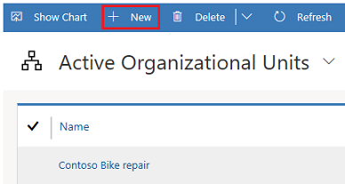
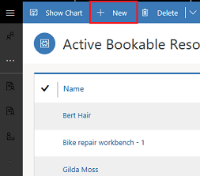
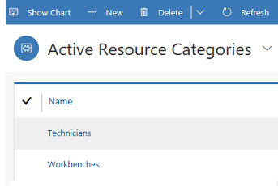
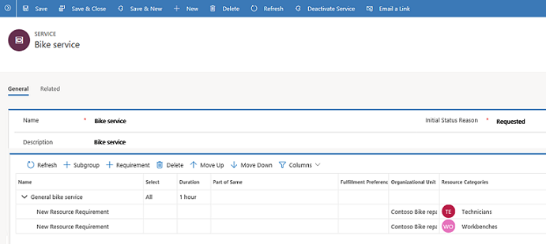
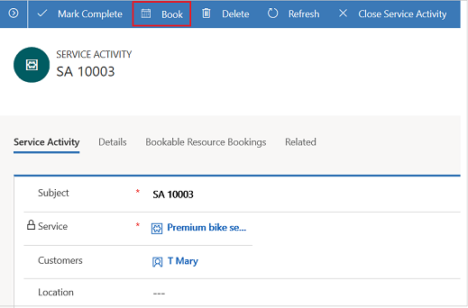
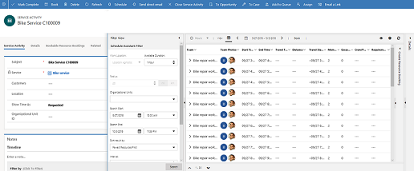
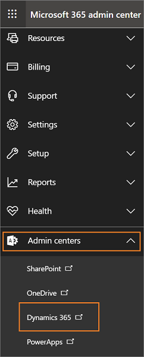
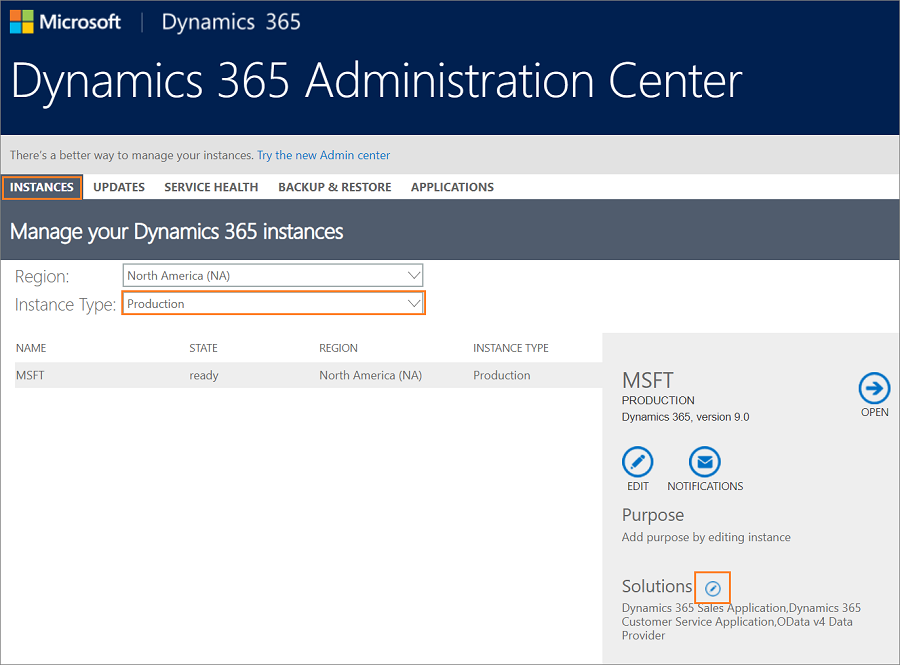
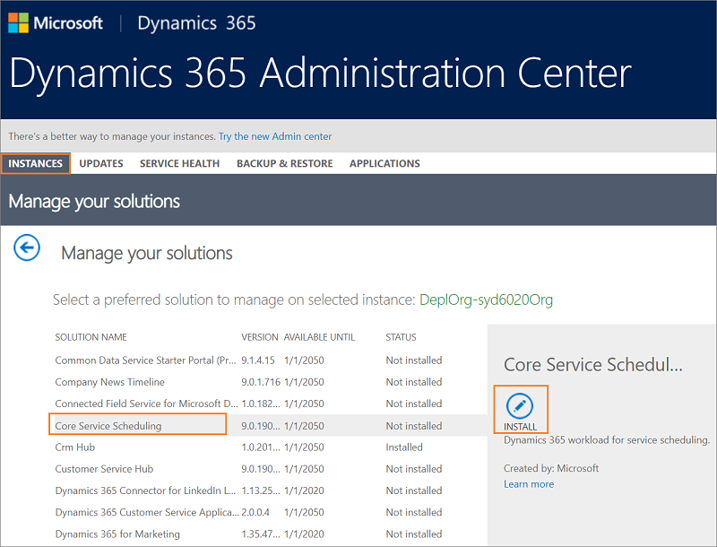
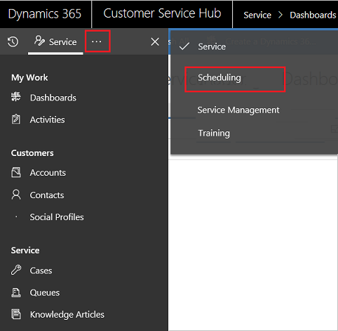

# Overview of Service Scheduling

Avoid disruptions in service by making sure that your resources are scheduled optimally and efficiently. Using Scheduling in Customer Service Hub, you can plan and schedule service activities for your customers by bringing together all your resources.

## Understand the scheduling experience

Scheduling, which is built on top of **Universal Resource Scheduling (URS)**, provides an efficient way to schedule resources for service activity. It considers the availability of employees, facilities, and equipment to plan schedules accordingly. It also helps customer service organizations with improved service quality by preventing over-scheduling.

### Scheduling scenario

The following scenario helps to understand how the scheduling capability lets you manage your service activities seamlessly: 

Contoso bike repair schedules repair services for their customers. To facilitate this process, Contoso needs to bring together the following information:

- Geographical locations where they need to offer their services.
- The personnel and equipment they need to perform those services. 
- The types of bike repair services they offer. 
- Work hours during which they perform their services. 
- Capacity and expert level for all personnel.

Contoso can benefit from the scheduling feature by quickly catering to their customers with their repair services. With the various scheduling entities, they can plan service activities for their customers by considering the availability of resources, facilities, and equipment. 

Let's see how Contoso accomplishes the task:

**Step 1: Create organizational units**   
   Organizational units are the locations where Contoso provides service to their customers. [!INCLUDE[proc_more_information](../includes/proc-more-information.md)] [Create and manage organizational units](create-org-units-cs-scheduling.md)

    
   
**Step 2: Create resources** 
  Contoso lists the resources required to perform the services. 

  > [!NOTE]
  > You can create all resource types using the Resource entity.

  In this example, two resources (contacts) Bert Hair and Gilda Moss are created. Similarly, two more resources (facility/equipment) are created as Bike repair workbench - 1 and Bike repair workbench - 2, which are required to perform the service. [!INCLUDE[proc_more_information](../includes/proc-more-information.md)] [Create and set up bookable resources](resources-service-scheduling.md)

   

**Step 3: Set work hours for the resource, resource group or facility/equipment**  
   The availability of the resources is defined in the work hours section. [!INCLUDE[proc_more_information](../includes/proc-more-information.md)] [Set work hours for the resources](resources-service-scheduling.md#set-work-hours-for-the-resources)

     
   
  
**Step 4: Create resource groups**  
   The resources are aligned in resource groups or resource categories. 

   In the example, Bert Hair and Gilda Moss are grouped as Technicians and Bike repair workbench - 1 and Bike repair workbench - 2 are grouped as Workbenches.
    
   [!INCLUDE[proc_more_information](../includes/proc-more-information.md)] [Create and manage resource categories](resource-categories-service-scheduling.md)

    

**Step 5: Create a service record**   
   Contoso now collates all the above inputs to create a bike repair service record for the customer. They also specify the resources/resource groups they will need for the service. [!INCLUDE[proc_more_information](../includes/proc-more-information.md)] [Create or edit a service in Service Scheduling](create-edit-service-csh.md)

    
 
**Step 6: Create a service activity**   
   A service activity is defined to look for the next available time slot to schedule the service and align resources as per requirement.  [!INCLUDE[proc_more_information](../includes/proc-more-information.md)] [Schedule a service activity](schedule-service-activity-csh.md)

   

**Step 7: Book the service in the schedule board**   

  The schedule board displays all the service configurations at one place to quickly schedule a service. [!INCLUDE[proc_more_information](../includes/proc-more-information.md)] [Use the schedule board to configure service activity](use-schedule-board-configure-service-activity.md)

     

## Set up the Service Scheduling experience

The set up experience is different based on the following scenarios:

- For a new Dynamics 365 Customer Service environment, by default, the **Core Service Scheduling** solutions is installed. You can access scheduling from Customer service hub app site map. To learn more, see [Access scheduling in the Customer Service Hub](#access-scheduling-in-the-customer-service-hub).

- For an existing Dynamics 365 Customer Service organization, you must install the service scheduling solutions from the Microsoft 365 admin center. To learn more, see [Install the Scheduling solutions](#install-the-scheduling-solutions).

### Prerequisites

- Make sure that you have the required security role or equivalent permissions. [!INCLUDE[proc_more_information](../includes/proc-more-information.md)] [Manage security roles in service scheduling](manage-security-roles.md)

- Ensure your organization has Universal Resource Scheduling 3.2.0.405 or a later version. If your organization has a version prior to 3.2.0.405, then Universal Resource Scheduling installation fails. To check the Unified Resource Scheduling version on your instance, go to **Settings** > **Solutions**.

   [!INCLUDE[proc_more_information](../includes/proc-more-information.md)] [Schedule anything with Universal Resource Scheduling (Sales, Customer Service, Field Service, Project Service Automation)](../common-scheduler/schedule-anything-with-universal-resource-scheduling.md).

   > [!NOTE]
   > - If your organization doesn't have Universal Resource Scheduling, the **Core Service Scheduling** solution installs the latest version of Universal Resource Scheduling.
   > - If Field Service or Project Service is already installed on your organization with Universal Resource Scheduling 3.2.0.405 or later version, then Universal Resource Scheduling will also be upgraded to the latest version. Otherwise, the installation fails.
   > - The latest version of Universal Resource Scheduling might not be compatible with the older versions of Field Service or Project Service.

- Ensure your organization has Customer Service Hub application.

### Install the Scheduling solutions

1. Go to [Microsoft 365 Admin center](https://admin.microsoft.com/AdminPortal/Home).

2. Select **... Show all** > **Admin centers** > **Dynamics 365**. Dynamics 365 opens in a new tab.

   > [!div class=mx-imgBorder]
   > 

3. In the **Dynamics 365 Administration Center**, under the **Instances** tab, select an instance type from the drop-down. 

4. select the edit icon next to solutions. Manage your solutions page appears.

   > [!div class=mx-imgBorder]
   > 

5. In the **Manage your solutions** page, select **Core Service Scheduling**. The status column shows **Not installed**.

6. Select the install icon next on the **Core Service Scheduling** card. The **Terms of service** page appears.

   > [!div class=mx-imgBorder]
   > 

7. In the **Terms of service** page, read the terms and conditions and then select **install**. The installation may take few minutes.

After successful installation, you can access scheduling in the Customer Service Hub sitemap.

## Access scheduling in the Customer Service Hub

With the latest release of Dynamics 365 Customer Service, Scheduling is powered by Universal Resource Scheduling, and is available from the Customer Service Hub sitemap.

- Select  to go to **Scheduling** and access the entity record types.

  > [!div class=mx-imgBorder]
  > 

## Configure entity records in the new scheduling experience

Configure all your entity records in the new experience manually from the user interface. 

Make sure that you have the correct security role or equivalent permissions. Know more about security roles: [Manage security roles in service scheduling](manage-security-roles.md).

> [!IMPORTANT]
> The admin must follow the order as given in the [Scheduling scenario](#scheduling-scenario) while configuring entity records in the new scheduling experience.

> [!NOTE]
> All entity records can be configured from the user interface except Service Activity.

## Understand scheduling entities

Scheduling entities are grouped under the following logical groups:

**Scheduling**

- **Resources**  
   Anything that needs to be scheduled can be termed as **Resources**. This can be personnel, crews, service centers, company assets (equipment), accounts, or contacts. 

  [!INCLUDE[proc_more_information](../includes/proc-more-information.md)] [Create and set up bookable resources](resources-service-scheduling.md)

- **Facilities/Equipment**   
   Facilities and equipment are resources you'd use to perform services for your customers. Facilities can be physical spaces like service bays or conference rooms and equipment could be tools or other assets. 

   [!INCLUDE[proc_more_information](../includes/proc-more-information.md)] [Add facilities and equipments to schedule service](add-facilities-equipment-ss-csh.md)

- **Resource Categories**  
   With Resource categories,  you can group your bookable resources by type. For example, you can create categories like technician, supervisor, subcontractor, vehicle, or equipment. 
 
   [!INCLUDE[proc_more_information](../includes/proc-more-information.md)] [Create and manage resource categories](resource-categories-service-scheduling.md)

- **Services**   
   To make scheduling services quick and easy, it's helpful to predefine the specifics of the services you'd provide to customers. 

   [!INCLUDE[proc_more_information](../includes/proc-more-information.md)] [Create or edit a service](create-edit-service-csh.md)

- **Service Activities**  
   Create a service activity by finding the next time resources are available for a service. 

   [!INCLUDE[proc_more_information](../includes/proc-more-information.md)] [Schedule a service activity](schedule-service-activity-csh.md)

- **Fulfillment Preferences**  
    Choose and customize how to display schedule assistant results, like with neat hourly appointments or morning and afternoon time windows.

    [!INCLUDE[proc_more_information](../includes/proc-more-information.md)] [Fulfillment preferences](../common-scheduler/fulfillment-preferences.md)

**Tools**

- **Schedule Board**  
   The Dynamics 365 Customer Service schedule board provides an overview of resource availability and bookings you can make. 

   [!INCLUDE[proc_more_information](../includes/proc-more-information.md)] [Use the schedule board to configure service activity](use-schedule-board-configure-service-activity.md)

**Settings**

- **Organizational Units**  
   Your company organizes its business by geography, function, or other areas. You can create organizational units that reflect your business. 

   [!INCLUDE[proc_more_information](../includes/proc-more-information.md)] [Create and manage organizational units](create-org-units-cs-scheduling.md)

- **Business Closure**  
   Prevent scheduling resources on holidays and other non-working days by defining business closures. 

   [!INCLUDE[proc_more_information](../includes/proc-more-information.md)] [Set when your business is closed](set-when-business-closed-csh.md)

### See also    
    
[Service Scheduling FAQ](service-scheduling-faq.md) 
