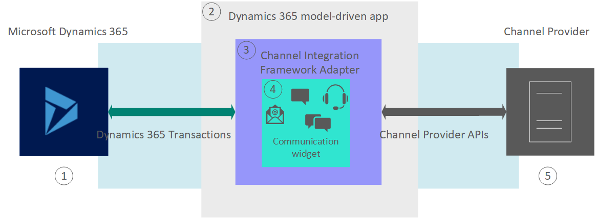

<!-- The editors are reviewing uses of "model-drive app" to make sure they're up to date according to the style guide. This topic uses the term multiple times (in the image as well). Can you please review the uses here and see if they comply with the style guide? https://styleguides.azurewebsites.net/Styleguide/Read?id=2696&topicid=45145 I am not certain if the term is used correctly here. -->

# Architecture overview of Dynamics 365 Channel Integration Framework 

Dynamics 365 Channel Integration Framework version 1.0 provides an extensible framework to integrate third-party channel providers to serve your customers with more focus and agility.

> [!div class="mx-imgBorder"]
> 

**1 - Microsoft Dynamics 365** 
Dynamics 365 environment where the Dynamics 365 Channel Integration Framework app is present to create and manage the configurations required for a third-party communication widget to interact with the Dynamics 365 model-driven app.

**2 - Dynamics 365 model-driven app** 
The single-session Dynamics 365 model-driven app exposes the Dynamics 365 Channel integration Framework panel to host the third-party communication widget (channel provider).

**3 - Channel Integration Framework Adapter** 
The Channel Integration Framework Adapter enables the communication between a single-session Dynamics 365 model-driven app and the capabilities of the channel provider.

**4 - Web-based Communication widget** 
The web-based communication channel (third party) is hosted in the widget that Dynamics 365 Channel Integration Framework provides. This is a multipurpose communication widget wherein you can host a CTI, chat, or email channels of your choice.

**5 - Cloud Channel Provider** 
The Cloud Channel Provider is the service that you want to integrate and interact with a single session Dynamics 365 model-driven app using the Dynamics 365 Channel Integration Framework. The capabilities of a channel are voice, SMS, chat, email, and so on. These capabilities of a channel are specific to the channel provider and Dynamics 365 Channel Integration Framework is agnostic on the working of the channel.

> [!div class="nextstepaction"]
> [System requirements of Dynamics 365 Channel Integration Framework](system-requirements-channel-integration-framework.md)

## See also

[Overview of Dynamics 365 Channel Integration Framework](overview-channel-integration-framework.md)

[!INCLUDE[footer-include](../../includes/footer-banner.md)]
