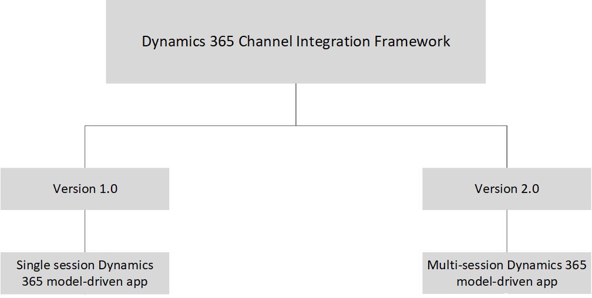

# Choose between Dynamics 365 Channel Integration Framework version 1.0 and version 2.0

This topic explains the key feature differences between Dynamics 365 Channel Integration Framework version 1.0 and version 2.0, and helps you choose the version that suits your business requirements.

## Dynamics 365 Channel Integration Framework version 1.0

You can use Dynamics 365 Channel Integration Framework version 1.0 to integrate a channel provider of your choice if your organization is using any of the single-session Dynamics 365 model-driven apps, such as:

- Dynamics 365 Customer Service
- Dynamics 365 Sales
- Dynamics 365 Project Service
- Dynamics 365 Field Service

You can integrate channels such as telephony, messaging (SMS) or chat channels with any of the single-session Dynamics 365 model-driven apps to have an immersive experience.

More information: [Channel Integration Framework version 1.0](overview-channel-integration-framework.md)

> [!NOTE]
> Dynamics 365 Channel Integration Framework version 1.0 is available for Government Community Cloud (GCC).

## Channel Integration Framework version 2.0

You can use Dynamics 365 Channel Integration Framework version 2.0 to integrate telephony channel providers of your choice if your organization is using the multi-session apps, such as Omnichannel for Customer Service and Customer Service Workspace.

Using Dynamics 365 Channel Integration Framework version 2.0 with multi-session apps, such as Omnichannel for Customer Service and Customer Service Workspace, enables you to use cross-channel analytics.

More information: [Channel Analytics](v2/channel-analytics.md)  
More information: [Channel Integration Framework version 2.0](v2/overview-channel-integration-framework.md)

To learn more about multi-session app, see [Omnichannel for Customer Service](../../omnichannel/omnichannel-customer-service-guide.md).

## Version 1.0 and 2.0

The following matrix explains the various aspects of versions 1.0 and 2.0.

|Feature| Version 1.0 | Version 2.0 |
|--------------------------------|---------------------------|-------------------------------|
|Session| Single-session  | Multi-session|
|Model-driven app | Dynamics 365 Customer Service   Dynamics 365 Sales   Dynamics 365 Project Service   Dynamics 365 Field Service | Omnichannel for Customer Service Customer Service Workspace |
|Deployment/provisioning(preview)|Using Channel Integration Framework version 1.0 model-driven app|Deployed with Customer Service workspace (preview) and Omnichannel for Customer Service|
|Communication panel | Right side | Left side |
|Communication panel modes | Minimized   Expanded | Docked   Minimized   Hidden |
|Features| Support for one channel provider at any time   Communication panel management |Support for multiple telephony channel providers   Communication panel management   Channel analytics   Notification management templates  Application tab management templates  Session management templates |

> [!NOTE]
> For information about how to integrate custom messaging channel providers with Omnichannel for Customer Service, see [Bring your own channel](../../omnichannel/developer/how-to/bring-your-own-channel.md).

> [!div class="mx-imgBorder"]
> 

### See also

[Channel Integration Framework version 1.0](overview-channel-integration-framework.md)  
[Channel Integration Framework version 2.0](v2/overview-channel-integration-framework.md)  
[Integrate Channel Integration Framework version 2.0 with Omnichannel for Customer Service](v2/integration-multi-session-experiences.md)  
[Multi-session agent experiences](https://docs.microsoft.com/business-applications-release-notes/april19/service/omnichannel-for-customer-service/multi-session-agent-experiences-web-usd)  
[Bring your own channel](../../omnichannel/developer/how-to/bring-your-own-channel.md)

[!INCLUDE[footer-include](../../includes/footer-banner.md)]
