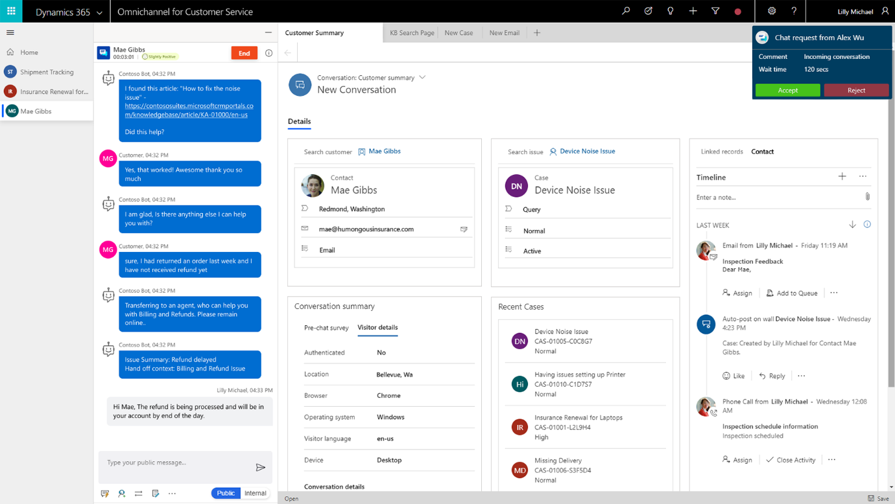
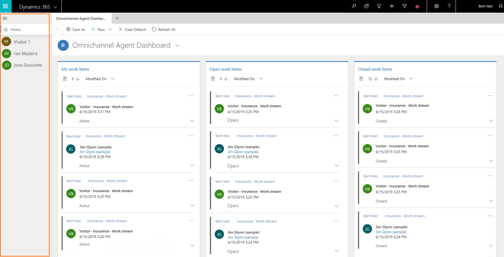
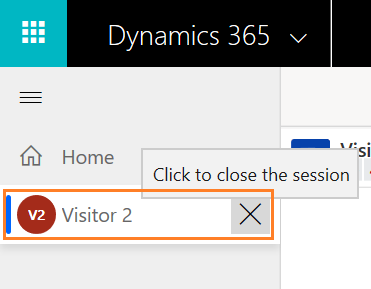
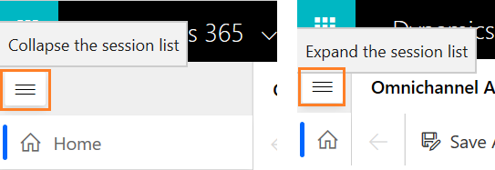
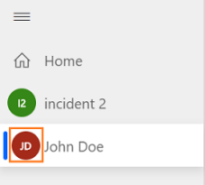

# Preview: Integration with multi-session experiences

The Omnichannel for Customer Service app enables organizations to instantly connect and engage with their customers via channels like Chat for Dynamics 365 and SMS. The app provides context rich multi-tasking experience across different customer sessions.

## Value propositions of Omnichannel for Customer Service app

- **Unified experience:** The app provides unified and consistent single-view experience for the agents to view conversation details, Customer information, and access web-based Line-of-Business applications from within the app.

- **Multi-session and application management:** The app enables agents to handle multiple sessions and manage contextual applications (app tab panel) related to the sessions with ease, which in-turn leads to less errors, faster case resolution, and customer satisfaction.

- **Extensibility:** The app is built on the Unified Interface framework, which makes easy for the developers and system customizers to customize and extend the app. Any changes you make in underlying CRM forms are automatically lit up in the new experience.

## High-level feature capabilities for the agents

As an agent, you might engage with several customers simultaneously across different channels but managing all the customer sessions is a challenge, especially switching between the sessions while understanding the context of the engagement. Omnichannel for Customer Service provides a consistent experience regardless of the support channel and organizations can maximize agent productivity.

The Omnichannel for Customer Service provides key capabilities like:

-   Ability to open multiple sessions to simultaneously work on multiple customer interactions.

-   Ability to open contextual applications in the sessions

-   Host the communication widget in the sessions

-   Ability to show notifications with apt information and action buttons on incoming conversations.

  

## Components in the agent interface

When you sign in to the Omnichannel for Customer Service app, the agent interface has the following components:

1.  Session panel

2.  Communication panel

3.  Application tab panel

4.  Unified Interface application area

5.  Search, quick create, and presence

  

### 1. Session panel

The vertical panel on the left side is the session panel that allows you (the agent) to work on multiple customer sessions simultaneously. In addition, as an agent you can switch between sessions without losing context of the conversation and customer details. The ability to handle multiple sessions simultaneously (while preserving customer context) allows you to resolve issues faster and achieve higher productivity.

### 2. Communication panel

The Communication Panel is where you, as an agent, interact with your customer. Partner widgets built using Channel Integration Framework version 2.0 are loaded in this panel. The communication widget in this experience has following key differences as compared to the version 1.0 based widgets:

| **Version 2.0**                                                    | **Version 1.0**                                                     |
|--------------------------------------------------------------------|---------------------------------------------------------------------|
| Communication panel is displayed to the left of session panel      | Communication panel is displayed to the right of side of the screen |
| Communication panel supports a Docked, Minimized, and Hidden mode. | Communication panel supports a Docked, Minimized mode.              |

### 3. Application tab panel

The horizontal bar below the Dynamics 365 navigation bar is called the application tab panel. Every customer session has at least one application tab that is not closable; it is called an ***Anchor tab***. The Application tab has a **+** icon. If you select the icon, the menu that has options that are made available by your administrator in the app sitemap. The menu shows the out-of-box and custom entities. Also, you can access any third-party Line-of-Business applications which have been configured in the app sitemap. Select the option from the list to open it in the application tab.

  

### 4. Unified Interface application area

The application area is the area where the pages needed to work on the service request are opened. By default, when an agent logs into the app, she goes to the home session. The home session normally contains apps which are normally referred by the agent to monitor their work, performance or assignments and start working on the work items assigned to them. For example, it can have different dashboards where agent can get a quick view of the work items and assignments.

Multiple contextual application tabs can be opened in the sessions. These tabs can be opened along with the session using the session templates or can be used manually using the + button on the ap tab panel. The application tabs in a session are specific to that session and when you switch session the application tabs are also accordingly switched.

### 5. Search and Agent presence

Search, quick create, and presence are the options present in the nav bar.

  

a. **Search.** Do a simple search for records using the advanced search option and open the record in an application tab. Advanced Search is also called as Categorized Search.

b. **Presence.** Set presence as per your availability. Select the icon to launch the presence dialog and use the drop-down list to select a status.

## Managing Sessions

The vertical panel on the left side is the session panel that allows you (the agent) to work on multiple customer sessions simultaneously. As an agent, you can switch between sessions without losing context of the conversation and customer details. The ability to handle multiple sessions simultaneously (while preserving customer context) allows you to resolve issues faster and achieve higher productivity.

  

### Start a session

As an agent, you can start the sessions in two ways:

-   Manually start a session

-   programmatically start a session

### Manually start a session using the gestures

Use a combination of keyboard and mouse-click gesture to start a session. You can press **Shift** and click on any CRM record to open it in a new session. This can be done from dashboards, grids and even links on other CRM record forms.

### Programmatically start a session

Channel integration framework version 2.0 allows providers to start sessions programmatically. It provides APIs to pop notifications to the agents with relevant information. Providers can start sessions based on agent responses.

  

 

  

### Work on multiple customer sessions

As an agent, when you are working on a case or another conversation, you get an incoming conversation request, and you accept the request, this should start a new session. Partners can use predefined templates to open applications such as KB Search, Open records, and any Line-of-Business applications.

When you switch sessions, unsaved changes are not lost, and you can continue to work on them.

For example, you are working on a case by entering the title of the case and not yet saved the form. Now, you get a notification about the incoming conversation and you accept the request, which leads to starting of a new session. Again, you can switch back to case session and the data entered is present for you to continue.

In addition, when you are working on a session, there is another session which requires the agent’s attention. You (partner/developer) can use the **requestFocusSession** API to provide a visual indicator on the session tab so agent can see and take the next steps. To learn more, see **requestFocusSession**.

  

### Close a session

You can close any session manually by selecting the **X** button next to the session title. When you hover the cursor on a session, you see the **X** button, and if you select the button, a confirmation dialog is shown to you.

 

  

### Mode of the session panel

By default, the session panel is in expanded mode. Use the burger icon to toggle between expand or collapse mode. At all times, the **Home** session is anchored, and you can't close it. The Home session shows the default dashboard set for you by your administrator.

  

### Title and icon of the session

#### Session Title

By default, the title of session is name of the customer, account, or title of the case. For an unauthenticated conversation request, the title will be displayed as visitor with a number. For example, **Visitor 1**.

For an authenticated chat, name of the contact, account or title of the case is displayed.

#### Session icon

By default, the first two letters of the session title are displayed as the session icon.

## See also

[Modes and locations for the communication widget](modes-communication-widget.md)