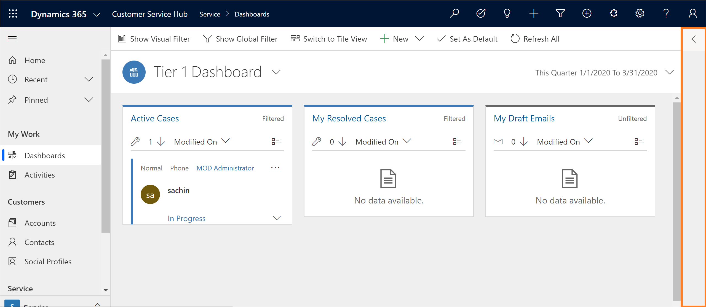
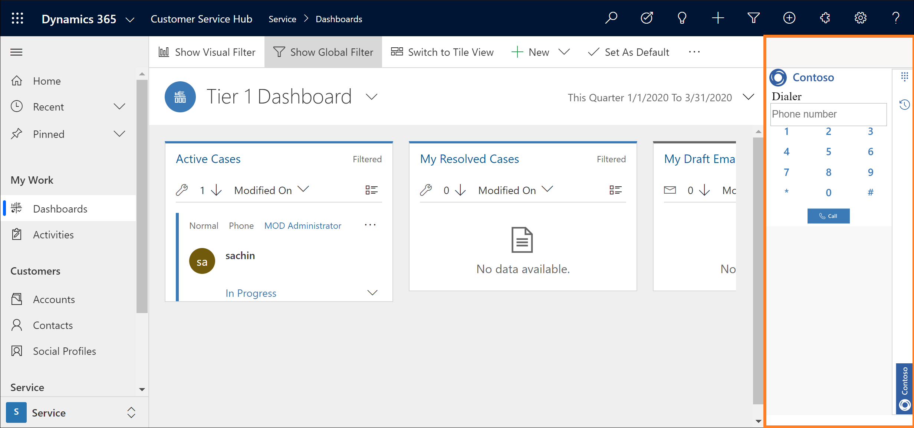

# Sample softphone integration using Dynamics 365 Channel Integration Framework

[Download](https://github.com/microsoft/Dynamics365-Apps-Samples/tree/master/customer-service/channel-integration-framework/TwilioSampleInteg_version1) the softphone integration sample for Microsoft Dynamics 365 Channel Integration Framework version 1.0.

> [!NOTE]
> The sample code is not supported on Internet Explorer and on browsers that do not have webRTC support. More information: [WebRTC](https://webrtc.org/)

> [!Important]
> - This sample code currently has limited availability.
> - The sample code for softphone integration with Dynamics 365 using Dynamics 365 Channel Integration Framework is made available so customers can get early access and provide feedback. The sample code is not meant for production use and may have limited or restricted functionality.
> - Microsoft doesn't provide support for this sample code for production use and Microsoft Dynamics 365 Technical Support won’t be able to help you with issues or questions. This is subject to [supplemental terms of use](https://go.microsoft.com/fwlink/p/?LinkId=511446).

## Prerequisites

A valid Azure subscription is required to publish the sample app to Azure.

> [!Note]
> If you don't have an Azure subscription, you can create a [free account](https://azure.microsoft.com/free/).

## Publish a sample app to Azure

1. Open the solution **SampleInteg.sln** using Visual Studio 2017.
2. In **Solution Explorer**, right-click on the solution and build the complete solution.
3. In **Solution Explorer**, right-click on the project **SampleInteg**  and select **Publish**.
4. Select **Start** to launch the **Publish** wizard.
5. Choose **App Service** as the publish target.
6. Select **Create New** and then select **Publish**.
7. Provide an app name. For example, **SampleInteg**.
8. Provide valid subscription, resource group, and hosting plan details.
9. Select **Create** to create the Azure app service, and save the app service URL for future use.

   For example, `https://sampleinteg.azurewebsites.net`.

    

## Create a function to use with the app service

1. Create sample code for the **client-voice** function.  Refer to the function from the readme file packaged with the sample softphone integration in the [Dynamics 365 Insider Portal](https://go.microsoft.com/fwlink/p/?linkid=2025867).

2. Use the sample code for the **capability-token** function.  Refer to function from the readme file packaged with the sample softphone integration in the [Dynamics 365 Insider Portal](https://go.microsoft.com/fwlink/p/?linkid=2025867).

> [!Note]
> Save the URL for the **capability-token** function you obtain from the above sample code. For example, the URL is `https://sampleinteg.sample/capability-token`.

## Configure a sample app in Dynamics 365

1. Note the base URL of the Dynamics 365 org in which all web resources are stored. For an online org, this should be of the form `https://<orgname>.crmXX.dynamics.com`. For example, `https://sampleorg.crm10.dynamics.com`

1. Get the **Dynamics 365 Channel Integration Framework** solution. For more information, see [Get Dynamics 365 Channel Integration Framework](get-channel-integration-framework.md).

2. Configure the channel provider by providing the details as shown in the matrix. For more information, see [Configure the channel provider](configure-channel-provider-channel-integration-framework.md).

   | Field | Description |
   |-------|-------|
   |Name|Name of the channel provider.   Example: Contoso|
   |Label|The label is displayed as the title on the widget.   Example: Contoso|
   |Channel URL| The channel URL is in the format: `<azure_app_service_url>?base=<crm_base_url>`  **Note:** For this sample, the URL is `https://sampleinteg.azurewebsites.net?base=https://sampleorg.crm10.dynamics.com`. |
   |Enable Outbound Communication| Yes |
   |Channel Order| 0 |
   |API Version| 1.0 |
   |Trusted Domains|The domain (URL) that can access the Channel Integration Framework APIs.|
   |Select the Unified Interface Apps for the Channel| The list of Unified Interface apps where the channel is displayed for the agents. |
   |Select Roles for the Channel|The security roles that are present in Dynamics 365. **Note:** If you do not assign any role, the channel provider is shown to all users assigned for the Dynamics 365 Unified Interface app.|

3. Launch the Unified Interface app to see the communication widget on the right side.

   **The communication widget in the minimized mode**

   
   
   **The communication widget in the expanded mode**
   
   

> [!Important]
> - All URLs must be HTTPS.
> - If you use a self-signed certificate for the Azure app or the Dynamics 365 org, certain browsers might reject the connection and fail to load the sample phone. As a workaround, open the Azure app in a separate tab and accept the certificate once.
> - Ensure microphone and speaker access is not blocked by browser policy.

## Related topics

[Get Dynamics 365 Channel Integration Framework](get-channel-integration-framework.md)

[Configure the channel provider](configure-channel-provider-channel-integration-framework.md)

[Microsoft.CIFramework](reference/microsoft-ciframework.md)

[Client-side events](reference/client-side-events.md)

[Entity reference](reference/entities-attributes/msdyn-ciprovider.md)

[!INCLUDE[footer-include](../../includes/footer-banner.md)]