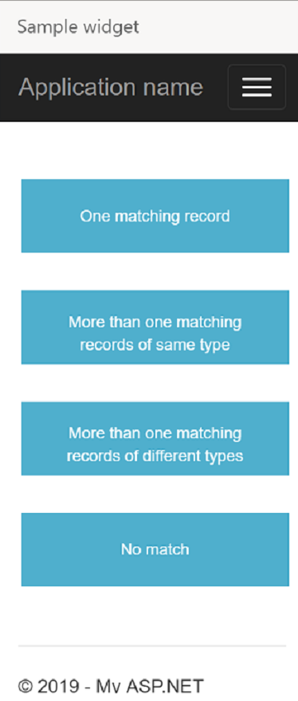

# Walkthrough: Search and open records on an incoming conversation

In this tutorial, we demonstrate how you can search and open records in Dynamics 365 on an incoming call using the Microsoft Dynamics 365 Channel Integration Framework APIs.

The sample given below covers four scenarios:

1. Customer's contact number matches one record in Dynamics 365. The record is retrieved using the [searchAndOpenRecords](reference/microsoft-ciframework/searchAndOpenRecords.md) API.

2. Customer's contact number matches multiple records of same entity type in Dynamics 365. The records are retrieved using the [searchAndOpenRecords](reference/microsoft-ciframework/searchAndOpenRecords.md) API.

3. Customer's contact number matches multiple records of multiple entity types in Dynamics 365. The Account entity and Contact entity records are searched for the contact number of the incoming call and then the search results are displayed on the console.

4. Customer's contact number does not match any record in Dynamics 365, so we search and open empty results and then create a new record for the customer using the [createRecord](reference/microsoft-ciframework/createRecord.md) API.

## Prerequisites

- Visual Studio 2017.
- A valid Microsoft Azure subscription is required to publish the sample app to Azure.

> [!IMPORTANT]
> This tutorial is a continuation of [Getting started with building a simple communication widget](getting-started-simple-widget.md). If you have not created a simple *Hello World!* widget yet that can be hosted on Dynamics 365 Channel Integration Framework, we suggest you read that first.

## Build the widget

1. Open the basic widget that you created using the steps mentioned in [Get started with building a simple communication widget](getting-started-simple-widget.md) in Visual Studio 2017.

2. Open the `Index.cshtml` file and replace the code in the file with the code given below. 

   <br />

```html
<!DOCTYPE html>
<style>
    .button {
        background-color: #4FAFCD;
        border: none;
        color: white;
        padding: 15px 32px;
        text-align: center;
        text-decoration: none;
        display: inline-block;
        font-size: 16px;
        margin: 4px 2px;
        cursor: pointer;
        height: 55px;
        width: 200px;
        font-size: 12px;
    }
</style>

<html>
<body>
    <br /><br />
    <!--Replace <ORG-URL> in the script tag below with the URL of your Dynamics 365 instance -->
    <script type="text/javascript" src="<ORG-URL>/webresources/Widget/msdyn_ciLibrary.js" data-crmurl="<ORG-URL>" data-cifid="CIFMainLibrary">
    </script>
    <script>

        function singlematch() {
            // The customer phone number matches one contact in Dynamics 365
            var contactno = "555-5555"; // The contact number to be searched
            var entityname = "account"; // Entity type whose records are to be searched

            Microsoft.CIFramework.searchAndOpenRecords(entityname, "?$select=name,telephone1&$filter=telephone1 eq '" + `${contactno}` + "'" + "&$search=" + `${contactno}`, false).then(
                function success(result) {
                    res = JSON.parse(result);
                    // Display the name and telephone number of the retrieved contact on the console
                    console.log(`Record values: Name: ${res[0].name}, Telephone number: ${res[0].telephone1}`);
                },
                function (error) {
                    console.log(error.message);
                }
            );
        }

        function multiplematchsingletype() {
            // More than one contacts are matched with same phone number
            // Search and show search results on console
            var contactno = "555-5555"; // The contact number to be searched
            var entityname = "account"; // Entity type whose records are to be searched

            Microsoft.CIFramework.searchAndOpenRecords(entityname, "?$select=name,telephone1&$filter=telephone1 eq '" + `${contactno}` + "'" + "&$search=" + `${contactno}`, false).then(
                function success(result) {
                    res = JSON.parse(result);
                    count = Object.keys(res).length;
                    // Print all the retrieved records on the console
                    while (count >= 1) {
                        console.log(`Record values: Name: ${res[count - 1].name}, Telephone number: ${res[count - 1].telephone1}`);
                        count = count - 1;
                    }
                },
                function (error) {
                    console.log(error.message);
                }
            );
        }

        function multiplematchmultipletype() {
            // More than one records are matched with the same phone number. These records belong to different entity types
            // Search and show search results on console
            var contactno = "555-5555"; // The contact number to be searched

            // Set the value of searchOnly parameter to True if you only want to get results of the search as a promise result and not open the record or search page. More information: https://docs.microsoft.com/dynamics365/customer-engagement/developer/channel-integration-framework/reference/microsoft-ciframework/searchandopenrecords#parameters.
            Microsoft.CIFramework.searchAndOpenRecords("contact", "?$select=fullname,telephone1&$filter=telephone1 eq '" + `${contactno}` + "'"  + "&$search=" + `${contactno}`, true).then(
                function success(result) {
                    res = JSON.parse(result);
                    count = Object.keys(res).length;
                    // Print all the retrieved records on the console
                    while (count >= 1)
                    {
                        console.log(`Contact entity record values: Name: ${res[count - 1].fullname}, Telephone number: ${res[count-1].telephone1}`);
                        count = count - 1;
                    }
                }, function (error) {
                    console.log(error.message);
                });

            Microsoft.CIFramework.searchAndOpenRecords("account", "?$select=name,telephone1&$filter=telephone1 eq '" + `${contactno}` + "'"  + "&$search=" + `${contactno}`, true).then(
                function success(result) {
                    res = JSON.parse(result);
                    count = Object.keys(res).length;
                    // Print all the retrieved records on the console
                    while (count >= 1)
                    {
                        console.log(`Contact entity record values: Name: ${res[count - 1].name}, Telephone number: ${res[count - 1].telephone1}`);
                        count = count - 1;
                    }
                }, function (error) {
                    console.log(error.message);
                });
        }

        function nomatch() {
            // Search and show empty search results
            // Create new contact based on the details of the incoming call
            // Associate new contact to session
            var contactno = "000040000025"; // The contact number to be searched
            var callername = "Contoso Ltd."; 

            Microsoft.CIFramework.searchAndOpenRecords("account", "?$select=name,telephone1&$filter=telephone1 eq '" + `${contactno}` + "'"  + "&$search=" + `${contactno}`, false).then(
                function success(result) {
                    res = JSON.parse(result);
                    console.log(res);
                    // Check if the JSON response returned by the request is empty
                    if (Object.keys(res).length == 0) {
                        console.log("No records with contact number as " + contactno);
                        console.log("Creating a new Account record");

                        // Creating new Account record
                        var entityLogicalName = "account";
                        var data = {
                            "name": callername,
                            "telephone1": contactno
                        }
                        var jsondata = JSON.stringify(data);

                        // use createRecord API to create a new entity record
                        Microsoft.CIFramework.createRecord(entityLogicalName, jsondata).then(
                            function success(result) {
                                res = JSON.parse(result);
                                // Print the AccountID of the created Account record on the console
                                console.log("Account record created with ID: " + res.id);
                            })
                    }
                    else {
                        console.log(`Record values: Name: ${res[0].name}, Telephone number: ${res[0].telephone1}`);
                    } 
                },
                function (error) {
                    console.log(error.message);
                }
            );
        }
    </script>

    <button class="button" type="button" onclick="singlematch()">One matching record</button><br /><br />
    <!-- singlematch() method is invoked when you click on "One matching record" button. This returns the record which has the same phone number as the number of the incoming call -->
    <button class="button" type="button" onclick="multiplematchsingletype()">More than one matching records of same type</button><br /><br />
    <!-- multiplematchsingletype() method is invoked when you click on "More than one matching records of same type" button. This returns the all records of one particular entity type, which have the same phone number as the number of the incoming call -->
    <button class="button" type="button" onclick="multiplematchmultipletype()">More than one matching records of different types</button><br /><br />
    <!-- multiplematchmultipletype() method is invoked when you click on "More than one matching records of different types" button. This returns the all records of mutliple entity types, which have the same phone number as the number of the incoming call -->
    <button class="button" type="button" onclick="nomatch()">No match</button><br /><br />
    <!-- nomatch() method is invoked when you click on "No match" button. If there is no existing record with the same phone number as the number of the incoming call, it uses the details of the incoming call to create a new record -->

    
</body>
</html>
```

## Publish and configure the widget

Follow the steps mentioned in [Publish and configure the widget](getting-started-simple-widget.md#BKMK_publish) to publish the widget. The published widget should look like this:

  <br />

## See also

[Get started with building a simple communication widget](getting-started-simple-widget.md)

[Sample code for softphone integration](sample-softphone-integration.md)

[Frequently asked questions](faq-channel-integration-framework.md)


[!INCLUDE[footer-include](../../includes/footer-banner.md)]