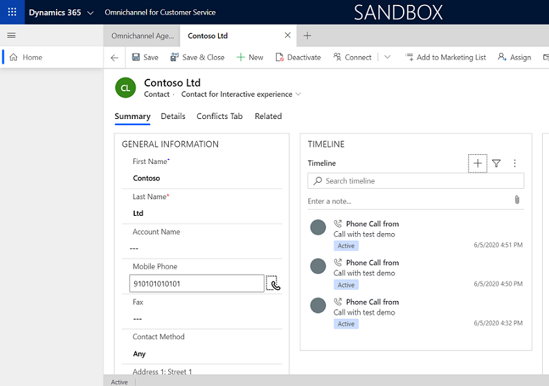
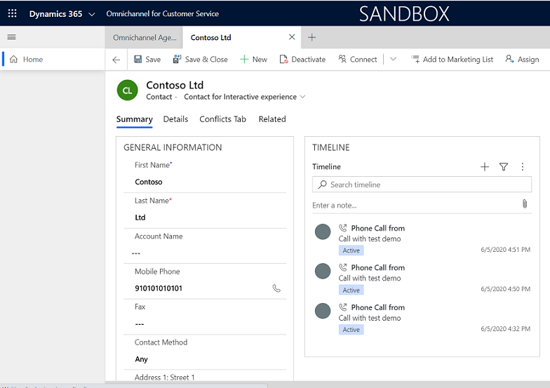

You can enable outbound communication either with or without customization, as follows:

- To enable outbound communication using customizations on the phone control, follow steps 1 through 4.
- To enable outbound communication without any customizations, follow steps 1, 3, and 4.

To enable outbound communication for your channel, you must perform the following:

1. Using app profile manager or Customer Service admin center, enable outbound communication for the specific channel provider. More information: [Configure channel provider for outbound communication](#configure-channel-provider-for-outbound-communication)

2. In the Unified Interface form, add the **Channel communication control** to the **Phone** field for which you want to enable outbound communication (ClickToAct), and publish the customizations. More information: [Add the Channel Communication Control to the Unified Interface form](#add-the-channel-communication-control-to-the-unified-interface-form)

3. Register the event handler in your JavaScript code using `Microsoft.CIFramework.addHandler` method. More information: [Register the event handler in JavaScript code using the onclicktoact event](#register-the-event-handler-in-javascript-code-using-the-onclicktoact-event) 

4. Select the mobile phone icon to trigger the `onclicktoact` event. More information: [Trigger the onclicktoact event](#trigger-the-onclicktoact-event)

## Configure channel provider for outbound communication
   
If you're using Customer Service admin center, do the following:
   
1. In the site map, select **Workspaces** in **Agent experience**. The **Workspaces** page opens.
    
2. Select **Manage** for **Third party voice channel provider**.
    
3. Select a provider from the **Active Channel Providers** list, and select **Edit**.
    
4. In the **General** tab, set the **Enable Out Bound** field to **Yes**.

If you're using the app profile manager, then do the following:

1. Sign in to your [Power Apps](https://make.powerapps.com/) portal.

2. Under the available apps, select the ellipses to the right of&nbsp;**Omnichannel for Customer Service**&nbsp;or&nbsp;**Customer Service workspace**.

3. On the menu that appears, select&nbsp;**App profile manager**. 

4. On the app profile manager page, expand **Omnichannel for Customer Service**&nbsp;or&nbsp;**Customer Service workspace**&nbsp;and select&nbsp;**Channel provider**.
 
5. Select your channel provider from the list, and set the **Enable Outbound Communication** field to **Yes**.

## Add the Channel Communication Control to the Unified Interface form

You can add the Channel Communication Control based on your organization and business requirements. The following steps describe how you can add the Channel Communication Control for the Contact form of Main type under the Contact entity.

1. Sign in to Dynamics 365.

2. Go to **Settings** > **Customizations**.

3. Expand **Entities** > **Contact** and select **Forms**.<br>


4. Select the **Contact** form of the **Main** type from the list.<br>


5. Select the phone field for which you want to add the control. Double-click the **Business Phone** or **Mobile Phone** field.<br> The **Field Properties** dialog appears.

6. In the **Field Properties** dialog, choose **Controls** tab, and select the **Add control...** option. <br>


7. In the **Add Control** dialog, choose **Channel Communication Control**, and select **Add**.<br>


8. In the **Field Properties** dialog, select the radio buttons for **Web**, **Phone**, and **Tablet**, and then select **Ok**.<br>
 

9. Select **Save**, and then select **Publish** to publish all customizations.

## Register the event handler in JavaScript code using the onclicktoact event

During the initialization of the function, register the handler for the `onlicktoact` event.

```JavaScript
function initCTI() {
    Microsoft.CIFramework.setClickToAct(true);
    Microsoft.CIFramework.addHandler("onclicktoact", clickToActHandler);
    log("Added clickToActhandler to the panel");
}
```
Make sure to add `initCTI`, which is an initialization method in the softphone sample code, in your own initialization code.

## Trigger the onclicktoact event

Select the mobile phone icon to trigger the `onclicktoact` event, as shown below.

|Mobile phone with customizations|Mobile phone icon without customizations|
|----|----|
| ||

> [!Note]
> Dynamics 365 Channel Integration Framework invokes the onclicktoact event only if you programmatically set the `setClickToAct` API to `true` or configure the **Enable Outbound Communication** to **Yes** in the channel provider configurations.
